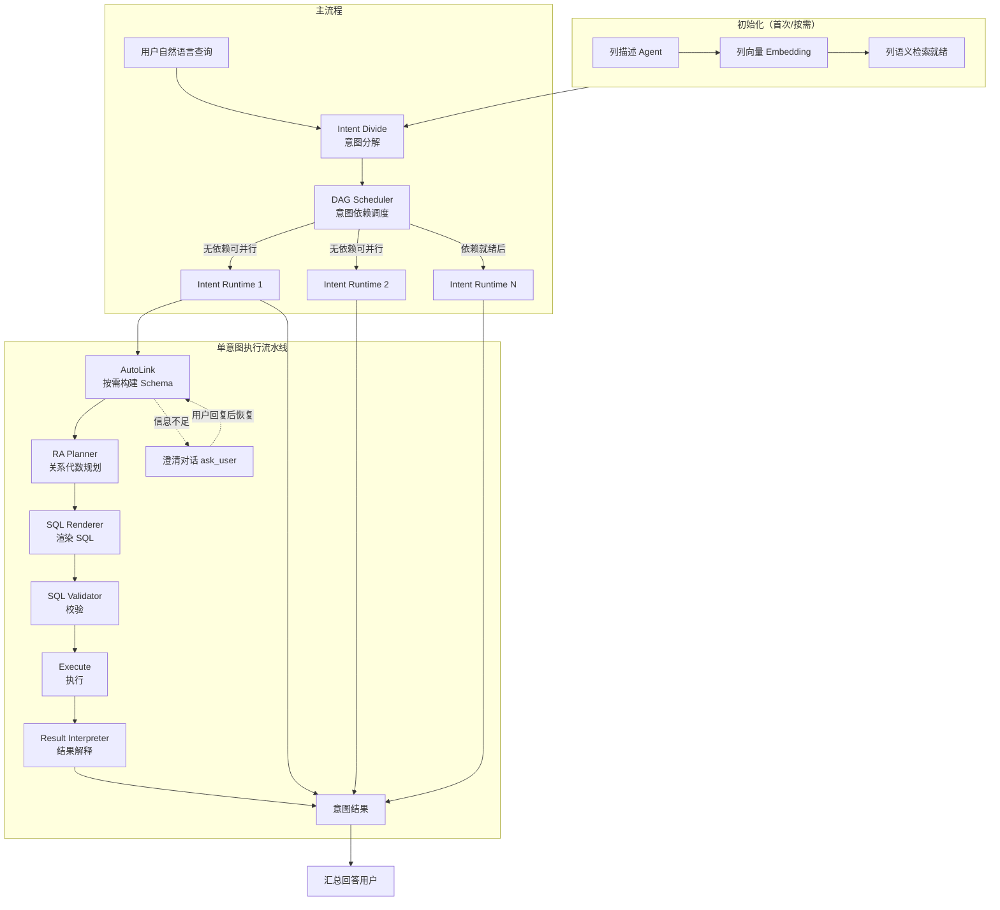

# AskDB

将自然语言查询转换为可执行 SQL 的流水线。支持多意图 DAG、按需 Schema、澄清式交互与关系代数规划。

## 项目特点

与常见「一问一 SQL」的 NL2SQL 不同，本项目的核心差异如下：

| 特点 | 说明 |
|------|------|
| **1. 多意图 + DAG** | 一句自然语言 → 拆成多个子意图，意图之间有依赖关系，形成 DAG；无依赖的意图可并行执行，不是「一问一 SQL」。 |
| **2. 按需 Schema（AutoLink）** | 不做全库 schema 灌入，而是按意图按需构建最小 schema（BUILD/ENRICH），由 AutoLink 多轮规划 + 工具补齐。 |
| **3. 澄清式交互** | 信息不足时暂停执行、向用户提问（ask_user / dialog ticket），用户回复后在原状态上恢复继续，而不是简单多轮闲聊。 |
| **4. 关系代数中间层** | 每个意图先做 RA 规划（entities / joins / filters / checks），再从 RA 渲染 SQL，是「规划 → 渲染」而不是直接 text-to-SQL。 |
| **5. 列级语义** | 初始化阶段做列级描述与向量；意图分解时用 query_columns_by_text 做列语义检索，是列粒度而不是仅表名。 |
| **6. 通用任务分解** | 不绑定某类「异常类型」或固定意图枚举，意图是通用子任务 + 依赖，可扩展到各类复杂问句。 |

## 整体流程架构



## 功能概览

- **意图分解（Intent Divide）**：把用户自然语言查询拆成多个可独立执行的子任务，并识别依赖关系。
- **DAG 调度**：按依赖顺序执行各意图，支持并行执行无依赖的意图。
- **单意图执行**：每个意图依次经过 Schema 构建（AutoLink）→ 关系代数规划 → SQL 渲染 → 校验 → 执行 → 结果解释。
- **澄清对话**：当 Schema 或口径不足时，可暂停并向用户提问，恢复后继续执行。
- **初始化阶段**：对配置的数据库做列描述（Agent）与列向量嵌入（Embedding），供意图分解时的列语义检索使用。

## 环境要求

- Python 3.10+
- MySQL（或兼容协议）数据库
- 支持 LangChain 的 LLM API（如 Qwen、DeepSeek、OpenAI 等，见 `config/json/models.json`）

## 快速开始

**使用前请完成：**

1. **添加密钥文件**：在项目根目录执行 `cp .env.example .env`，编辑 `.env` 填入数据库密码与各 LLM 的 API Key（如 `OPENAI_API_KEY`、`QWEN_API_KEY`、`DEEPSEEK_API_KEY`）。`.env` 已加入 `.gitignore`，不会提交到版本库。
2. **按需修改配置**：数据库连接、模型与阶段参数等可在 `config/json/` 下配置（`database.json`、`models.json`、`stages.json`），详见 [config/README.md](config/README.md)。

### 1. 安装依赖

```bash
pip install -r requirements.txt
```

### 2. 配置

- **数据库**：在 `config/json/database.json` 中配置 `default_scope`、`connections` 等。
- **模型与阶段**：在 `config/json/models.json`、`config/json/stages.json` 中配置 LLM 与各阶段参数。
- 更多配置项说明与示例见 [config/README.md](config/README.md)。

### 3. 运行

**交互式（默认会先检查并补齐 initialize 产物）**：

```bash
python main.py
```

按提示输入自然语言查询；若需澄清，根据提示补充信息后继续。输入 `exit` 或 `quit` 退出。

**单次查询**：

```bash
python main.py --query "查询每个工厂的设备数量"
```

**跳过初始化检查**（已确认 data/ 与 embedding 就绪时使用）：

```bash
python main.py --skip-init --query "你的问题"
```

### 4. 配置目录

若希望使用独立配置目录，可设置环境变量：

```bash
export APP_CONFIG_DIR=/path/to/your/config
python main.py
```

## 项目结构（简要）

```
config/          # 配置（database、stages、models 等 JSON）
stages/
  intent_divide/ # 意图分解
  initialize/    # 初始化（agent + embedding）
  sql_generation/# SQL 生成（DAG、intent runtime、autolink）
utils/           # 数据库、日志、embedding、路径等工具
main.py          # 入口与交互循环
```

各阶段详细设计见 `stages/*/README.md`。

## 许可证

本项目采用 [MIT License](LICENSE)。
