# Intent Divide 详细设计方案与技术实现

## 一、系统概述

### 1.1 设计目标

Intent Divide（意图分解）模块是 SQL Generation 流水线的入口模块，负责将用户的**自然语言查询**拆分为多个独立的**可执行意图**，每个意图对应一个子任务。

**核心设计原则**：

1. **语义导向**：基于实体语义识别与约束口径，不依赖数据库 Schema
2. **任务导向**：每个意图对应一个可独立执行的子任务
3. **自包含单元**：每个意图独立处理，支持并行执行
4. **依赖管理**：明确识别意图间的执行依赖关系
5. **重试收敛**：通过输出校验和重试机制保证输出质量

### 1.2 系统定位

Intent Divide 在 SQL Generation 流水线中的位置：

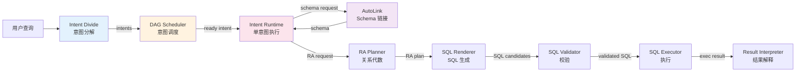

### 1.3 核心职责

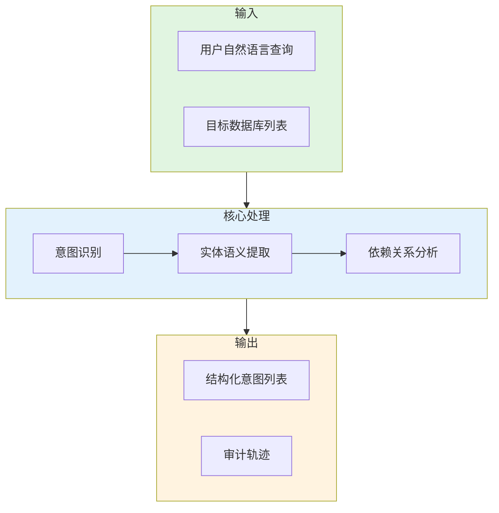

---

## 二、数据模型设计

### 2.1 核心数据结构

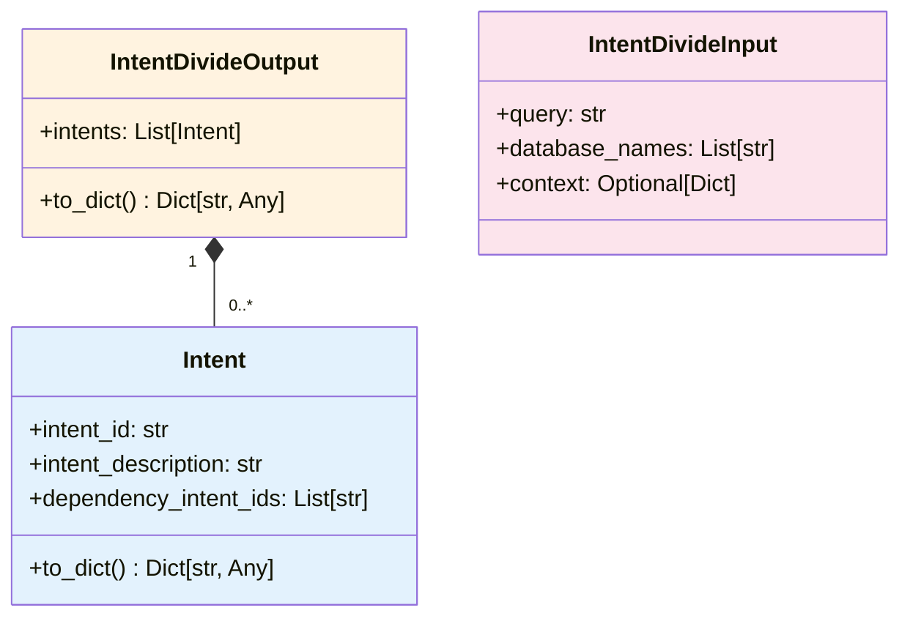

### 2.2 Intent 字段说明

| 字段 | 类型 | 说明 | 示例 |
|------|------|------|------|
| `intent_id` | str | 意图唯一标识 | `intent_001` |
| `intent_description` | str | 自然语言的子任务描述 | `检查用户表中手机号格式是否正确` |
| `dependency_intent_ids` | List[str] | 依赖的意图 ID 列表 | `[]` 或 `["intent_001"]` |

---

## 三、模块架构设计

### 3.1 模块组件结构

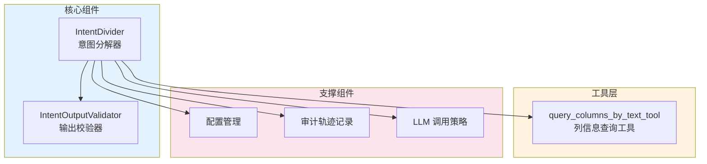

### 3.2 文件结构

```
stages/intent_divide/
├── __init__.py              # 模块入口
├── main.py                  # 主入口函数
├── divider.py               # IntentDivider 核心实现
├── models.py                # 数据模型定义（Intent, IntentDivideOutput）
├── tools.py                 # LangChain 工具定义
├── validator.py             # 输出校验器
├── tracing.py                # 审计轨迹记录
└── README.md                # 本文档
```

---

## 四、核心组件详细设计

### 4.1 IntentDivider（意图分解器）

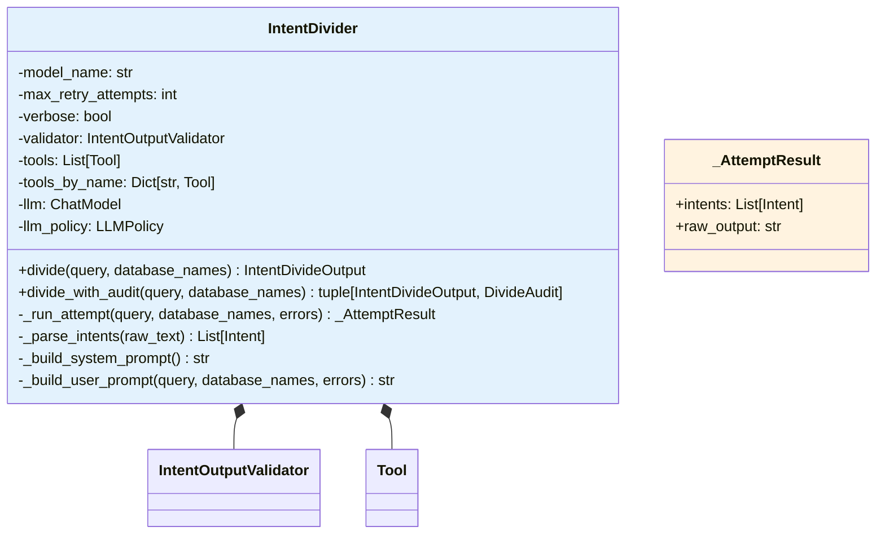

### 4.2 IntentDivider 主流程

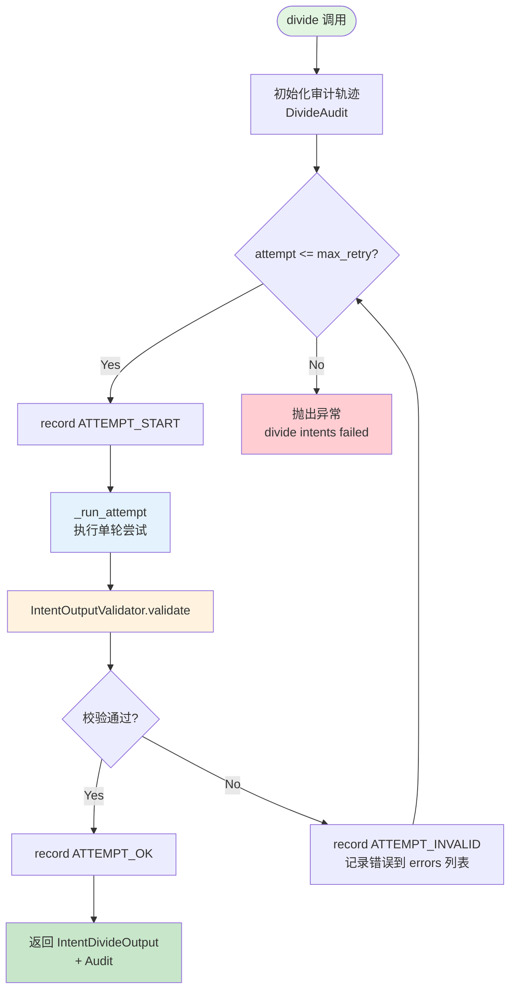

### 4.3 单轮尝试执行流程 (_run_attempt)

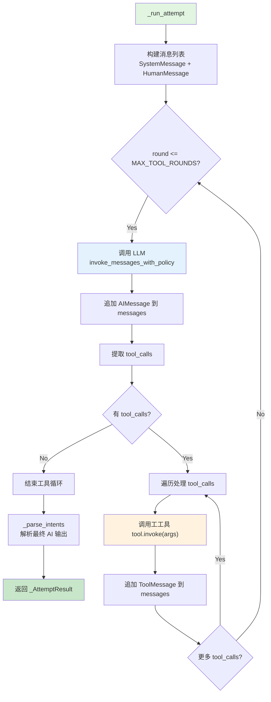

### 4.4 工具调用协议

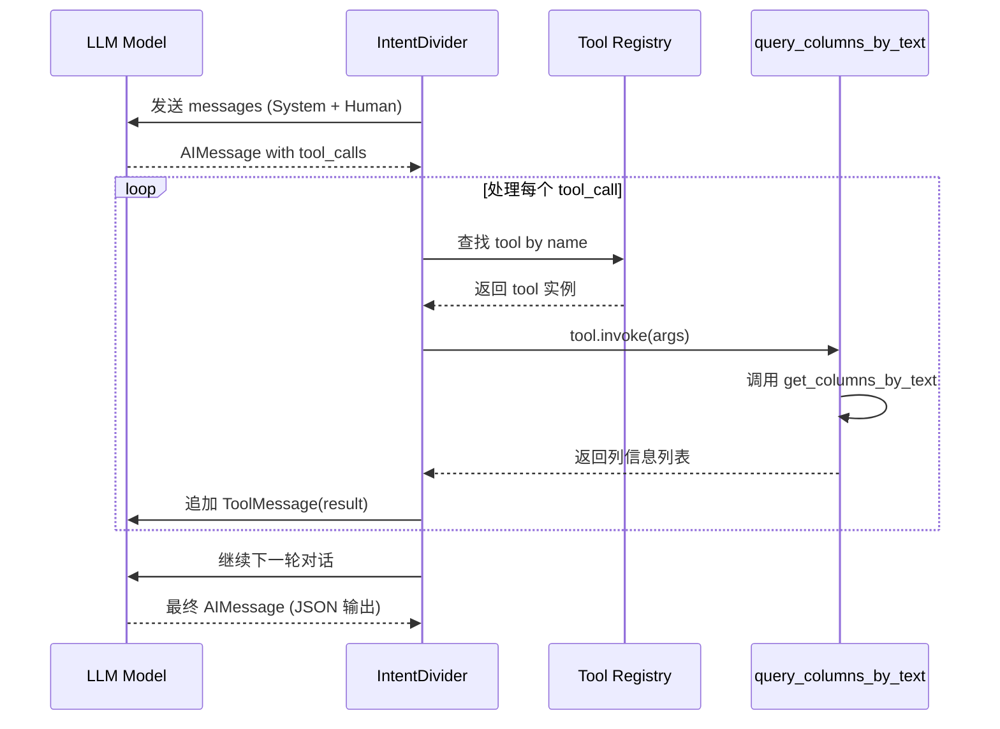

### 4.5 输出解析流程

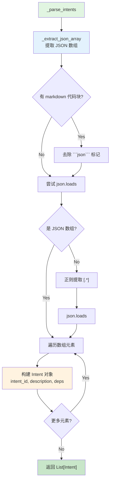

---

## 五、Agent 协作与交换协议

### 5.1 Agent 角色定义

| Agent | 职责 | 输入 | 输出 |
|-------|------|------|------|
| **IntentDivider** | 意图识别与分解 | query + database_names | IntentDivideOutput |
| **LLM Model** | 语义理解与意图生成 | System/Human messages | AIMessage (含 tool_calls) |
| **query_columns_by_text** | 列信息语义检索 | text + databases + top_k | List[ColumnInfo] |
| **IntentOutputValidator** | 输出格式校验 | List[Intent] | ValidationResult |

### 5.2 Agent 间交换协议

#### 5.2.1 Divider → LLM

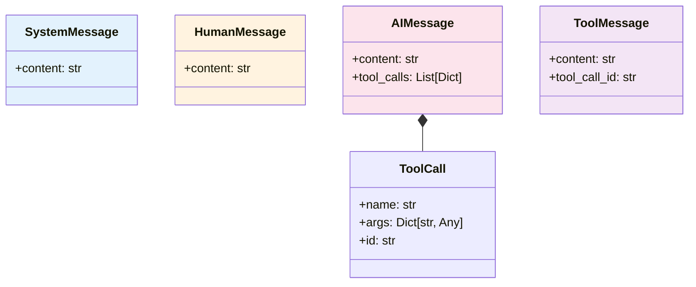

**SystemMessage 内容**：
```
重要：你最终必须只输出 1 个 JSON 数组（禁止 markdown/代码块/解释文字/前后缀文本）。
数组元素必须是 JSON 对象，字段严格包含:
- intent_id
- intent_description
- dependency_intent_ids (list)

你是意图分解助手，负责把用户自然语言查询拆成可独立执行的 intent 列表。
可以调用工具 query_columns_by_text 来辅助识别列语义。
不要输出任何解释文本。
```

**HumanMessage 内容**：
```
用户查询：{query}
可用数据库：{database_names}
上一轮输出错误如下，请修正:
1. {error_1}
2. {error_2}
```

#### 5.2.2 Divider → Tool Agent

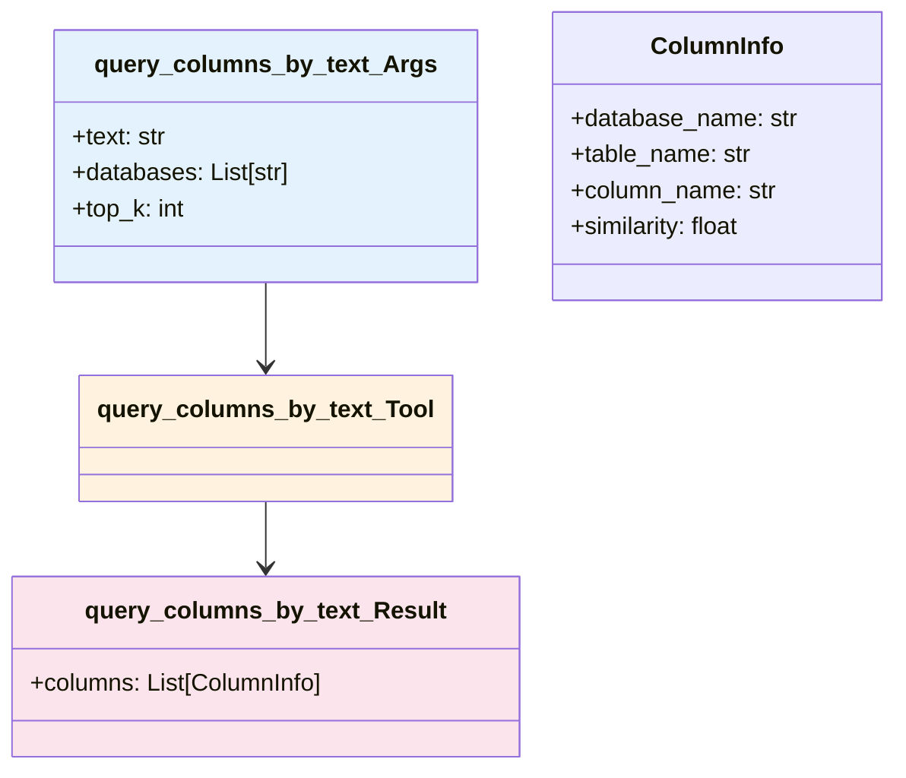

#### 5.2.3 Validator → Divider

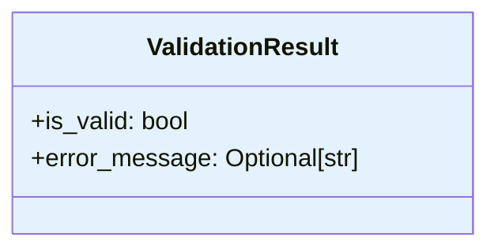

**校验规则**：
1. intents 非空
2. intent_id 唯一且非空
3. intent_description 非空
4. dependency_intent_ids 必须是 list
5. 依赖的 intent_id 必须存在
6. 不能自依赖

---

## 六、输入/输出协议

### 6.1 输入协议

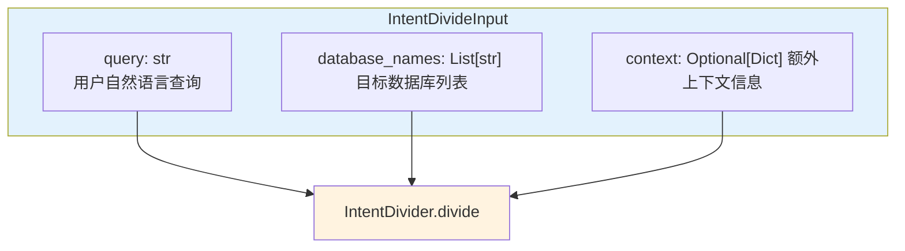

**示例输入**：
```python
{
    "query": "检查用户表中手机号格式是否正确，订单表中是否存在空值，以及订单金额是否等于单价乘以数量",
    "database_names": ["industrial_monitoring"]
}
```

### 6.2 输出协议

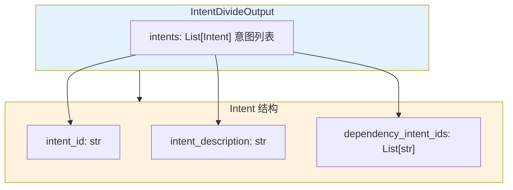

**示例输出**：
```python
{
    "intents": [
        {
            "intent_id": "intent_001",
            "intent_description": "检查用户表中手机号格式是否正确",
            "dependency_intent_ids": []
        },
        {
            "intent_id": "intent_002",
            "intent_description": "检查订单表中是否存在空值",
            "dependency_intent_ids": []
        },
        {
            "intent_id": "intent_003",
            "intent_description": "检查订单总金额是否等于单价乘以数量",
            "dependency_intent_ids": []
        }
    ]
}
```

### 6.3 审计轨迹输出

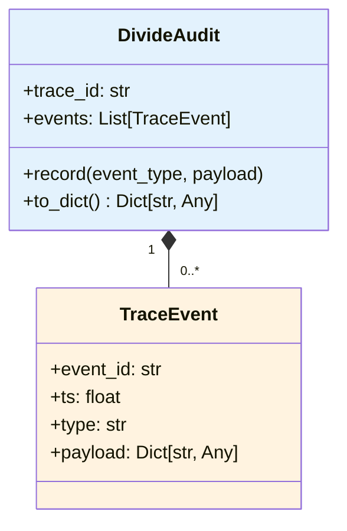

**事件类型**：
- `REQUEST`: 请求接收
- `ATTEMPT_START`: 尝试开始
- `ATTEMPT_OK`: 尝试成功
- `ATTEMPT_INVALID`: 校验失败
- `ATTEMPT_FAILED`: 运行时错误

---

## 七、完整运行流程

### 7.1 端到端处理流程

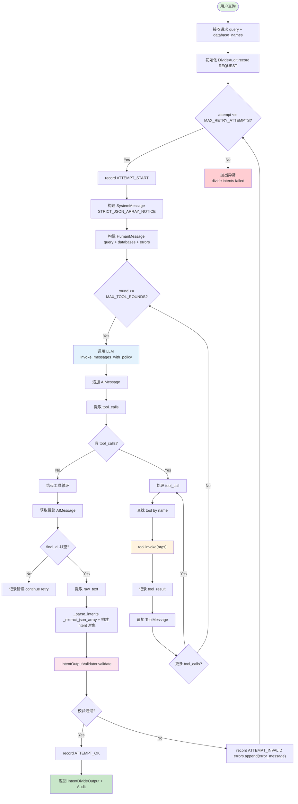

### 7.2 重试机制流程

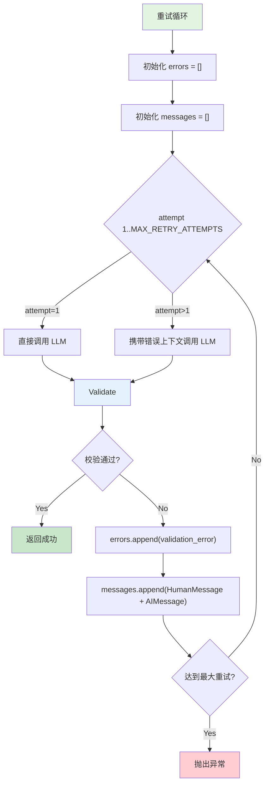

### 7.3 工具调用详细流程

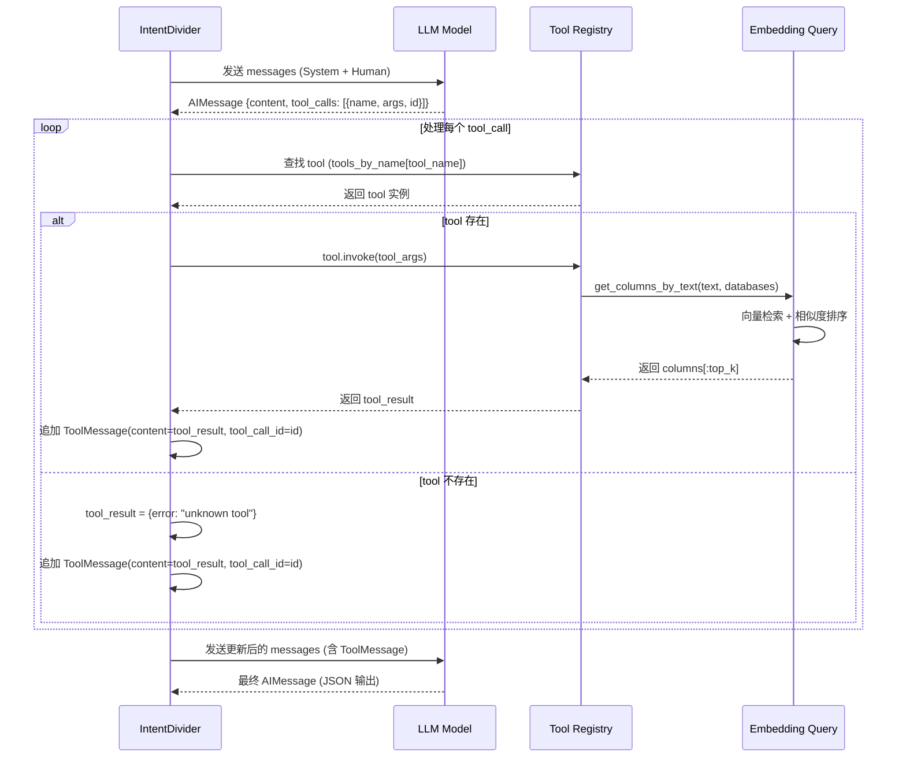

---

## 八、校验器详细设计

### 8.1 IntentOutputValidator 校验规则

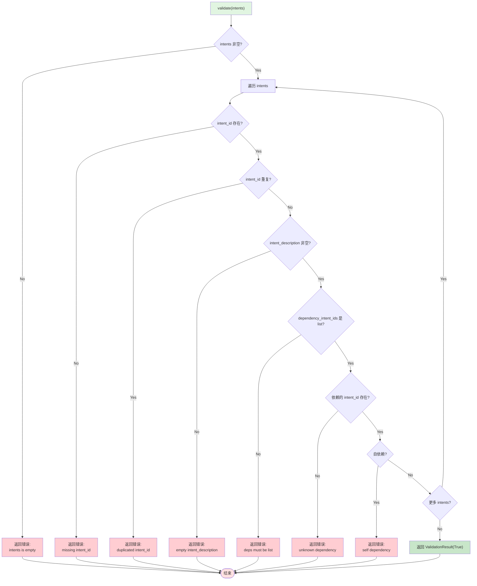

---

## 九、配置与参数

### 9.1 配置项

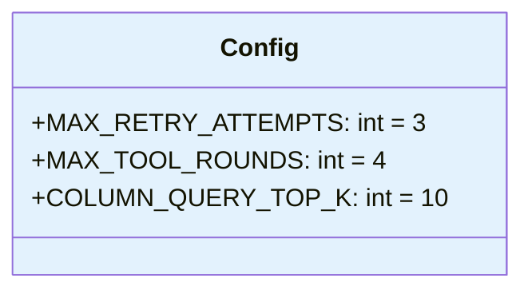

| 配置项 | 默认值 | 说明 |
|--------|--------|------|
| `MAX_RETRY_ATTEMPTS` | 3 | 最大重试次数 |
| `MAX_TOOL_ROUNDS` | 4 | 每轮尝试的最大工具调用轮数 |
| `COLUMN_QUERY_TOP_K` | 10 | 列信息查询返回的最大结果数 |

### 9.2 LLM 调用策略

```mermaid
flowchart TD
    Start[invoke_messages_with_policy] --> InitPolicy[default_llm_call_policy]
    InitPolicy --> InvokeLLM[调用 LLM]
    InvokeLLM --> HasResponse{有响应?}

    HasResponse -->|No| CheckRetry{重试次数 < max?}
    HasResponse -->|Yes| Return[返回响应]

    CheckRetry -->|Yes| Retry[重试调用]
    CheckRetry -->|No| Raise[抛出异常]

    Retry --> InvokeLLM

    style Start fill:#e1f5e1
    style Return fill:#c8e6c9
    style Raise fill:#ffcdd2
    style InvokeLLM fill:#e3f2fd
```

---

## 十、错误处理

### 10.1 错误类型与处理

```mermaid
flowchart TD
    subgraph Errors[错误类型]
        E1[JSON 解析失败]
        E2[校验失败]
        E3[工具调用失败]
        E4[LLM 调用失败]
        E5[运行时异常]
    end

    subgraph Handling[处理策略]
        H1[重试机制]
        H2[错误上下文累积]
        H3[友好错误信息]
        H4[审计轨迹记录]
    end

    E1 --> H1
    E2 --> H1
    E3 --> H2
    E4 --> H3
    E5 --> H4

    style Errors fill:#ffe1e1
    style Handling fill:#e1f5e1
```

### 10.2 错误信息构建

```mermaid
flowchart TD
    Start[构建错误上下文] --> InitErrors["errors = []"]
    InitErrors --> Loop{遍历 intents}

    Loop --> CheckField{检查字段}
    CheckField --> Missing[字段缺失]
    CheckField --> Invalid[字段无效]
    CheckField --> Mismatch[字段不匹配]

    Missing --> AppendErr["errors.append(error_message)"]
    Invalid --> AppendErr
    Mismatch --> AppendErr

    AppendErr --> Next{更多错误?}
    Next -->|Yes| Loop
    Next -->|No| BuildPrompt[构建 HumanMessage<br/>包含 errors 列表]

    BuildPrompt --> SendLLM[发送给 LLM 修正]

    style Start fill:#e1f5e1
    style SendLLM fill:#e3f2fd
    style AppendErr fill:#ffcdd2
```

---

## 十一、审计与追溯

### 11.1 审计事件流

```mermaid
sequenceDiagram
    participant U as User
    participant D as IntentDivider
    participant A as DivideAudit

    U->>D: divide(query, database_names)
    D->>A: record(REQUEST, {query_preview, database_names})

    loop 每次尝试
        D->>A: record(ATTEMPT_START, {attempt})
        alt 校验通过
            D->>A: record(ATTEMPT_OK, {attempt, intent_count})
        else 校验失败
            D->>A: record(ATTEMPT_INVALID, {attempt, error})
        else 运行时错误
            D->>A: record(ATTEMPT_FAILED, {attempt, error})
        end
    end

    D-->>U: 返回 IntentDivideOutput + Audit
```

### 11.2 审计轨迹结构

```mermaid
classDiagram
    class DivideAudit {
        +trace_id: str
        +events: List[TraceEvent]
        +record(type, payload)
        +to_dict() Dict
    }

    class TraceEvent {
        +event_id: str
        +ts: float
        +type: str
        +payload: Dict
    }

    DivideAudit "1" *-- "0..*" TraceEvent

    style DivideAudit fill:#e3f2fd
    style TraceEvent fill:#fff3e0
```

**示例审计轨迹**：
```json
{
    "trace_id": "trace_abc123",
    "events": [
        {
            "event_id": "evt_xyz789",
            "ts": 1234567890.123,
            "type": "REQUEST",
            "payload": {
                "query_preview": "检查用户表中手机号格式是否正确",
                "database_names": ["industrial_monitoring"]
            }
        },
        {
            "event_id": "evt_abc456",
            "ts": 1234567891.456,
            "type": "ATTEMPT_START",
            "payload": {"attempt": 1}
        },
        {
            "event_id": "evt_def789",
            "ts": 1234567892.789,
            "type": "ATTEMPT_OK",
            "payload": {"attempt": 1, "intent_count": 3}
        }
    ]
}
```

---

## 十二、设计决策说明

### 12.1 为什么不在意图分解阶段识别精确表名和列名？

```mermaid
flowchart TD
    subgraph Reasons[设计理由]
        R1[无 Schema 信息<br/>意图分解阶段没有访问数据库 Schema 的权限]
        R2[职责分离<br/>精确匹配在 Schema 构建阶段完成]
        R3[灵活性<br/>语义描述可处理同义词/模糊匹配]
        R4[符合设计<br/>基于实体识别与依赖分析]
    end

    subgraph Workflow[工作流程]
        W1[意图分解<br/>实体语义描述与依赖识别]
        W2[Schema 构建<br/>向量检索找到精确表名/列名]
        W3[SQL 生成<br/>使用精确表名/列名生成 SQL]
    end

    Reasons --> Workflow
    W1 --> W2
    W2 --> W3

    style Reasons fill:#e3f2fd
    style Workflow fill:#fff3e0
```

### 12.2 为什么采用重试机制？

```mermaid
flowchart TD
    Start[LLM 输出不稳定性] --> Problems[问题]
    Problems --> P1[JSON 格式错误]
    Problems --> P2[字段缺失]
    Problems --> P3[枚举值不匹配]

    Problems --> Solution[重试机制]
    Solution --> S1[保留上下文]
    Solution --> S2[累积错误信息]
    Solution --> S3[清晰错误提示]

    S1 --> Benefit[提高输出质量]
    S2 --> Benefit
    S3 --> Benefit

    style Start fill:#e1f5e1
    style Benefit fill:#c8e6c9
    style Solution fill:#e3f2fd
```

### 12.3 为什么采用 LangChain Tool Calling？

```mermaid
flowchart TD
    subgraph Advantages[优势]
        A1[标准化接口]
        A2[自动参数校验]
        A3[错误处理封装]
        A4[多轮对话支持]
    end

    subgraph Tools[可用工具]
        T1[query_columns_by_text<br/>列信息语义检索]
    end

    Advantages --> Enable[支持工具调用]
    Tools --> Enable

    style Advantages fill:#c8e6c9
    style Tools fill:#e3f2fd
```

---

## 十三、性能优化建议

### 13.1 优化策略

```mermaid
flowchart TD
    subgraph Strategies[优化策略]
        S1[批量处理<br/>合并多个查询的意图分解]
        S2[结果缓存<br/>避免重复分解相同查询]
        S3[工具调用优化<br/>批量查询/缓存]
        S4[LLM 调用优化<br/>异步调用/超时控制]
    end

    S1 --> Impact[降低延迟<br/>提高吞吐量]
    S2 --> Impact
    S3 --> Impact
    S4 --> Impact

    style Strategies fill:#e3f2fd
    style Impact fill:#c8e6c9
```

### 13.2 缓存策略

```mermaid
flowchart TD
    Start[查询到达] --> HashKey[计算 query hash]
    HashKey --> CheckCache{缓存命中?}
    CheckCache -->|Yes| ReturnCache[返回缓存结果]
    CheckCache -->|No| Process[执行意图分解]
    Process --> CacheResult[缓存结果]
    CacheResult --> Return[返回结果]

    style Start fill:#e1f5e1
    style Return fill:#c8e6c9
    style CheckCache fill:#e3f2fd
    style ReturnCache fill:#c8e6c9
```

---

## 十四、测试用例设计

### 14.1 简单异常测试

```mermaid
flowchart TD
    Input["查询：检查用户表中手机号格式是否正确"] --> Expected["期望输出:<br/>单个 intent，description 描述该检查"]
    Input --> Process[IntentDivider.divide]
    Process --> Validate[校验输出]
    Validate --> Assert{断言通过?}
    Assert -->|Yes| Pass[测试通过]
    Assert -->|No| Fail[测试失败]

    style Input fill:#e1f5e1
    style Expected fill:#e3f2fd
    style Pass fill:#c8e6c9
    style Fail fill:#ffcdd2
```

### 14.2 多意图测试

```mermaid
flowchart TD
    Input["查询：检查用户表中手机号格式是否正确，<br/>订单表中是否存在空值"] --> Expected["期望输出:<br/>intent_count=2<br/>1. PHONE_FORMAT_INVALID<br/>2. NULL_CHECK"]
    Input --> Process[IntentDivider.divide]
    Process --> Validate[校验输出]
    Validate --> Assert{断言通过?}
    Assert -->|Yes| Pass[测试通过]
    Assert -->|No| Fail[测试失败]

    style Input fill:#e1f5e1
    style Expected fill:#e3f2fd
    style Pass fill:#c8e6c9
    style Fail fill:#ffcdd2
```

### 14.3 依赖关系测试

```mermaid
flowchart TD
    Input["查询：检查订单中的客户 ID 是否在客户表中存在，<br/>以及订单总金额是否等于单价乘以数量"] --> Expected["期望输出:<br/>intent_count=2<br/>1. DIRTY_DATA_REFERENCE<br/>2. RELATED_DATA_INCONSISTENT<br/>   dependency_intent_ids=[intent_001]"]
    Input --> Process[IntentDivider.divide]
    Process --> Validate[校验输出]
    Validate --> Assert{断言通过?}
    Assert -->|Yes| Pass[测试通过]
    Assert -->|No| Fail[测试失败]

    style Input fill:#e1f5e1
    style Expected fill:#e3f2fd
    style Pass fill:#c8e6c9
    style Fail fill:#ffcdd2
```

---

## 十五、快速开始

### 15.1 基本用法

```python
from stages.intent_divide.divider import IntentDivider

# 创建意图分解器
divider = IntentDivider(
    model_name="qwen3-max",
    max_retry_attempts=3,
    verbose=True
)

# 执行意图分解
query = "检查用户表中手机号格式是否正确，订单表中是否存在空值"
database_names = ["industrial_monitoring"]

output = divider.divide(
    query=query,
    database_names=database_names
)

# 输出结果
for intent in output.intents:
    print(f"Intent ID: {intent.intent_id}")
    print(f"Description: {intent.intent_description}")
    print(f"ID: {intent.intent_id}, Description: {intent.intent_description}")
    print(f"Dependencies: {intent.dependency_intent_ids}")
    print("---")
```

### 15.2 带审计轨迹的用法

```python
from stages.intent_divide.divider import IntentDivider

divider = IntentDivider(verbose=True)

output, audit = divider.divide_with_audit(
    query=query,
    database_names=database_names
)

# 查看审计轨迹
import json
print(json.dumps(audit.to_dict(), indent=2, ensure_ascii=False))
```

### 15.3 输出示例

```json
{
    "intents": [
        {
            "intent_id": "intent_001",
            "intent_description": "检查用户表中手机号格式是否正确",
            "dependency_intent_ids": []
        },
        {
            "intent_id": "intent_002",
            "intent_description": "检查订单表中是否存在空值",
            "dependency_intent_ids": []
        }
    ]
}
```

---

## 十六、文件结构

```
stages/intent_divide/
├── __init__.py              # 模块入口，导出 IntentDivider
├── main.py                  # 主入口函数
├── divider.py               # IntentDivider 核心实现
├── models.py                # 数据模型定义 (Intent, IntentDivideOutput)
├── tools.py                 # LangChain 工具定义 (query_columns_by_text_tool)
├── validator.py             # 输出校验器 (IntentOutputValidator)
├── config.py                # 配置变量 (MAX_RETRY_ATTEMPTS, MAX_TOOL_ROUNDS)
├── tracing.py               # 审计轨迹记录 (DivideAudit, TraceEvent)
└── plan.md                  # 实现计划文档
└── README.md                # 本设计文档
```

---

## 十七、与后续阶段的集成

### 17.1 与 DAG Scheduler 的集成

```mermaid
flowchart TD
    subgraph IntentDivide[Intent Divide]
        ID[IntentDivider]
        IDOut[IntentDivideOutput]
    end

    subgraph DAG[DAG Scheduler]
        BuildState[build_global_state]
        IntentMap[IntentNode map]
    end

    subgraph Runtime[Intent Runtime]
        Coordinator[IntentSQLCoordinator]
    end

    ID --> IDOut
    IDOut --> BuildState
    BuildState --> IntentMap
    IntentMap --> Coordinator

    style IntentDivide fill:#e3f2fd
    style DAG fill:#fff3e0
    style Runtime fill:#fce4ec
```

### 17.2 Intent 到 IntentNode 的映射

```mermaid
flowchart TD
    Intent[Intent<br/>intent_id<br/>intent_description<br/>dependency_intent_ids] --> Mapping[映射到 IntentNode]
    Mapping --> Node[IntentNode<br/>intent_id<br/>description<br/>deps<br/>status=PENDING<br/>artifacts.intent_meta]

    Node --> Artifacts["artifacts.intent_meta:<br/>- exception_category<br/>- exception_type"]

    style Intent fill:#e3f2fd
    style Node fill:#fff3e0
    style Artifacts fill:#fce4ec
```