# SQL Generation 阶段 - 设计方案与技术实现

## 概述

SQL Generation 阶段负责将结构化的意图（Intent）转换为可执行的 SQL 查询。该阶段采用**自研 DAG 调度系统**协调具有依赖关系的多个意图，使用**AutoLink 模式发现引擎**进行动态模式解析，并实现了带有**多阶段执行流水线**和**内置澄清对话机制**的完整处理流程。

---

## 系统架构

### 核心组件结构

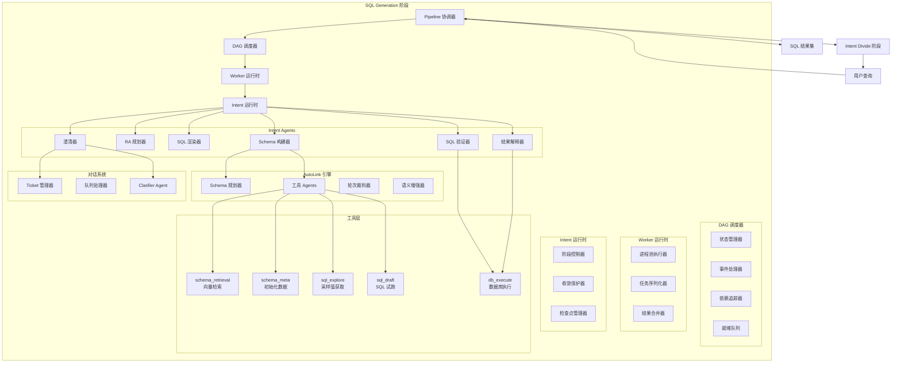

### 模块依赖关系

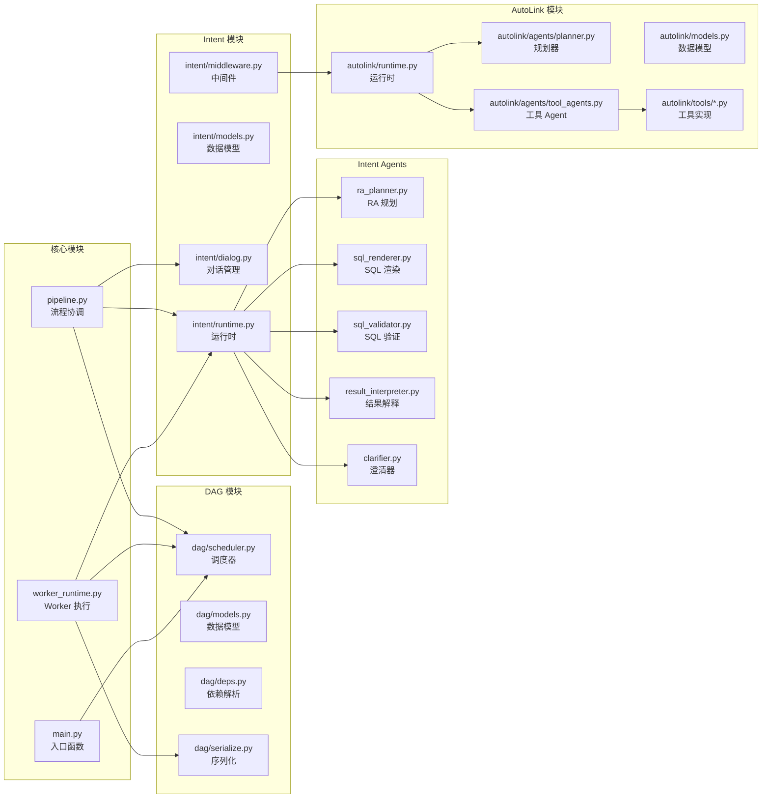

---

## 数据流设计

### 端到端处理流程

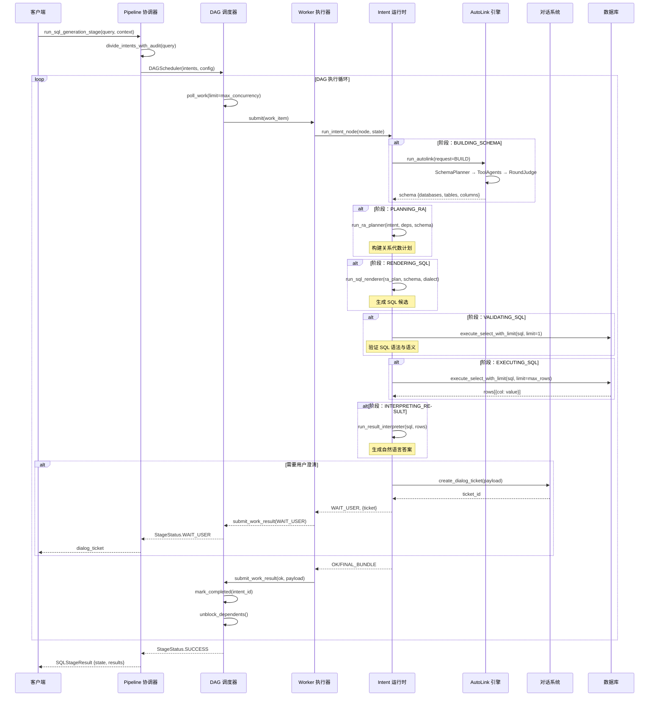

### Intent 阶段状态机

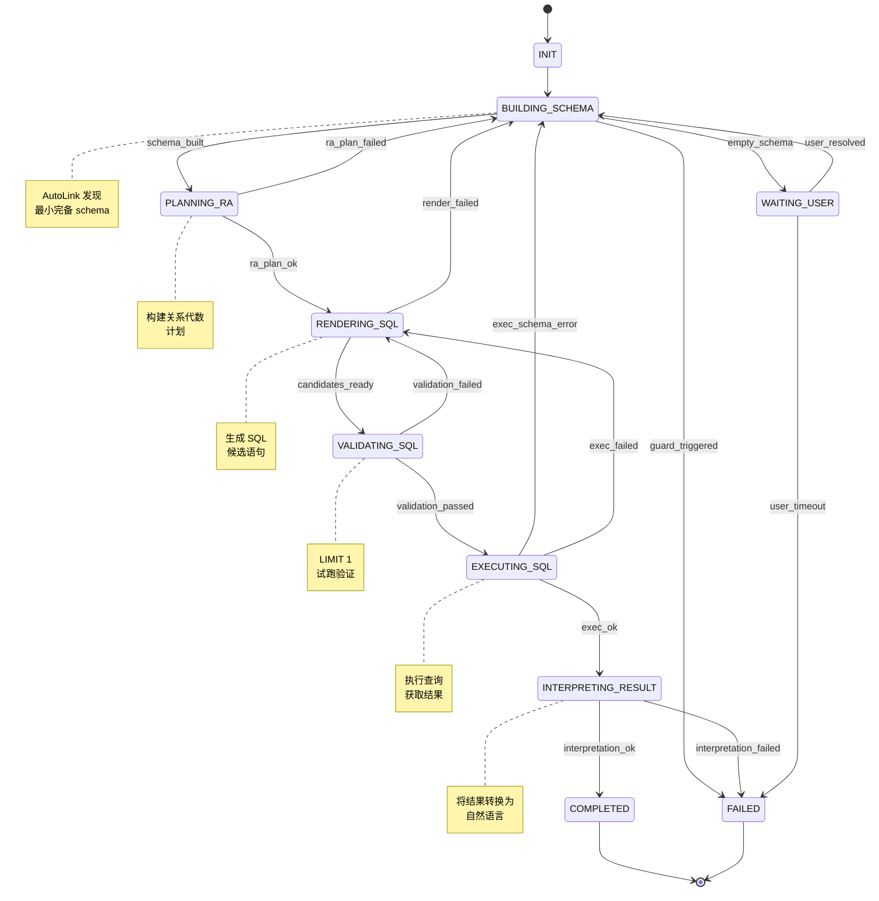

### DAG 调度器状态转换

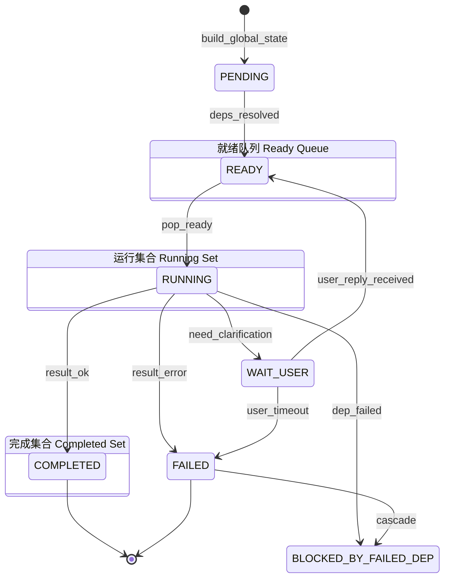

### AutoLink 引擎工作流程

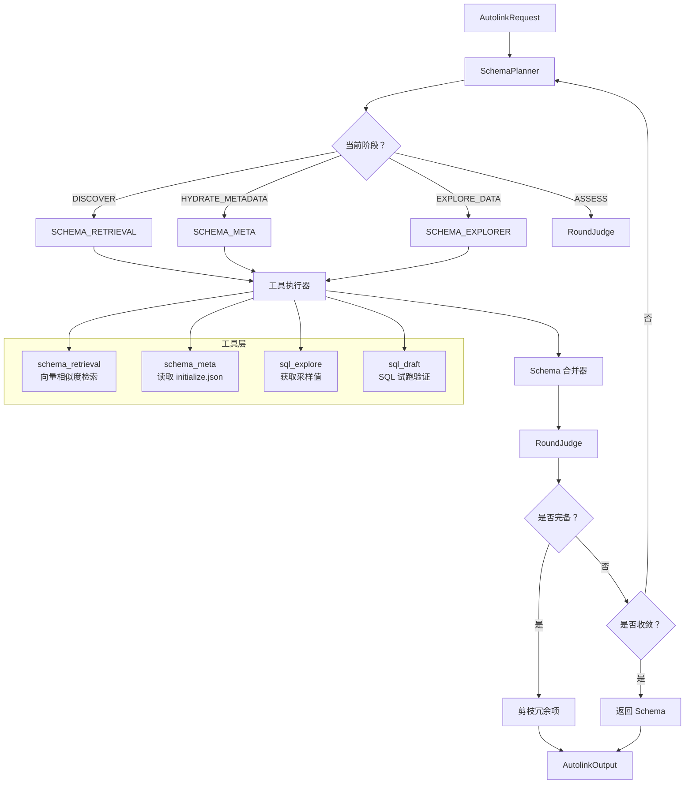

---

## 核心协议设计

### 1. DAG 调度协议

**状态机流转：**

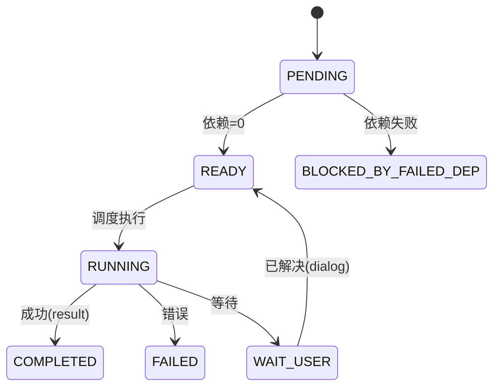

**事件类型：**

| 事件 | 含义 |
|------|------|
| INTENT_READY | 依赖已解析，加入就绪队列 |
| INTENT_COMPLETED | 执行成功，解锁依赖节点 |
| INTENT_FAILED | 执行失败，级联阻塞依赖节点 |
| INTENT_WAIT_USER | 需要用户澄清 |
| USER_REPLY_RECEIVED | 用户已回复，恢复执行 |
| NODE_BLOCKED | 被失败的依赖节点阻塞 |

### 2. Worker 通信协议

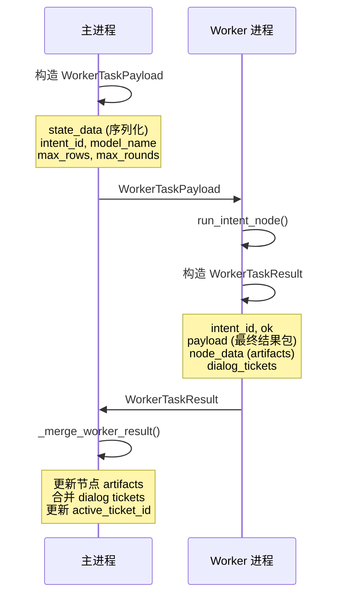

- **序列化方式**：同进程内做 state 快照与合并（dict 序列化）。
- **隔离性**：每个 Worker 接收完整的状态快照。

### 3. 对话澄清协议

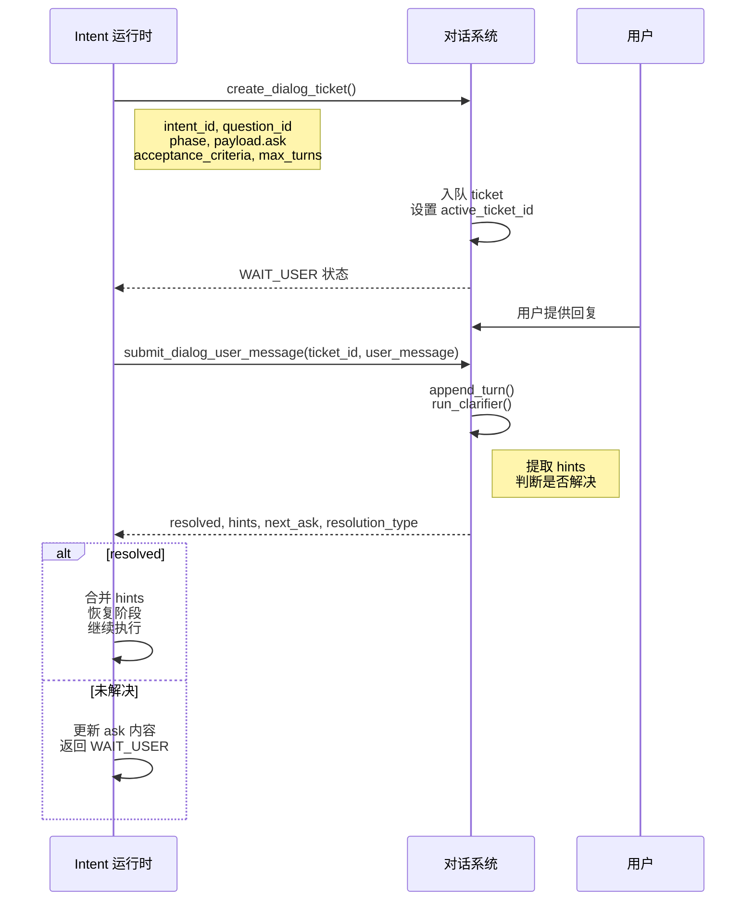

**解决类型：**

| 类型 | 含义 |
|------|------|
| RESOLVED | 用户提供了充分的澄清信息 |
| ASSUMPTIVE | 达到最大轮次，尽力恢复执行 |
| ABANDONED | 用户明确放弃 |

### 4. AutoLink Schema 发现协议

**四个阶段：**

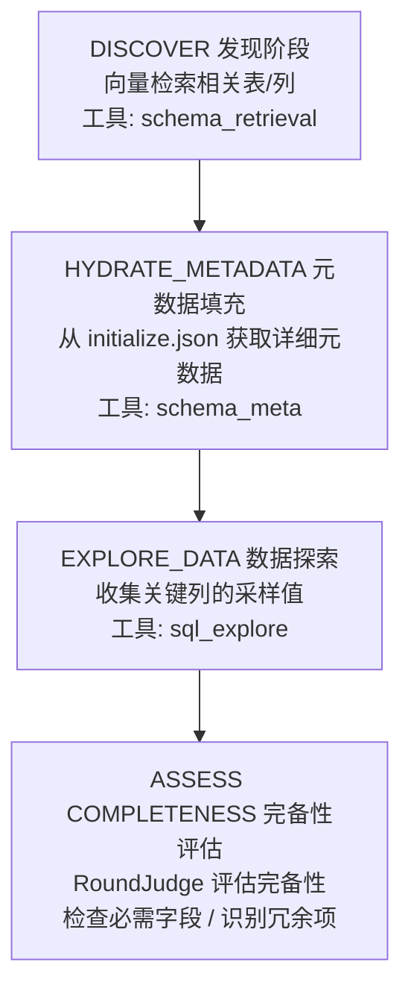

**RoundJudge 决策逻辑：**

- `should_stop = (所有必需字段已存在 AND schema 连续 N 轮未变化) OR 达到最大轮次`
- `redundant_items = 未在任何工具结果映射中引用的列/表`

**输出：**

- **schema**：最小完备 schema（含表、列、键）
- **audit**：所有阶段、工具调用、决策的追踪记录
- **status**：SUCCESS | PARTIAL_SUCCESS | FAILED

---

## 收敛保护机制

```mermaid
graph TB
    A[Intent 运行时循环] --> B{阶段执行}
    B --> C[应用 Artifacts]
    C --> D[更新 Guard 状态]
    
    D --> E{状态指纹是否变化？}
    E -->|否 | F[no_progress_rounds++]
    E -->|是 | G[no_progress_rounds=0]
    
    F --> H{no_progress_rounds >= 3?}
    H -->|是 | I[触发：no_progress]
    H -->|否 | J{错误类型是否重复？}
    
    G --> J
    
    J -->|是 | K[repeated_error_classes[class]++]
    J -->|否 | L[记录阶段边]
    
    K --> M{计数 > 2?}
    M -->|是 | N[触发：repeated_error]
    M -->|否 | O[继续循环]
    
    L --> O
    
    I --> P[标记 Intent 为 FAILED]
    N --> P
    
    O --> Q{还有迭代次数？}
    Q -->|是 | B
    Q -->|否 | R[触发：max_iterations]
    R --> P
    
    style I fill:#ff6b6b
    style N fill:#ff6b6b
    style R fill:#ff6b6b
    style P fill:#ff6b6b
```

### 保护机制说明

| 保护类型 | 触发条件 | 处理方式 |
|---------|---------|---------|
| 无进展保护 | 状态指纹连续 3 轮未变化 | 标记 FAILED |
| 重复错误保护 | 同一错误类型出现 >2 次 | 标记 FAILED |
| 迭代次数保护 | 超过最大迭代次数 (12) | 标记 FAILED |

---

## 接口规范

### Pipeline API

```python
# 初始执行
result = run_sql_generation_stage(
    query: str,
    context: Dict[str, Any],  # database_scope, max_rows, sql_dialect
    model_name: str = "qwen3-max",
    max_concurrency: int = 3,
) -> SQLStageResult

# 用户澄清后恢复执行
result = resume_sql_generation_stage_after_user_reply(
    state: GlobalState,  # 从上次结果持久化的状态
    ticket_id: str,
    user_message: str,
    context: Optional[Dict[str, Any]] = None,
    model_name: str = "qwen3-max",
) -> SQLStageResult
```

### SQLStageResult 结构

```python
@dataclass
class SQLStageResult:
    status: StageStatus  # SUCCESS | WAIT_USER | FAILED
    state: GlobalState   # 完整 DAG 状态及所有 artifacts
    dialog_ticket: Optional[Dict[str, Any]]  # WAIT_USER 时存在
    error: str  # FAILED 时存在
```

### GlobalState 结构

```python
@dataclass
class GlobalState:
    intent_map: Dict[str, IntentNode]      # 所有 Intent 节点
    ready_queue: List[str]                 # 就绪 Intent ID
    running_set: Set[str]                  # 运行中 Intent ID
    completed_set: Set[str]                # 已完成 Intent ID
    dependency_index: Dict[str, List[str]] # 反向依赖图
    remaining_deps_count: Dict[str, int]   # 每个 Intent 未解析依赖数
    dialog_state: DialogState              # Dialog tickets 及队列
    config: Dict[str, Any]                 # 运行时配置
    audit_log: List[Dict[str, Any]]        # 事件审计日志
```

### IntentNode Artifacts

```python
@dataclass
class IntentNode:
    intent_id: str
    description: str
    deps: List[str]
    status: NodeStatus
    artifacts: Dict[str, Any] = {
        "intent_meta": {...},
        "schema": {...},           # 来自 AutoLink
        "ra_plan": {...},          # 关系代数计划
        "sql_candidates": [...],   # 生成的 SQL 候选
        "validations": [...],      # 验证报告
        "exec_result": {...},      # 执行结果
        "exec_raw": {...},         # 原始数据行
        "user_hints": {...},       # 来自对话澄清
        "facts_bundle": {...},     # 派生事实
        "checkpoint": {...},       # 阶段检查点
        "guard": {...},            # 收敛保护状态
        "final": {...},            # 最终结果包
    }
```

---

## 错误处理

### 错误分类表

| 错误类型 | 触发条件 | 恢复策略 |
|---------|---------|---------|
| `empty_schema` | AutoLink 返回空 schema | 对话澄清 |
| `ra_plan_failed` | 无法构建 RA 计划 | 返回 schema 构建 |
| `sql_render_failed` | 无法生成 SQL | 返回 RA 规划 |
| `sql_validate_failed` | 所有候选 SQL 验证失败 | 重新渲染 SQL |
| `sql_exec_schema_error` | 未知列/表 | 返回 schema 构建 |
| `sql_exec_failed` | SQL 运行时错误 | 重新渲染 SQL |
| `no_progress` | 状态 3 轮无变化 | 标记失败 |
| `repeated_error` | 同错误 >2 次 | 标记失败 |
| `iteration_limit` | 超过最大迭代 | 标记失败 |

### 级联失败传播

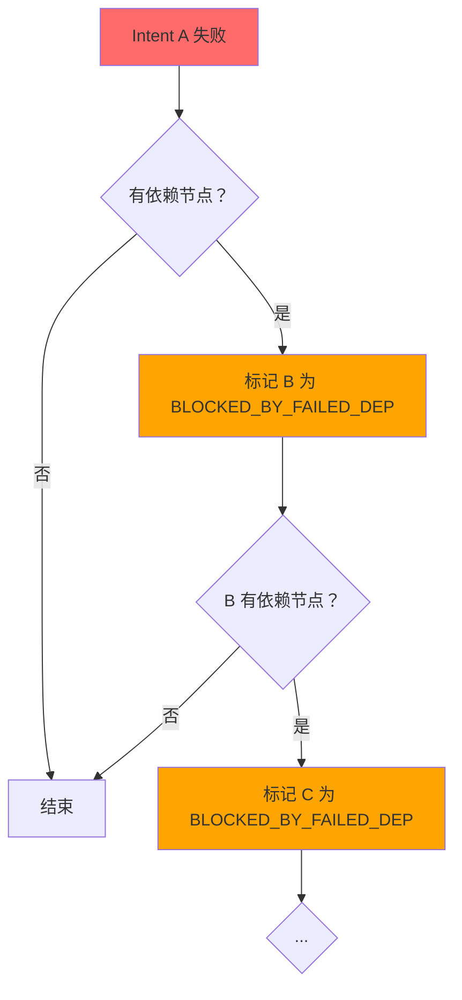

---

## 性能与资源配置

### 并发控制

- **max_concurrency**: 限制并行 Intent 执行数（默认：3）
- **Worker Pool**: 单进程多线程（每个 Intent 基于 state 快照执行，完成后合并结果）
- **State Serialization**: dict 快照（无 pickle / 无进程边界）

### 资源限制参数

| 参数 | 默认值 | 用途 |
|-----|-------|-----|
| `max_rows` | 100 | 限制结果集大小 |
| `max_rounds_per_intent` | 4 | 最大迭代轮次 |
| `max_runtime_iterations` | 12 | 最大阶段转换次数 |
| `max_no_progress_rounds` | 3 | 无进展保护阈值 |
| `max_repeated_error_class` | 2 | 重复错误保护阈值 |
| `max_meta_tables` | 8 | AutoLink schema 数量限制 |

---

## 审计与追踪

每次执行都会生成完整的审计日志：

```python
state.audit_log = [
    {"event": "intent_divide", "audit": {...}},
    {"event": "build", "node_count": N, "ready_count": M},
    {"event": "scheduler_event_emitted", "event_type": "INTENT_READY", ...},
    {"event": "dispatch", "intent_ids": [...]},
    {"event": "complete", "intent_id": "..."},
    {"event": "drain_events", "count": N},
    ...
]
```

每个 Intent 的 `final` artifact 包含：
- `audit`: Intent 运行时的完整追踪
- `facts_bundle`: 派生事实、指标、约束
- `schema`: 最终使用的 schema
- `exec_raw`: 执行结果数据
