# AutoLink 多 Agent Schema 链接系统

## 一、系统概述

### 1.1 设计目标

AutoLink 是一个**多 Agent 协作的 Schema 链接系统**，用于将自然语言查询需求转换为**最小完备的数据库 Schema 描述**（db-tb-column 三层 JSON），支持后续 SQL 生成。

**核心设计原则**：

1. **最小完备性**：输出满足 SQL 生成所需的最小 schema，避免冗余
2. **多 Agent 协作**：Planner → Tool Agents → Judge 的迭代式工作流
3. **本地优先**：优先使用 initialize JSON 元数据，DB 查询作为 fallback
4. **可追溯性**：完整审计轨迹（Audit Trace）记录所有决策过程

### 1.2 系统架构

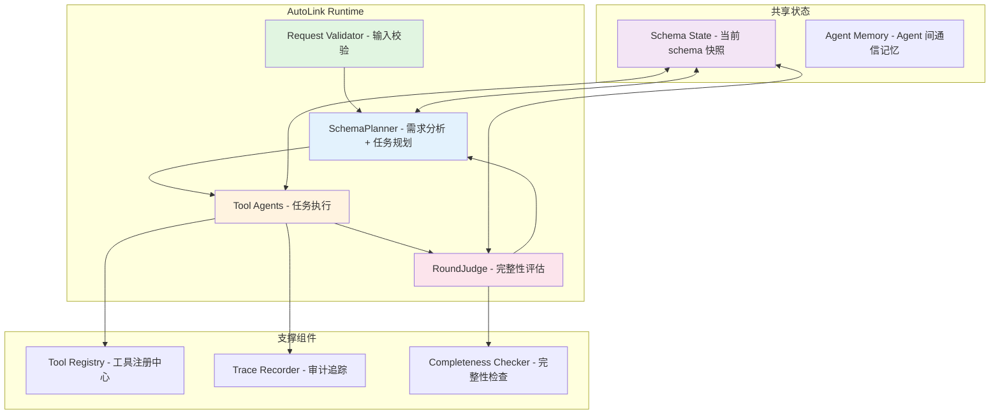
```mermaid
flowchart TB
    subgraph Runtime["AutoLink Runtime"]
        RequestValidator["Request Validator - 输入校验"]
        SchemaPlanner["SchemaPlanner - 需求分析 + 任务规划"]
        ToolAgents["Tool Agents - 任务执行"]
        RoundJudge["RoundJudge - 完整性评估"]
    end

    subgraph Support["支撑组件"]
        ToolRegistry["Tool Registry - 工具注册中心"]
        TraceRecorder["Trace Recorder - 审计追踪"]
        CompletenessChecker["Completeness Checker - 完整性检查"]
    end

    subgraph State["共享状态"]
        SchemaState["Schema State - 当前 schema 快照"]
        AgentMemory["Agent Memory - Agent 间通信记忆"]
    end

    RequestValidator --> SchemaPlanner
    SchemaPlanner --> ToolAgents
    ToolAgents --> RoundJudge
    RoundJudge --> SchemaPlanner

    SchemaState <--> SchemaPlanner
    SchemaState <--> ToolAgents
    SchemaState <--> RoundJudge

    ToolAgents --> ToolRegistry
    ToolAgents --> TraceRecorder
    RoundJudge --> CompletenessChecker

    style RequestValidator fill:#e1f5e1
    style SchemaPlanner fill:#e3f2fd
    style ToolAgents fill:#fff3e0
    style RoundJudge fill:#fce4ec
    style SchemaState fill:#f3e5f5
```

---

## 二、数据模型设计

### 2.1 核心 Schema 结构（三层模型）

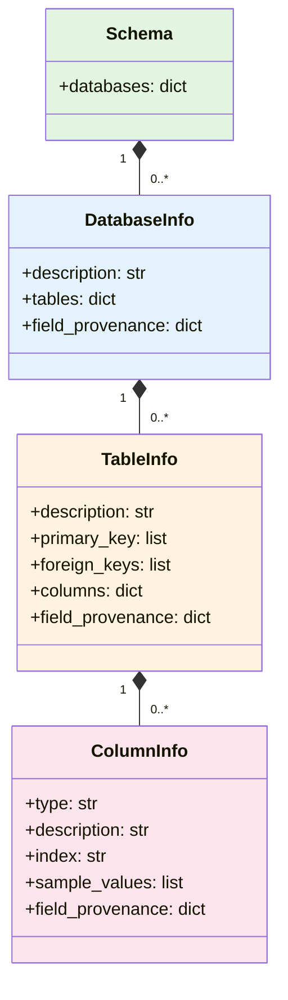
```mermaid
classDiagram
    class Schema
    class DatabaseInfo
    class TableInfo
    class ColumnInfo

    Schema "1" *-- "0..*" DatabaseInfo
    DatabaseInfo "1" *-- "0..*" TableInfo
    TableInfo "1" *-- "0..*" ColumnInfo

    class Schema {
        +databases: dict
    }
    class DatabaseInfo {
        +description: str
        +tables: dict
        +field_provenance: dict
    }
    class TableInfo {
        +description: str
        +primary_key: list
        +foreign_keys: list
        +columns: dict
        +field_provenance: dict
    }
    class ColumnInfo {
        +type: str
        +description: str
        +index: str
        +sample_values: list
        +field_provenance: dict
    }

    style Schema fill:#e1f5e1
    style DatabaseInfo fill:#e3f2fd
    style TableInfo fill:#fff3e0
    style ColumnInfo fill:#fce4ec
```

### 2.2 输入/输出协议

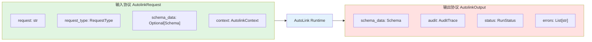
```mermaid
flowchart LR
    subgraph Input["输入协议 AutolinkRequest"]
        I1["request: str"]
        I2["request_type: RequestType"]
        I3["schema_data: Optional[Schema]"]
        I4["context: AutolinkContext"]
    end

    subgraph Output["输出协议 AutolinkOutput"]
        O1["schema_data: Schema"]
        O2["audit: AuditTrace"]
        O3["status: RunStatus"]
        O4["errors: List[str]"]
    end

    Input --> AutoLink["AutoLink Runtime"]
    AutoLink --> Output

    style Input fill:#e1f5e1
    style Output fill:#ffe1e1
    style AutoLink fill:#e3f2fd
```

---

## 三、Agent 角色与协作

### 3.1 Agent 角色定义

| Agent | 职责 | 可用工具 | 输出类型 |
|-------|------|---------|---------|
| **SchemaPlanner** | 需求分析、任务规划 | 无（纯 LLM） | `PlannerOutput` |
| **SchemaRetrievalAgent** | 语义检索表/列 | `schema_retrieval` | `SchemaWritePlan` |
| **SchemaMetaAgent** | 获取表结构/主外键 | `schema_meta` | `SchemaWritePlan` |
| **SchemaExplorerAgent** | 执行 SQL 探索数据 | `sql_explore`, `sql_draft` | `ResultMapping` |
| **RoundJudge** | 完整性评估、stop 决策 | 无（纯 LLM） | `RoundJudgeResult` |

### 3.2 Agent 协作流程

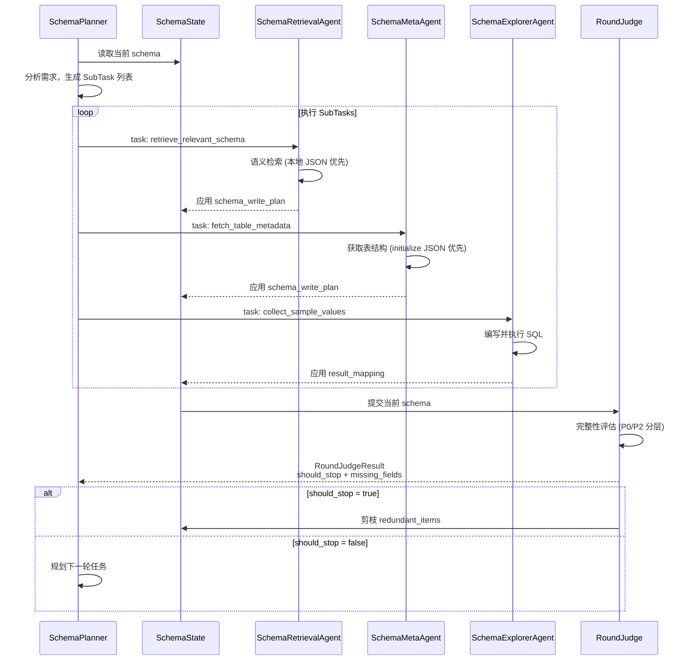
```mermaid
sequenceDiagram
    participant P as SchemaPlanner
    participant S as SchemaState
    participant R as SchemaRetrievalAgent
    participant M as SchemaMetaAgent
    participant E as SchemaExplorerAgent
    participant J as RoundJudge
    
    P->>S: 读取当前 schema
    P->>P: 分析需求，生成 SubTask 列表
    
    loop 执行 SubTasks
        P->>R: task: retrieve_relevant_schema
        R->>R: 语义检索 (本地 JSON 优先)
        R-->>S: 应用 schema_write_plan
        
        P->>M: task: fetch_table_metadata
        M->>M: 获取表结构 (initialize JSON 优先)
        M-->>S: 应用 schema_write_plan
        
        P->>E: task: collect_sample_values
        E->>E: 编写并执行 SQL
        E-->>S: 应用 result_mapping
    end
    
    S->>J: 提交当前 schema
    J->>J: 完整性评估 (P0/P2 分层)
    J-->>P: RoundJudgeResult<br/>should_stop + missing_fields
    
    alt should_stop = true
        J->>S: 剪枝 redundant_items
    else should_stop = false
        P->>P: 规划下一轮任务
    end
```

### 3.3 Agent 间通信协议

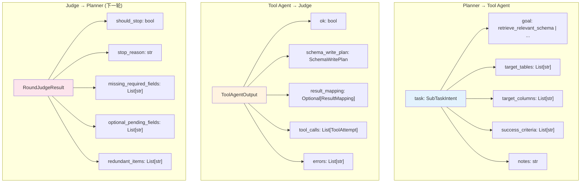
```mermaid
flowchart TD
    subgraph PlannerToTool[Planner → Tool Agent]
        PT1["task: SubTaskIntent"]
        PT1 --> PT2["goal: retrieve_relevant_schema | ..."]
        PT1 --> PT3["target_tables: List[str]"]
        PT1 --> PT4["target_columns: List[str]"]
        PT1 --> PT5["success_criteria: List[str]"]
        PT1 --> PT6["notes: str"]
    end
    
    subgraph ToolToJudge[Tool Agent → Judge]
        TT1["ToolAgentOutput"]
        TT1 --> TT2["ok: bool"]
        TT1 --> TT3["schema_write_plan: SchemaWritePlan"]
        TT1 --> TT4["result_mapping: Optional[ResultMapping]"]
        TT1 --> TT5["tool_calls: List[ToolAttempt]"]
        TT1 --> TT6["errors: List[str]"]
    end
    
    subgraph JudgeToPlanner["Judge → Planner (下一轮)"]
        JT1["RoundJudgeResult"]
        JT1 --> JT2["should_stop: bool"]
        JT1 --> JT3["stop_reason: str"]
        JT1 --> JT4["missing_required_fields: List[str]"]
        JT1 --> JT5["optional_pending_fields: List[str]"]
        JT1 --> JT6["redundant_items: List[str]"]
    end
    
    style PT1 fill:#e3f2fd
    style TT1 fill:#fff3e0
    style JT1 fill:#fce4ec
```

---

## 四、核心工具设计

### 4.1 工具注册中心

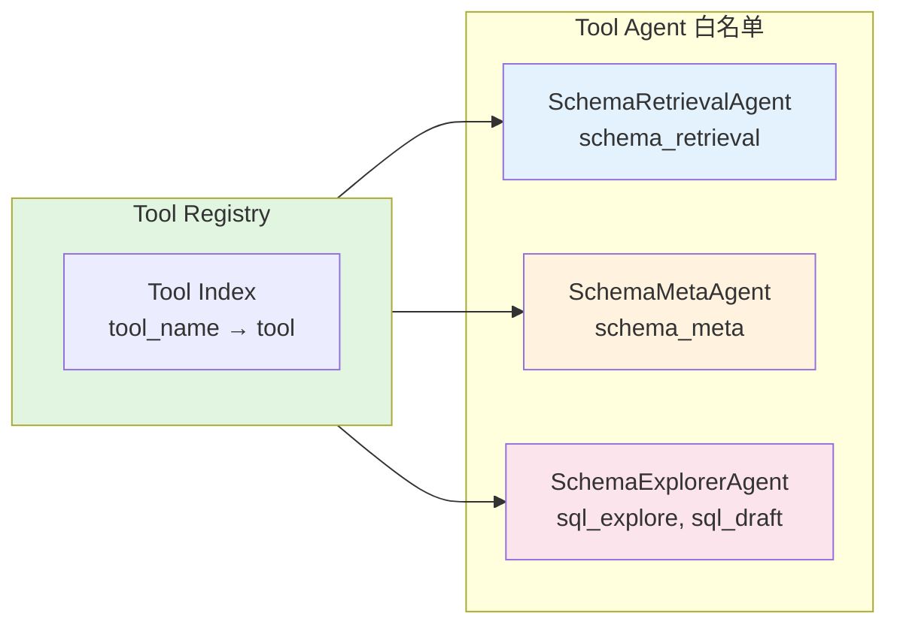
```mermaid
flowchart LR
    subgraph Registry[Tool Registry]
        R1[Tool Index<br/>tool_name → tool]
    end
    
    subgraph Agents[Tool Agent 白名单]
        A1[SchemaRetrievalAgent<br/>schema_retrieval]
        A2[SchemaMetaAgent<br/>schema_meta]
        A3[SchemaExplorerAgent<br/>sql_explore, sql_draft]
    end
    
    Registry --> A1
    Registry --> A2
    Registry --> A3
    
    style Registry fill:#e1f5e1
    style A1 fill:#e3f2fd
    style A2 fill:#fff3e0
    style A3 fill:#fce4ec
```

### 4.2 SchemaWritePlan 写入协议

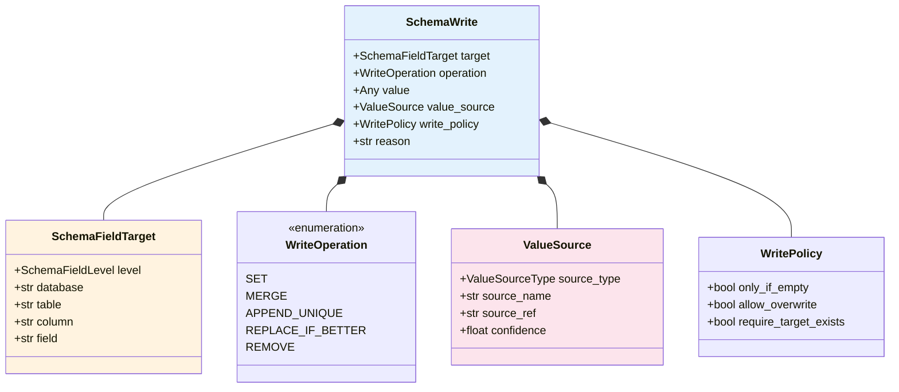
```mermaid
classDiagram
    class SchemaWrite {
        +SchemaFieldTarget target
        +WriteOperation operation
        +Any value
        +ValueSource value_source
        +WritePolicy write_policy
        +str reason
    }
    
    class SchemaFieldTarget {
        +SchemaFieldLevel level
        +str database
        +str table
        +str column
        +str field
    }
    
    class WriteOperation {
        <<enumeration>>
        SET
        MERGE
        APPEND_UNIQUE
        REPLACE_IF_BETTER
        REMOVE
    }
    
    class ValueSource {
        +ValueSourceType source_type
        +str source_name
        +str source_ref
        +float confidence
    }
    
    class WritePolicy {
        +bool only_if_empty
        +bool allow_overwrite
        +bool require_target_exists
    }
    
    SchemaWrite *-- SchemaFieldTarget
    SchemaWrite *-- WriteOperation
    SchemaWrite *-- ValueSource
    SchemaWrite *-- WritePolicy
    
    style SchemaWrite fill:#e3f2fd
    style SchemaFieldTarget fill:#fff3e0
    style ValueSource fill:#fce4ec
```

### 4.3 允许写入的字段（严格枚举约束）

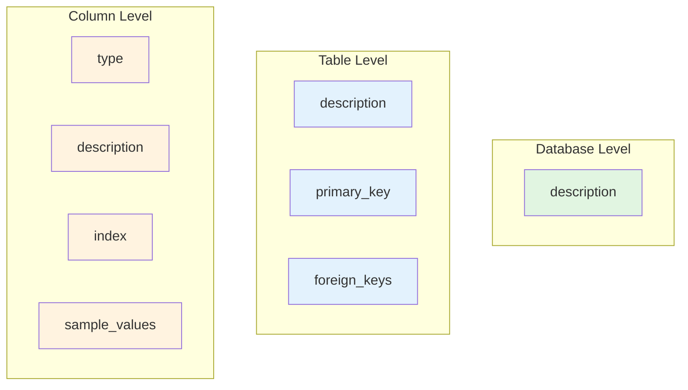
```mermaid
flowchart TD
    subgraph DatabaseLevel[Database Level]
        DB1[description]
    end
    
    subgraph TableLevel[Table Level]
        TB1[description]
        TB2[primary_key]
        TB3[foreign_keys]
    end
    
    subgraph ColumnLevel[Column Level]
        CL1[type]
        CL2[description]
        CL3[index]
        CL4[sample_values]
    end
    
    style DB1 fill:#e1f5e1
    style TB1 fill:#e3f2fd
    style TB2 fill:#e3f2fd
    style TB3 fill:#e3f2fd
    style CL1 fill:#fff3e0
    style CL2 fill:#fff3e0
    style CL3 fill:#fff3e0
    style CL4 fill:#fff3e0
```

---

## 五、运行时流程

### 5.1 主循环（Round-Based）

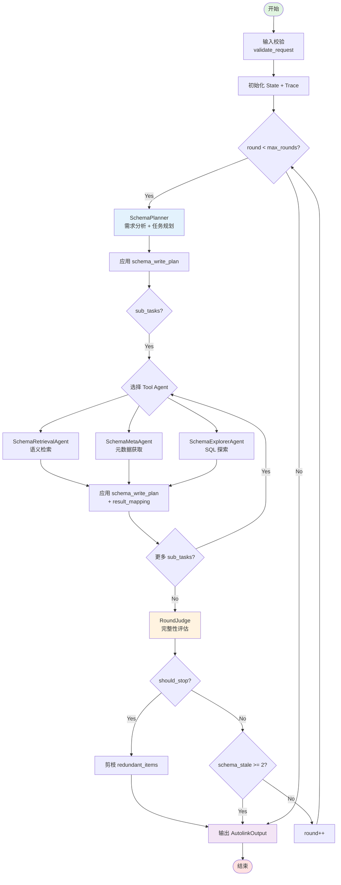
```mermaid
flowchart TD
    Start([开始]) --> Validate[输入校验<br/>validate_request]
    Validate --> Init[初始化 State + Trace]
    Init --> RoundLoop{round < max_rounds?}
    
    RoundLoop -->|Yes| Planner[SchemaPlanner<br/>需求分析 + 任务规划]
    Planner --> ApplyPlanner[应用 schema_write_plan]
    ApplyPlanner --> SubTaskLoop{sub_tasks?}
    
    SubTaskLoop -->|Yes| SelectAgent{选择 Tool Agent}
    SelectAgent --> Retrieval[SchemaRetrievalAgent<br/>语义检索]
    SelectAgent --> Meta[SchemaMetaAgent<br/>元数据获取]
    SelectAgent --> Explorer[SchemaExplorerAgent<br/>SQL 探索]
    
    Retrieval --> ApplyTool[应用 schema_write_plan<br/>+ result_mapping]
    Meta --> ApplyTool
    Explorer --> ApplyTool
    
    ApplyTool --> SubTaskDone{更多 sub_tasks?}
    SubTaskDone -->|Yes| SelectAgent
    SubTaskDone -->|No| Judge[RoundJudge<br/>完整性评估]
    
    Judge --> StopCheck{should_stop?}
    StopCheck -->|Yes| Prune[剪枝 redundant_items]
    Prune --> Output[输出 AutolinkOutput]
    
    StopCheck -->|No| StaleCheck{schema_stale >= 2?}
    StaleCheck -->|Yes| Output
    StaleCheck -->|No| RoundInc[round++]
    RoundInc --> RoundLoop
    
    RoundLoop -->|No| Output
    Output --> End([结束])
    
    style Start fill:#e1f5e1
    style End fill:#ffe1e1
    style Planner fill:#e3f2fd
    style Judge fill:#fff3e0
    style Output fill:#f3e5f5
```

### 5.2 SchemaPlanner 决策流程

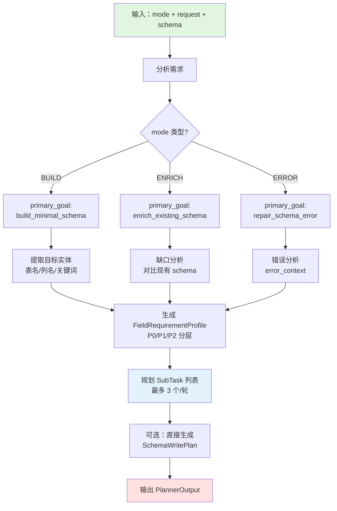
```mermaid
flowchart TD
    Input[输入：mode + request + schema] --> Analyze[分析需求]
    Analyze --> ModeCheck{mode 类型?}
    
    ModeCheck -->|BUILD| BuildGoal[primary_goal:<br/>build_minimal_schema]
    ModeCheck -->|ENRICH| EnrichGoal[primary_goal:<br/>enrich_existing_schema]
    ModeCheck -->|ERROR| RepairGoal[primary_goal:<br/>repair_schema_error]
    
    BuildGoal --> ExtractEntities[提取目标实体<br/>表名/列名/关键词]
    EnrichGoal --> GapAnalysis[缺口分析<br/>对比现有 schema]
    RepairGoal --> ErrorAnalysis[错误分析<br/>error_context]
    
    ExtractEntities --> GenRequirements[生成 FieldRequirementProfile<br/>P0/P1/P2 分层]
    GapAnalysis --> GenRequirements
    ErrorAnalysis --> GenRequirements
    
    GenRequirements --> PlanTasks[规划 SubTask 列表<br/>最多 3 个/轮]
    PlanTasks --> GenWritePlan[可选：直接生成<br/>SchemaWritePlan]
    GenWritePlan --> Output[输出 PlannerOutput]
    
    style Input fill:#e1f5e1
    style Output fill:#ffe1e1
    style PlanTasks fill:#e3f2fd
```

### 5.3 SchemaRetrievalAgent 执行流程

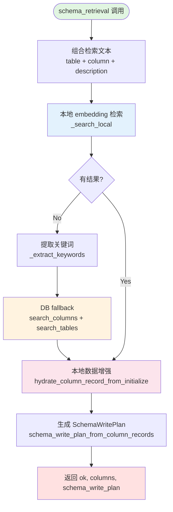
```mermaid
flowchart TD
    Start([schema_retrieval 调用]) --> CombineText[组合检索文本<br/>table + column + description]
    CombineText --> LocalSearch[本地 embedding 检索<br/>_search_local]
    LocalSearch --> HasResult{有结果?}
    
    HasResult -->|No| ExtractKW[提取关键词<br/>_extract_keywords]
    ExtractKW --> DBSearch[DB fallback<br/>search_columns + search_tables]
    DBSearch --> Hydrate
    HasResult -->|Yes| Hydrate[本地数据增强<br/>hydrate_column_record_from_initialize]
    
    Hydrate --> GenPlan[生成 SchemaWritePlan<br/>schema_write_plan_from_column_records]
    GenPlan --> Output[返回 ok, columns, schema_write_plan]
    
    style Start fill:#e1f5e1
    style Output fill:#ffe1e1
    style LocalSearch fill:#e3f2fd
    style DBSearch fill:#fff3e0
    style Hydrate fill:#fce4ec
```

### 5.4 SchemaMetaAgent 执行流程（Initialize JSON 优先）

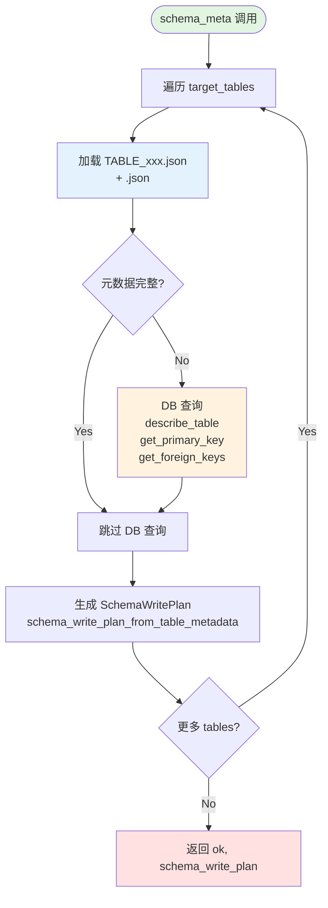
```mermaid
flowchart TD
    Start([schema_meta 调用]) --> Iterate[遍历 target_tables]
    Iterate --> LoadJSON[加载 TABLE_xxx.json<br/>+ <column>.json]
    LoadJSON --> Complete{元数据完整?}
    
    Complete -->|No| DBQuery[DB 查询<br/>describe_table<br/>get_primary_key<br/>get_foreign_keys]
    Complete -->|Yes| SkipDB
    DBQuery --> SkipDB[跳过 DB 查询]
    
    SkipDB --> GenPlan[生成 SchemaWritePlan<br/>schema_write_plan_from_table_metadata]
    GenPlan --> MoreTables{更多 tables?}
    MoreTables -->|Yes| Iterate
    MoreTables -->|No| Output[返回 ok, schema_write_plan]
    
    style Start fill:#e1f5e1
    style Output fill:#ffe1e1
    style LoadJSON fill:#e3f2fd
    style DBQuery fill:#fff3e0
```

### 5.5 SchemaExplorerAgent 执行流程

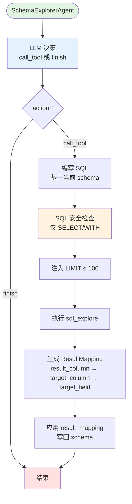
```mermaid
flowchart TD
    Start([SchemaExplorerAgent]) --> LLMDecision[LLM 决策<br/>call_tool 或 finish]
    LLMDecision --> ActionCheck{action?}
    
    ActionCheck -->|finish| Finish[结束]
    ActionCheck -->|call_tool| WriteSQL[编写 SQL<br/>基于当前 schema]
    
    WriteSQL --> SafetyCheck[SQL 安全检查<br/>仅 SELECT/WITH]
    SafetyCheck --> InjectLimit[注入 LIMIT ≤ 100]
    InjectLimit --> Execute[执行 sql_explore]
    Execute --> GenMapping[生成 ResultMapping<br/>result_column → target_column → target_field]
    GenMapping --> ApplyMapping[应用 result_mapping<br/>写回 schema]
    ApplyMapping --> Finish
    
    style Start fill:#e1f5e1
    style Finish fill:#ffe1e1
    style LLMDecision fill:#e3f2fd
    style SafetyCheck fill:#fff3e0
```

### 5.6 RoundJudge 决策流程

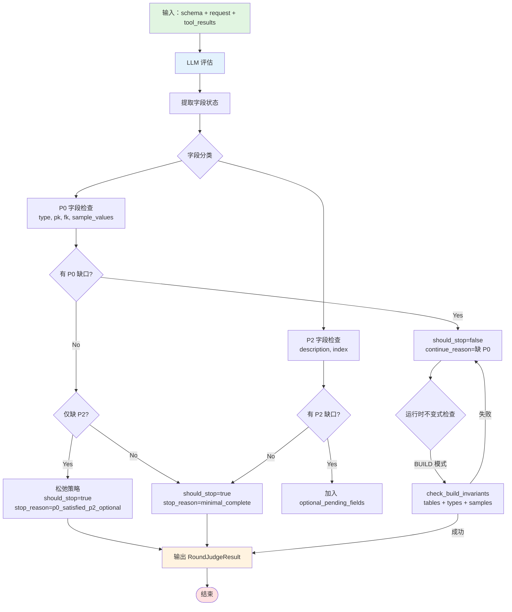
```mermaid
flowchart TD
    Input[输入：schema + request + tool_results] --> LLMJudge[LLM 评估]
    LLMJudge --> ExtractFields[提取字段状态]
    ExtractFields --> ClassifyFields{字段分类}
    
    ClassifyFields --> P0Check[P0 字段检查<br/>type, pk, fk, sample_values]
    ClassifyFields --> P2Check[P2 字段检查<br/>description, index]
    
    P0Check --> P0Missing{有 P0 缺口?}
    P2Check --> P2Missing{有 P2 缺口?}
    
    P0Missing -->|Yes| Continue[should_stop=false<br/>continue_reason=缺 P0]
    P0Missing -->|No| P2Check2{仅缺 P2?}
    
    P2Check2 -->|Yes| Relax[松弛策略<br/>should_stop=true<br/>stop_reason=p0_satisfied_p2_optional]
    P2Check2 -->|No| Complete[should_stop=true<br/>stop_reason=minimal_complete]
    
    P2Missing -->|Yes| Optional[加入 optional_pending_fields]
    P2Missing -->|No| Complete
    
    Continue --> RuntimeCheck{运行时不变式检查}
    Relax --> Output
    Complete --> Output
    
    RuntimeCheck -->|BUILD 模式| InvariantCheck[check_build_invariants<br/>tables + types + samples]
    InvariantCheck -->|失败| Continue
    InvariantCheck -->|成功| Output
    
    Output[输出 RoundJudgeResult] --> End([结束])
    
    style Input fill:#e1f5e1
    style End fill:#ffe1e1
    style LLMJudge fill:#e3f2fd
    style Output fill:#fff3e0
```

---

## 六、Schema 合并与写入

### 6.1 Schema 写入与合并流程

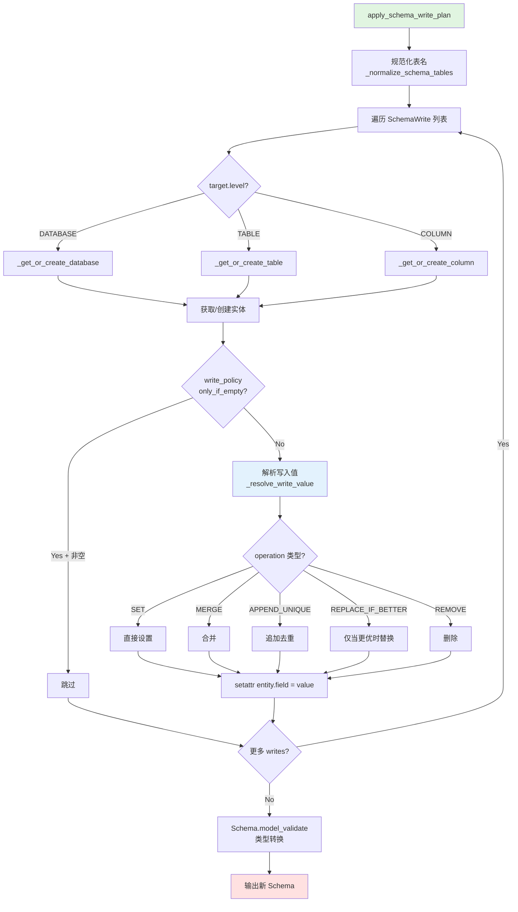
```mermaid
flowchart TD
    Start[apply_schema_write_plan] --> Normalize[规范化表名<br/>_normalize_schema_tables]
    Normalize --> Iterate[遍历 SchemaWrite 列表]
    
    Iterate --> LevelCheck{target.level?}
    LevelCheck -->|DATABASE| GetDB[_get_or_create_database]
    LevelCheck -->|TABLE| GetTable[_get_or_create_table]
    LevelCheck -->|COLUMN| GetColumn[_get_or_create_column]
    
    GetDB --> Entity[获取/创建实体]
    GetTable --> Entity
    GetColumn --> Entity
    
    Entity --> PolicyCheck{write_policy<br/>only_if_empty?}
    PolicyCheck -->|Yes + 非空| Skip[跳过]
    PolicyCheck -->|No| ResolveValue[解析写入值<br/>_resolve_write_value]
    
    ResolveValue --> OpCheck{operation 类型?}
    OpCheck -->|SET| SetValue[直接设置]
    OpCheck -->|MERGE| MergeValue[合并]
    OpCheck -->|APPEND_UNIQUE| AppendValue[追加去重]
    OpCheck -->|REPLACE_IF_BETTER| BetterValue[仅当更优时替换]
    OpCheck -->|REMOVE| RemoveValue[删除]
    
    SetValue --> Apply[setattr entity.field = value]
    MergeValue --> Apply
    AppendValue --> Apply
    BetterValue --> Apply
    RemoveValue --> Apply
    Skip --> Next
    
    Apply --> Next{更多 writes?}
    Next -->|Yes| Iterate
    Next -->|No| Validate[Schema.model_validate<br/>类型转换]
    Validate --> Output[输出新 Schema]
    
    style Start fill:#e1f5e1
    style Output fill:#ffe1e1
    style ResolveValue fill:#e3f2fd
```

### 6.2 WriteOperation 处理逻辑

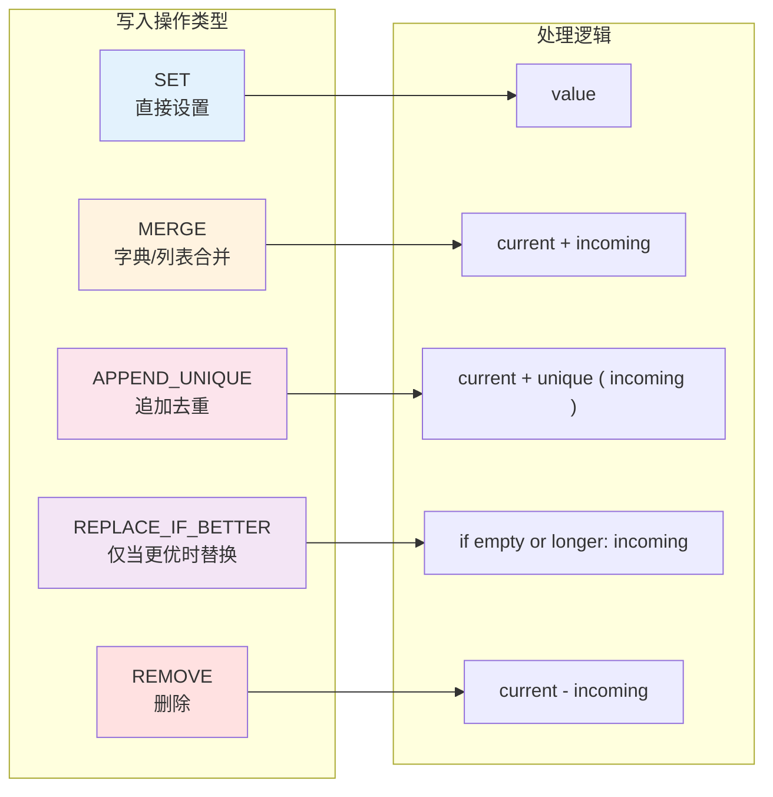
```mermaid
flowchart LR
    subgraph Operations[写入操作类型]
        SET[SET<br/>直接设置]
        MERGE[MERGE<br/>字典/列表合并]
        APPEND[APPEND_UNIQUE<br/>追加去重]
        REPLACE[REPLACE_IF_BETTER<br/>仅当更优时替换]
        REMOVE[REMOVE<br/>删除]
    end
    
    subgraph Logic[处理逻辑]
        SET_LOGIC[value]
        MERGE_LOGIC[current + incoming]
        APPEND_LOGIC["current + unique ( incoming )" ]
        REPLACE_LOGIC[if empty or longer: incoming]
        REMOVE_LOGIC[current - incoming]
    end
    
    SET --> SET_LOGIC
    MERGE --> MERGE_LOGIC
    APPEND --> APPEND_LOGIC
    REPLACE --> REPLACE_LOGIC
    REMOVE --> REMOVE_LOGIC
    
    style SET fill:#e3f2fd
    style MERGE fill:#fff3e0
    style APPEND fill:#fce4ec
    style REPLACE fill:#f3e5f5
    style REMOVE fill:#ffe1e1
```

---

## 七、字段分层与 Stop 策略

### 7.1 P0/P2 字段分层

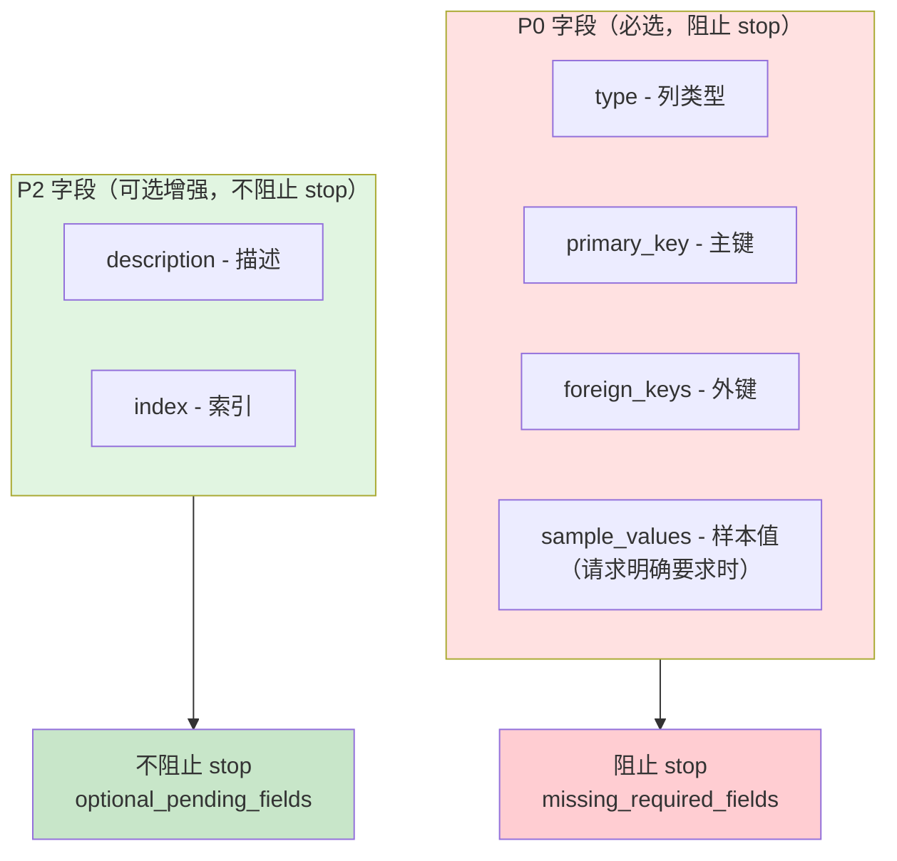
```mermaid
flowchart TD
    subgraph P0[P0 字段（必选，阻止 stop）]
        P0_TYPE[type - 列类型]
        P0_PK[primary_key - 主键]
        P0_FK[foreign_keys - 外键]
        P0_SAMPLE[sample_values - 样本值<br/>（请求明确要求时）]
    end
    
    subgraph P2[P2 字段（可选增强，不阻止 stop）]
        P2_DESC[description - 描述]
        P2_IDX[index - 索引]
    end
    
    P0 --> StopBlock[阻止 stop<br/>missing_required_fields]
    P2 --> NoStopBlock[不阻止 stop<br/>optional_pending_fields]
    
    style P0 fill:#ffe1e1
    style P2 fill:#e1f5e1
    style StopBlock fill:#ffcdd2
    style NoStopBlock fill:#c8e6c9
```

### 7.2 Stop 决策逻辑

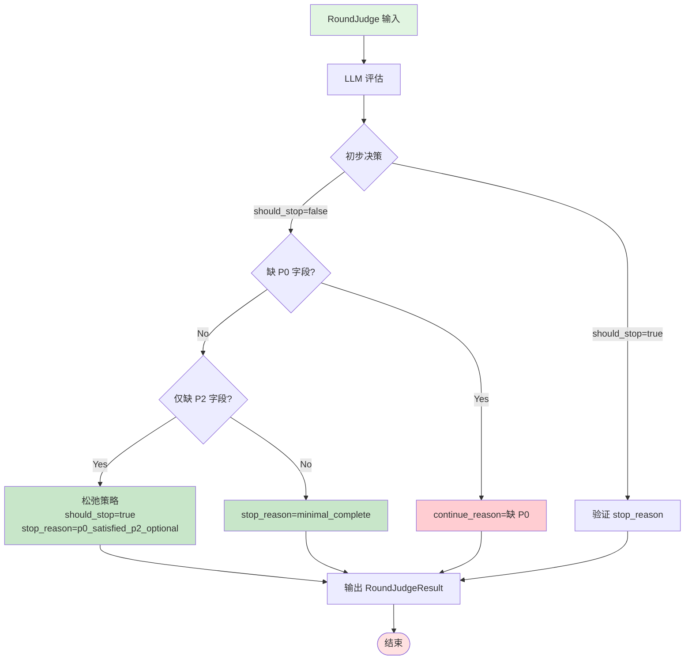
```mermaid
flowchart TD
    Start[RoundJudge 输入] --> LLM[LLM 评估]
    LLM --> InitialDecision{初步决策}
    
    InitialDecision -->|should_stop=false| CheckP0{缺 P0 字段?}
    InitialDecision -->|should_stop=true| Validate[验证 stop_reason]
    
    CheckP0 -->|Yes| Continue[continue_reason=缺 P0]
    CheckP0 -->|No| CheckP2{仅缺 P2 字段?}
    
    CheckP2 -->|Yes| Relax[松弛策略<br/>should_stop=true<br/>stop_reason=p0_satisfied_p2_optional]
    CheckP2 -->|No| Complete[stop_reason=minimal_complete]
    
    Relax --> Output
    Complete --> Output
    Continue --> Output
    Validate --> Output
    
    Output[输出 RoundJudgeResult] --> End([结束])
    
    style Start fill:#e1f5e1
    style End fill:#ffe1e1
    style Relax fill:#c8e6c9
    style Complete fill:#c8e6c9
    style Continue fill:#ffcdd2
```

---

## 八、审计与追溯

### 8.1 AuditTrace 结构

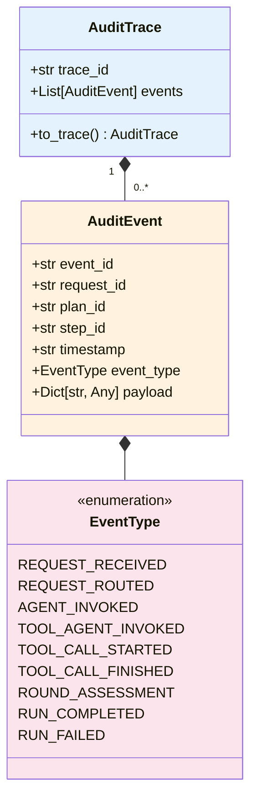
```mermaid
classDiagram
    class AuditTrace {
        +str trace_id
        +List[AuditEvent] events
        +to_trace() AuditTrace
    }
    
    class AuditEvent {
        +str event_id
        +str request_id
        +str plan_id
        +str step_id
        +str timestamp
        +EventType event_type
        +Dict[str, Any] payload
    }
    
    class EventType {
        <<enumeration>>
        REQUEST_RECEIVED
        REQUEST_ROUTED
        AGENT_INVOKED
        TOOL_AGENT_INVOKED
        TOOL_CALL_STARTED
        TOOL_CALL_FINISHED
        ROUND_ASSESSMENT
        RUN_COMPLETED
        RUN_FAILED
    }
    
    AuditTrace "1" *-- "0..*" AuditEvent
    AuditEvent *-- EventType
    
    style AuditTrace fill:#e3f2fd
    style AuditEvent fill:#fff3e0
    style EventType fill:#fce4ec
```

### 8.2 关键事件流转

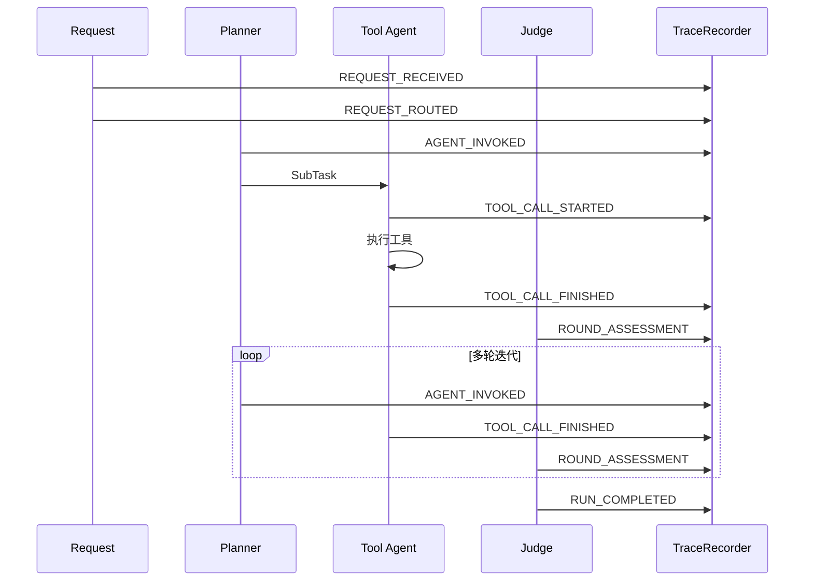
```mermaid
sequenceDiagram
    participant R as Request
    participant P as Planner
    participant T as Tool Agent
    participant J as Judge
    participant Trace as TraceRecorder
    
    R->>Trace: REQUEST_RECEIVED
    R->>Trace: REQUEST_ROUTED
    
    P->>Trace: AGENT_INVOKED
    P->>T: SubTask
    
    T->>Trace: TOOL_CALL_STARTED
    T->>T: 执行工具
    T->>Trace: TOOL_CALL_FINISHED
    
    J->>Trace: ROUND_ASSESSMENT
    
    loop 多轮迭代
        P->>Trace: AGENT_INVOKED
        T->>Trace: TOOL_CALL_FINISHED
        J->>Trace: ROUND_ASSESSMENT
    end
    
    J->>Trace: RUN_COMPLETED
```

---

## 九、错误处理与容错

### 9.1 LLM 调用容错机制

```mermaid
flowchart TD
    Start[invoke_llm_with_format_retry] --> InitRetry[初始化重试计数器]
    InitRetry --> Invoke[调用 LLM]
    Invoke --> Parse[Pydantic 校验 parse_fn]
    
    Parse --> Success{校验成功?}
    Success -->|Yes| Return[返回结果]
    Success -->|No| CheckRetry{重试次数 < max?}
    
    CheckRetry -->|Yes| AppendError[附加格式错误提示<br/>FORMAT_RETRY_APPENDIX]
    AppendError --> Retry[重试调用]
    Retry --> Invoke
    
    CheckRetry -->|No| Raise[抛出异常]
    
    style Start fill:#e1f5e1
    style Return fill:#c8e6c9
    style Raise fill:#ffcdd2
    style Invoke fill:#e3f2fd
```

### 9.2 运行时不变式检查（BUILD 模式）

```mermaid
flowchart TD
    Start[check_build_invariants] --> CheckTables{有 tables?}
    CheckTables -->|No| Missing[missing.append<br/>no tables]
    CheckTables -->|Yes| CheckColumns{有 columns?}
    
    CheckColumns -->|No| MissingCol[missing.append<br/>no columns]
    CheckColumns -->|Yes| CheckTypes{有强类型?}
    
    CheckTypes -->|No| MissingType[missing.append<br/>no strong types]
    CheckTypes -->|Yes| CheckSamples{请求需要 samples?}
    
    CheckSamples -->|Yes + 无 samples| MissingSample[missing.append<br/>missing sample_values]
    CheckSamples -->|No| OK
    CheckSamples -->|Yes + 有 samples| OK
    
    Missing --> Return["返回 (ok, missing)"]
    MissingCol --> Return
    MissingType --> Return
    MissingSample --> Return
    OK --> Return
    
    style Start fill:#e1f5e1
    style Return fill:#ffe1e1
    style OK fill:#c8e6c9
    style Missing fill:#ffcdd2
```

---

## 十、Initialize JSON 优先策略

### 10.1 数据源优先级

```mermaid
flowchart TD
    subgraph Priority1[优先级 1：Initialize JSON]
        JSON1[data/initialize/agent/<db>/<table>/<column>.json]
        JSON2[提取字段:<br/>data_type, semantic_summary,<br/>samples, indexes, foreign_key_ref]
        JSON3[优点:<br/>零延迟、无 DB 调用]
    end
    
    subgraph Priority2[优先级 2：DB Metadata Fallback]
        DB1[describe_table]
        DB2[get_primary_key]
        DB3[get_foreign_keys]
        DB4[触发条件:<br/>JSON 缺失或不完整]
    end
    
    JSON1 --> JSON2 --> JSON3
    DB1 --> DB2 --> DB3 --> DB4
    
    JSON3 --> Decision{元数据完整?}
    DB4 --> Decision
    
    Decision -->|Yes| Use[使用当前数据]
    Decision -->|No| Fallback[尝试另一数据源]
    
    style Priority1 fill:#c8e6c9
    style Priority2 fill:#fff3e0
    style Use fill:#e1f5e1
    style Fallback fill:#ffcdd2
```

### 10.2 Initialize JSON 文件结构

```mermaid
flowchart LR
    subgraph ColumnJSON[<column>.json]
        C1[database_name]
        C2[table_name]
        C3[column_name]
        C4[data_type]
        C5[semantic_summary]
        C6[semantic_keywords]
        C7[samples]
        C8[indexes]
        C9[foreign_key_ref]
    end
    
    subgraph TableJSON[TABLE_<table>.json]
        T1[description]
        T2[columns: List]
        T3[rows: int]
    end
    
    style ColumnJSON fill:#e3f2fd
    style TableJSON fill:#fff3e0
```

---

## 十一、中间件与校验

### 11.1 输入校验流程

```mermaid
flowchart TD
    Start[validate_request] --> CheckRequest{request 非空?}
    CheckRequest -->|No| Error1[抛出异常:request is required]
    CheckRequest -->|Yes| CheckType{request_type 有效?}
    
    CheckType -->|No| Error2[抛出异常:invalid request_type]
    CheckType -->|Yes| CheckSchema{ENRICH/ERROR 有 schema?}
    
    CheckSchema -->|No| Error3[抛出异常:schema required]
    CheckSchema -->|Yes| CheckDB{database_scope 非空?}
    
    CheckDB -->|No| AutoFill[自动填充:list_databases_tool]
    AutoFill --> CheckDB2{填充成功?}
    CheckDB2 -->|No| Error4[抛出异常:database_scope required]
    CheckDB2 -->|Yes| OK
    
    CheckDB -->|Yes| OK[校验通过]
    
    style Start fill:#e1f5e1
    style OK fill:#c8e6c9
    style Error1 fill:#ffcdd2
    style Error2 fill:#ffcdd2
    style Error3 fill:#ffcdd2
    style Error4 fill:#ffcdd2
```

### 11.2 LLM 输出解析与校验

```mermaid
flowchart TD
    Start[parse_fn] --> ExtractJSON[提取 JSON<br/>_extract_json_from_text]
    ExtractJSON --> ValidJSON{有效 JSON?}
    
    ValidJSON -->|No| Error[抛出 MiddlewareValidationError]
    ValidJSON -->|Yes| PydanticValidate[Pydantic model_validate]
    
    PydanticValidate --> ValidModel{模型校验通过?}
    ValidModel -->|No| ValidationError[抛出 ValidationError]
    ValidModel -->|Yes| Return[返回解析结果]
    
    style Start fill:#e1f5e1
    style Return fill:#c8e6c9
    style Error fill:#ffcdd2
    style ValidationError fill:#ffcdd2
```

---

## 十二、文件结构

```
stages/sql_generation/autolink/
├── __init__.py              # 模块入口，导出 run_autolink
├── runtime.py               # 主运行循环 run_autolink
├── models.py                # 数据模型定义（Pydantic）
├── prompts.py               # Agent Prompt 模板
├── registry.py              # 工具注册中心
├── middleware.py            # 输入/输出校验、重试逻辑
├── llm_utils.py             # LLM 调用策略与容错
├── tracing.py               # 审计轨迹记录器
├── completeness.py          # 完整性检查与不变式
├── schema_merge.py          # Schema 写入与合并逻辑
├── initialize_catalog.py    # Initialize JSON 加载工具
├── logging_utils.py         # 日志工具
│
├── agents/                  # Agent 实现
│   ├── __init__.py
│   ├── planner.py           # SchemaPlanner
│   ├── tool_agents.py       # Tool Agents 执行器
│   ├── judge.py             # RoundJudge
│   ├── semantic_enricher.py # 语义增强器（可选）
│   └── ...
│
└── tools/                   # 工具封装
├── __init__.py
    ├── schema_retrieval.py  # schema_retrieval_tool
    ├── schema_meta.py       # schema_meta_tool
    ├── sql_explore.py       # sql_explore_tool
    └── sql_draft.py         # sql_draft_tool
```

注：全局唯一 ID 生成器已统一到 `utils/id_generator.py`。

---

## 十三、快速开始

### 13.1 基本用法

```python
from stages.sql_generation.autolink import run_autolink, AutolinkRequest, RequestType
from config.llm_config import get_llm

# 构建请求
request = AutolinkRequest(
    request="查询每个工厂所有设备的最新维护时间以及维护人名称以及对应的工厂名称",
    request_type=RequestType.BUILD,
    context={
        "database_scope": ["industrial_monitoring"],
        "sql_dialect": "MYSQL"
    }
)

# 执行
output = run_autolink(
    request,
    model=get_llm("qwen3-max"),
    max_rounds=8
)

# 结果
print(f"Status: {output.status}")
print(f"Tables: {list(output.schema.databases['industrial_monitoring'].tables.keys())}")
```

### 13.2 输出示例

```json
{
    "schema": {
        "databases": {
            "industrial_monitoring": {
                "tables": {
                    "factories": {
                        "description": "",
                        "primary_key": ["factory_id"],
                        "columns": {
                            "factory_id": {
                                "type": "int",
                                "description": "唯一标识各个工厂实体",
                                "index": "PRIMARY",
                                "sample_values": ["1", "2"]
                            },
                            "name": {
                                "type": "varchar(100)",
                                "description": "工厂的唯一名称",
                                "sample_values": ["Factory A", "Factory B"]
                            }
                        }
                    },
                    "equipment": {
                        "primary_key": ["equipment_id"],
                        "foreign_keys": [
                            {"columns": ["factory_id"], "ref_table": "factories", "ref_columns": ["factory_id"]}
                        ],
                        "columns": {...}
                    },
                    "maintenance_records": {...}
                }
            }
        }
    },
    "status": "SUCCESS",
    "audit": {...}
}
```
