# DAG Scheduler 详细设计方案与技术实现

## 一、系统概述

### 1.1 设计目标

DAG Scheduler 是一个**基于有向无环图的意图调度系统**，用于管理 SQL Generation 流水线中多个意图的依赖关系、并行执行和状态流转。

**核心设计原则**：

1. **依赖驱动**：意图执行严格遵循依赖关系，只有依赖全部完成后才变为 ready 状态
2. **并发控制**：支持配置最大并发数，避免资源过载
3. **失败传播**：意图失败时自动阻塞所有下游依赖意图
4. **事件驱动**：基于事件队列实现状态流转和解耦
5. **可序列化**：支持完整状态持久化和恢复

### 1.2 系统定位

DAG Scheduler 在 SQL Generation 流水线中的位置：

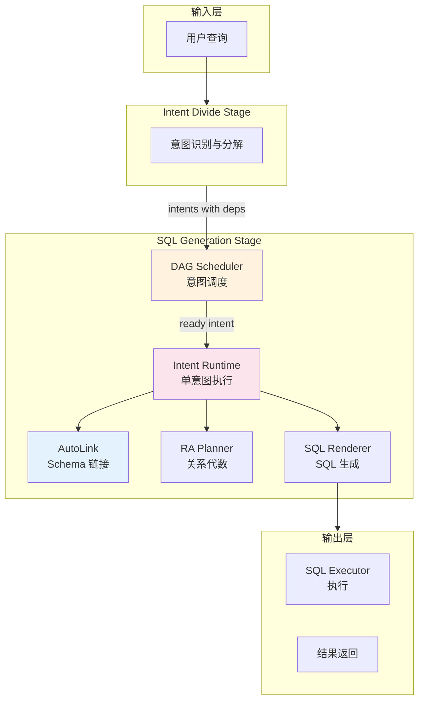

### 1.3 核心功能

| 功能 | 说明 | 实现方式 |
|------|------|---------|
| **拓扑构建** | 从意图列表构建 DAG | Kahn 算法 + 环检测 |
| **状态管理** | 跟踪每个意图的状态 | NodeStatus 枚举 + 状态机 |
| **并发调度** | 控制同时运行的意图数 | max_concurrency 配置 |
| **事件处理** | 异步状态流转 | SchedulerEvent 队列 |
| **失败处理** | 阻塞下游依赖 | 反向遍历依赖图 |
| **用户交互** | 支持等待用户输入 | WAIT_USER 状态 |

---

## 二、数据模型设计

### 2.1 核心数据结构

#### 2.1.1 IntentNode（意图节点）

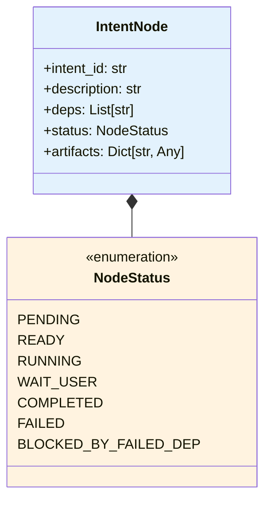

**IntentNode 字段说明**：

| 字段 | 类型 | 说明 |
|------|------|------|
| `intent_id` | str | 意图唯一标识 |
| `description` | str | 意图描述 |
| `deps` | List[str] | 依赖的 intent_id 列表 |
| `status` | NodeStatus | 当前状态 |
| `artifacts` | Dict | 执行产物和元数据 |

**artifacts 结构**：

```python
artifacts = {
    "intent_meta": {...},           # 意图元数据
    "schema": {...},                # Schema 信息
    "ra_plan": {...},               # 关系代数计划
    "sql_candidates": [...],        # SQL 候选列表
    "validations": [...],           # 验证结果
    "exec_result": {...},           # 执行结果
    "exec_raw": {...},              # 原始执行结果
    "user_hints": {...},            # 用户提示
    "facts_bundle": {...},          # 事实包
    "checkpoint": {...},            # 检查点
    "guard": {...},                 # 收敛性检查
    "final": {...},                 # 最终结果
    "error": str                    # 错误信息
}
```

#### 2.1.2 NodeStatus 状态机

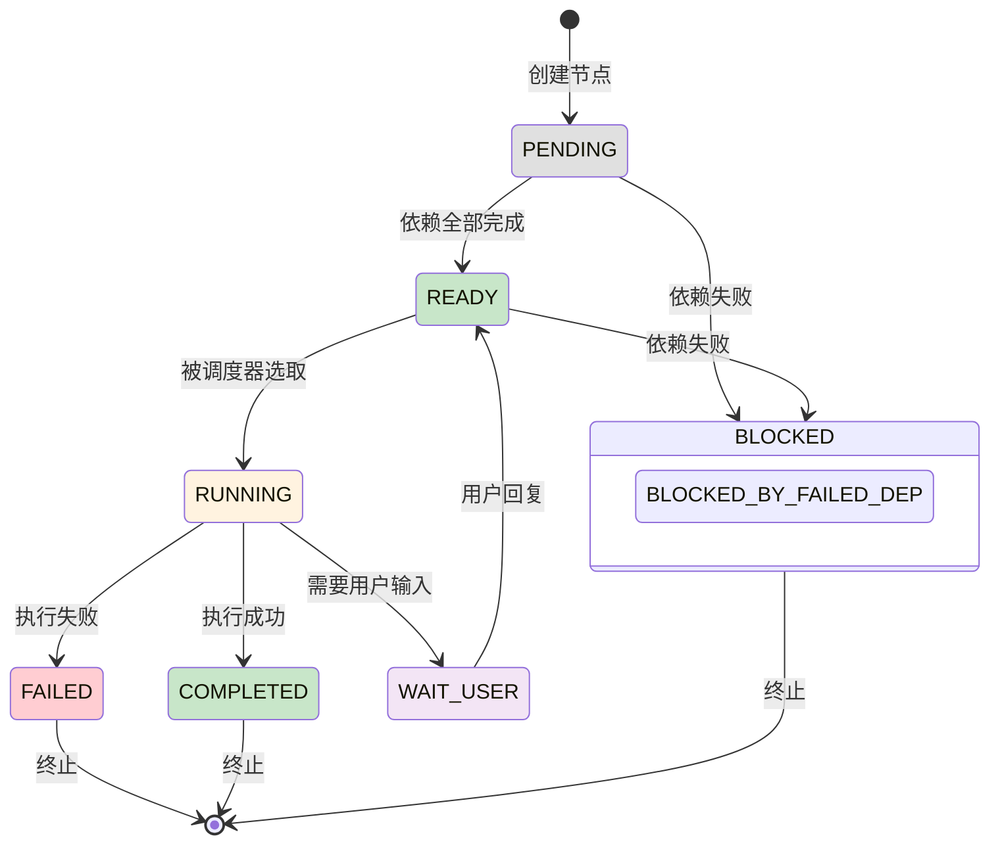

#### 2.1.3 GlobalState（全局状态）

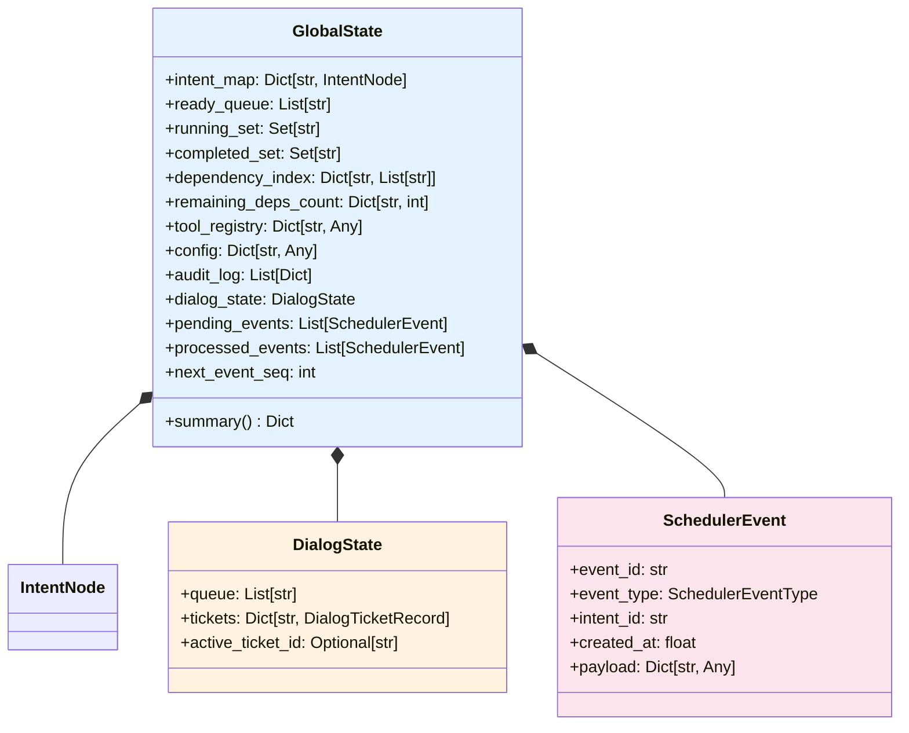

#### 2.1.4 SchedulerEventType

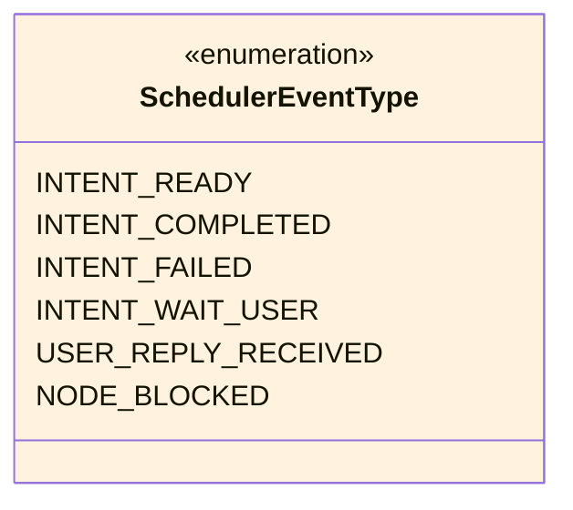

**事件类型说明**：

| 事件类型 | 触发时机 | 效果 |
|---------|---------|------|
| `INTENT_READY` | 依赖全部完成 | 节点状态 → READY，加入 ready_queue |
| `INTENT_COMPLETED` | 执行成功 | 节点状态 → COMPLETED，更新子节点剩余依赖数 |
| `INTENT_FAILED` | 执行失败 | 节点状态 → FAILED，阻塞所有下游节点 |
| `INTENT_WAIT_USER` | 需要用户输入 | 节点状态 → WAIT_USER，等待用户回复 |
| `USER_REPLY_RECEIVED` | 用户回复 | 节点状态 → READY，重新加入 ready_queue |
| `NODE_BLOCKED` | 被失败依赖阻塞 | 节点状态 → BLOCKED_BY_FAILED_DEP |

#### 2.1.5 DialogTicketRecord（对话票据）

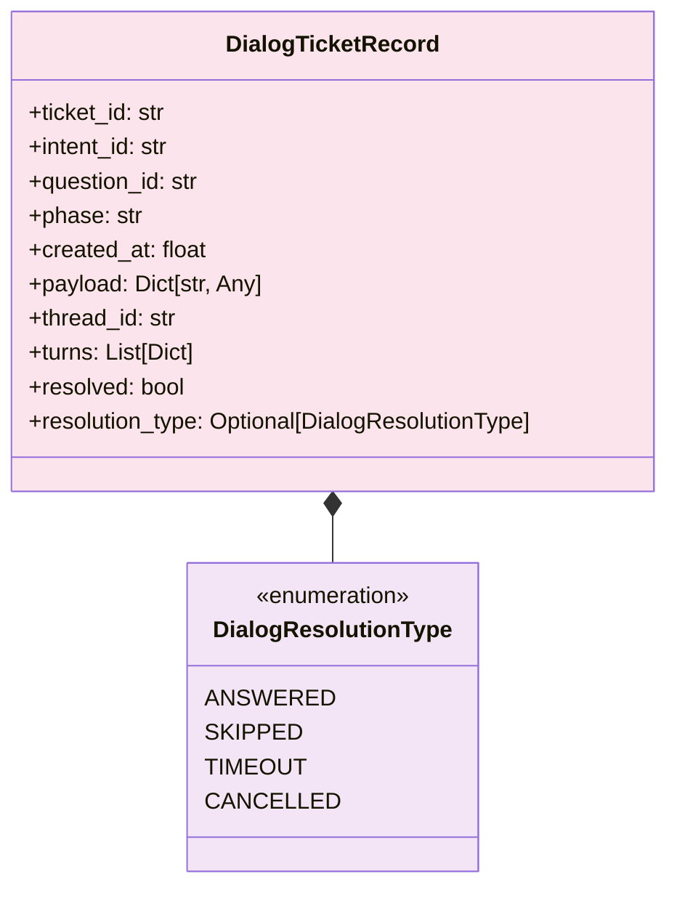

---

## 三、核心算法与实现

### 3.1 DAG 构建算法

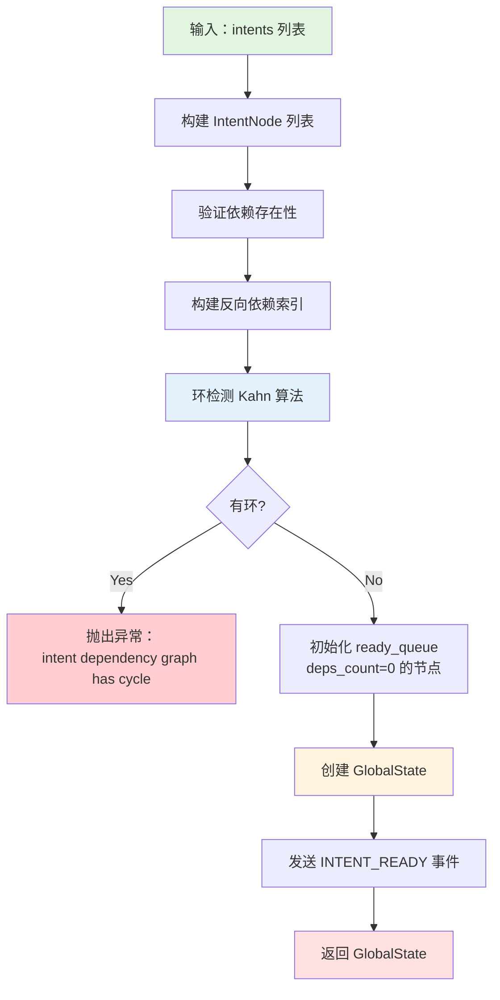

### 3.2 环检测算法（Kahn）

```python
def _validate_acyclic(intent_map, dependency_index, remaining):
    remaining_local = dict(remaining)
    queue = [id for id, cnt in remaining_local.items() if cnt == 0]
    visited = 0

    while queue:
        cur = queue.pop(0)
        visited += 1
        for child in dependency_index.get(cur, []):
            remaining_local[child] -= 1
            if remaining_local[child] == 0:
                queue.append(child)

    if visited != len(intent_map):
        raise ValueError("intent dependency graph has cycle")
```

**算法说明**：
1. 初始化：统计每个节点的入度（剩余依赖数）
2. 将入度为 0 的节点加入队列
3. 依次处理队列中的节点，减少其子节点的入度
4. 若子节点入度变为 0，加入队列
5. 若最终访问节点数 < 总节点数，说明存在环

### 3.3 调度器主循环

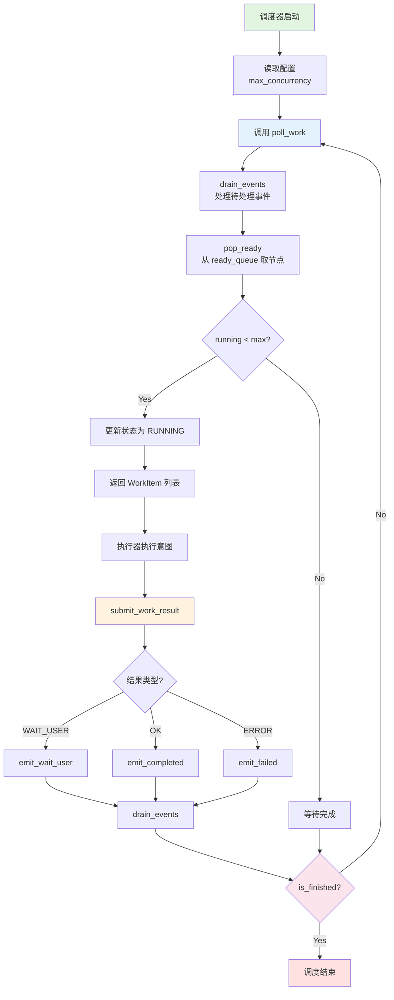

### 3.4 事件处理流程

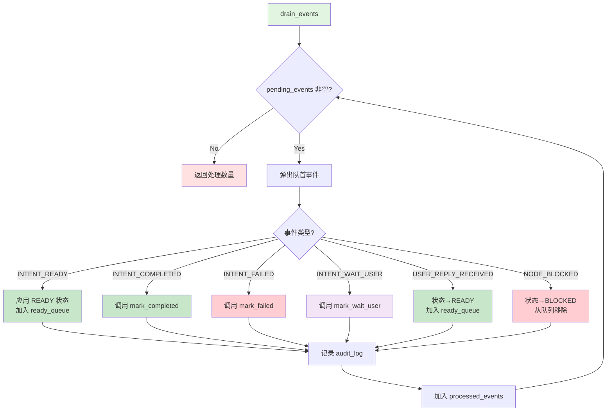

### 3.5 失败传播算法

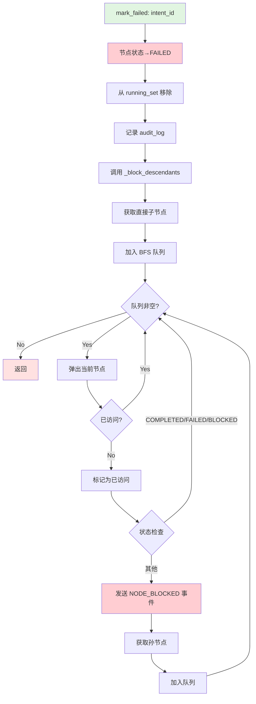

---

## 四、API 设计

### 4.1 DAGScheduler 公共接口

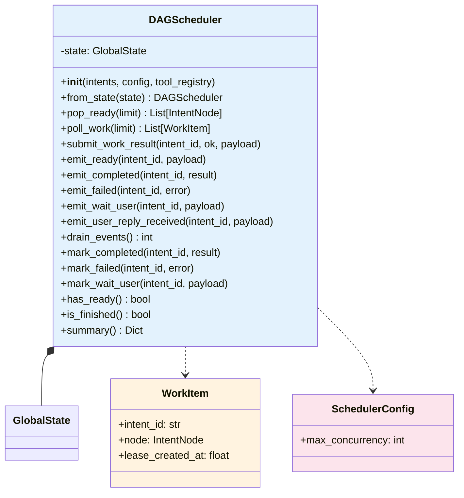

### 4.2 使用示例

```python
from stages.sql_generation.dag import DAGScheduler, SchedulerConfig

# 1. 定义意图（带依赖）
intents = [
    {"intent_id": "I1", "intent_description": "查询工厂信息", "dependency_intent_ids": []},
    {"intent_id": "I2", "intent_description": "查询设备信息", "dependency_intent_ids": ["I1"]},
    {"intent_id": "I3", "intent_description": "查询维护记录", "dependency_intent_ids": ["I2"]},
]

# 2. 创建调度器
config = SchedulerConfig(max_concurrency=2)
scheduler = DAGScheduler(intents, config=config)

# 3. 主循环
while not scheduler.is_finished():
    # 获取可执行的工作项
    work_items = scheduler.poll_work()

    for item in work_items:
        # 执行意图（这里调用 Intent Runtime）
        result = execute_intent(item.node)

        # 提交结果
        if result.ok:
            scheduler.submit_work_result(item.intent_id, ok=True, payload=result.data)
        elif result.wait_user:
            scheduler.submit_work_result(item.intent_id, ok="WAIT_USER", payload=result.question)
        else:
            scheduler.submit_work_result(item.intent_id, ok=False, payload=result.error)

# 4. 获取最终状态
summary = scheduler.summary()
print(f"Completed: {summary['completed']}")
print(f"Failed: {summary['failed']}")
```

### 4.3 状态查询接口

```python
# 获取调度器摘要
summary = scheduler.state.summary()

# 返回结构
{
    "intent_count": 10,           # 总意图数
    "ready": 2,                   # 就绪数
    "running": 1,                 # 运行中数
    "completed": 6,               # 完成数
    "status_counts": {            # 各状态计数
        "pending": 1,
        "ready": 2,
        "running": 1,
        "completed": 6,
        "failed": 0,
        "wait_user": 0,
        "blocked_by_failed_dep": 0
    },
    "failed_intents": [],         # 失败意图列表（最多 8 个）
    "wait_user": [],              # 等待用户的意图（最多 8 个）
    "audit_events": 45,           # 审计事件数
    "active_ticket_id": "",       # 当前活跃票据 ID
    "pending_tickets": [],        # 待处理票据（最多 8 个）
    "pending_events": 0,          # 待处理事件数
    "processed_events": 45        # 已处理事件数
}
```

---

## 五、依赖管理

### 5.1 依赖数据结构

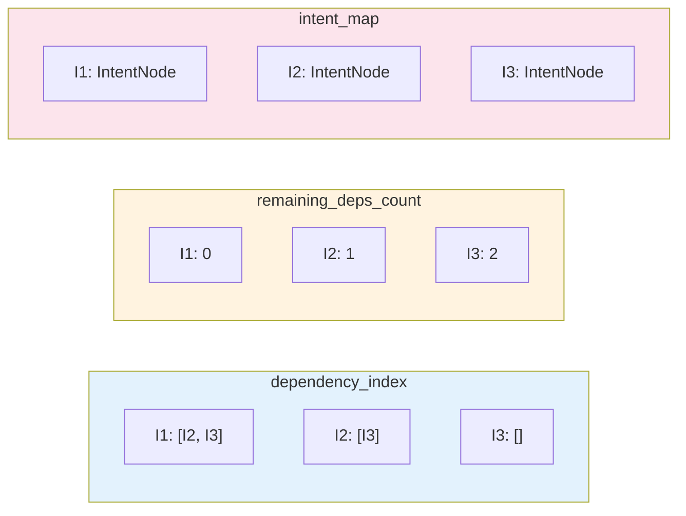

### 5.2 collect_ancestors 算法

```python
def collect_ancestors(intent_ids, intent_map):
    """收集所有祖先节点（传递依赖）"""
    queue = [x for x in intent_ids if x in intent_map]
    seen = set(queue)
    out = []

    while queue:
        cur = queue.pop(0)
        out.append(cur)
        for dep in intent_map[cur].deps:
            if dep in intent_map and dep not in seen:
                seen.add(dep)
                queue.append(dep)

    return out
```

**用途**：构建依赖 payload 时获取传递依赖信息

### 5.3 build_dependency_payload

```python
def build_dependency_payload(node, state, max_transitive=5):
    """为节点构建依赖 payload，传递给执行器"""
    deps = list(node.deps or [])
    direct_facts = []
    missing_dependencies = []

    # 1. 收集直接依赖的事实
    for dep_id in deps:
        dep = intent_map.get(dep_id)
        if dep is None or dep.status != NodeStatus.COMPLETED:
            missing_dependencies.append(dep_id)
            continue
        direct_facts.append(_facts_payload(dep))

    # 2. 收集传递依赖（最多 max_transitive 个）
    ancestors = collect_ancestors(deps, intent_map)
    transitive_ids = [x for x in ancestors if x not in deps][:max_transitive]
    transitive_facts = []
    for anc_id in transitive_ids:
        anc = intent_map.get(anc_id)
        if anc is None or anc.status != NodeStatus.COMPLETED:
            continue
        transitive_facts.append(_facts_payload(anc))

    return {
        "direct_facts": direct_facts,
        "transitive_facts": transitive_facts,
        "missing_dependencies": missing_dependencies,
        "meta": {
            "direct_dep_ids": deps,
            "transitive_selected_ids": transitive_ids,
        },
    }
```

---

## 六、对话管理

### 6.1 DialogState 结构

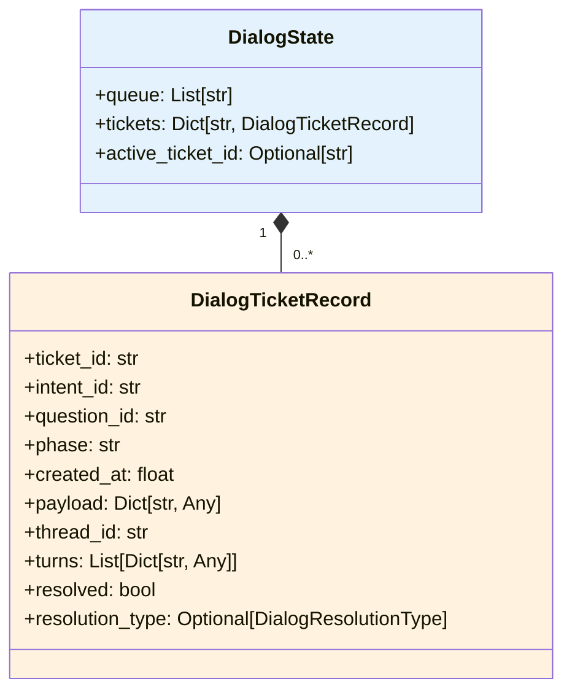

### 6.2 用户交互流程

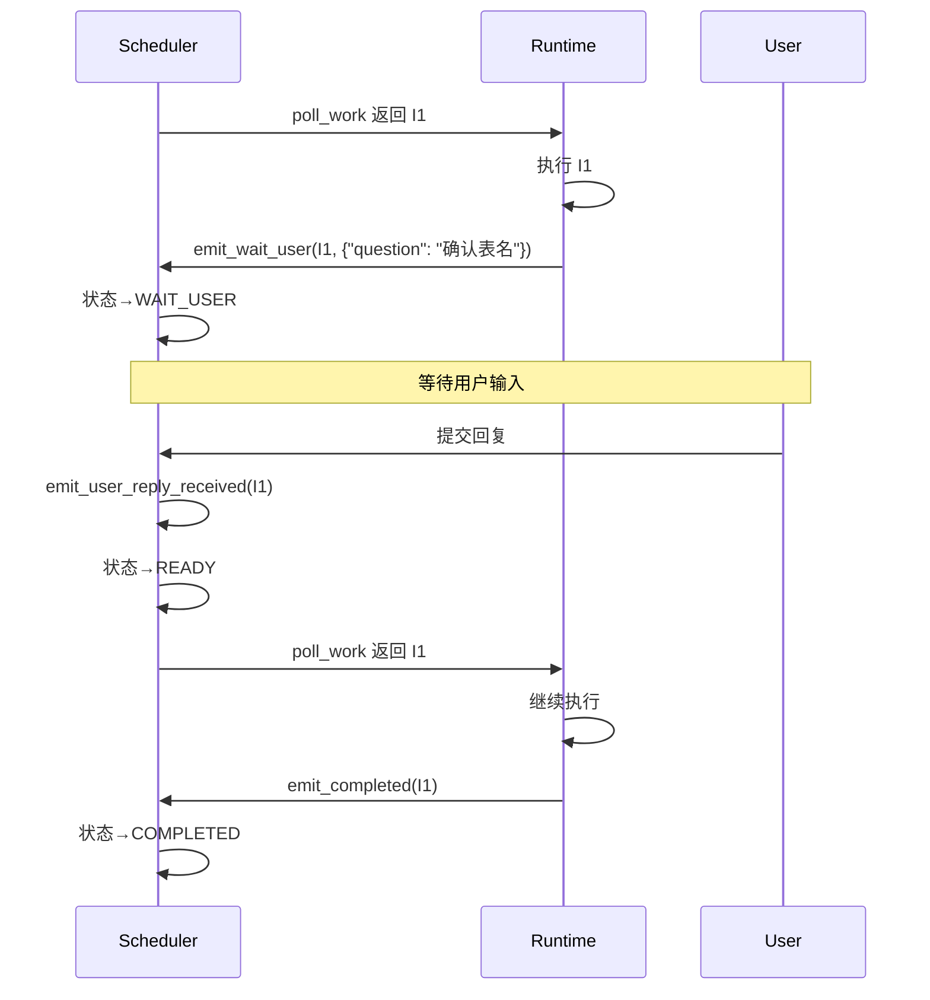

---

## 七、序列化与持久化

### 7.1 序列化接口

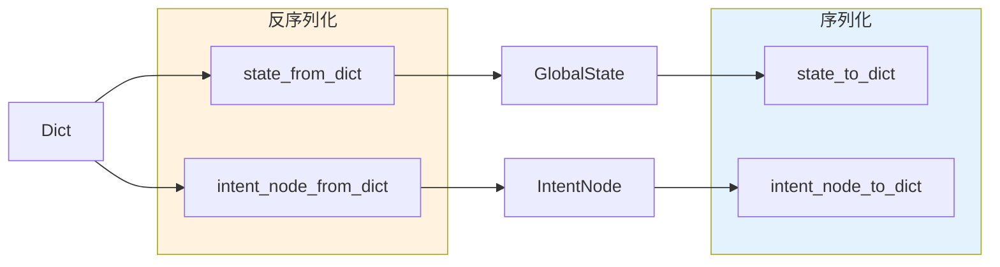

### 7.2 持久化策略

```python
# 序列化
from stages.sql_generation.dag import state_to_dict

state_data = state_to_dict(scheduler.state)

# 保存到文件/数据库
import json
with open("scheduler_state.json", "w") as f:
    json.dump(state_data, f, ensure_ascii=False, indent=2)

# 反序列化
from stages.sql_generation.dag import state_from_dict, DAGScheduler

with open("scheduler_state.json", "r") as f:
    state_data = json.load(f)

state = state_from_dict(state_data)
scheduler = DAGScheduler.from_state(state)
```

---

## 八、错误处理

### 8.1 错误类型

| 错误类型 | 触发条件 | 处理方式 |
|---------|---------|---------|
| `ValueError: intent_id is required` | intent 缺少 intent_id | 抛出异常，终止构建 |
| `ValueError: duplicate intent_id` | 重复的 intent_id | 抛出异常，终止构建 |
| `ValueError: depends on unknown intent_id` | 依赖不存在的 intent | 抛出异常，终止构建 |
| `ValueError: intent dependency graph has cycle` | 存在循环依赖 | 抛出异常，终止构建 |
| `ValueError: cannot complete from status X` | 状态不合法 | 抛出异常 |
| `ValueError: unknown intent_id` | intent_id 不存在 | 抛出异常 |

### 8.2 失败传播

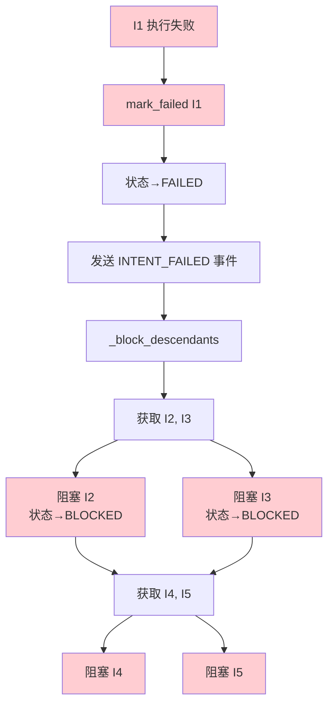

---

## 九、并发控制

### 9.1 max_concurrency 配置

```python
@dataclass(frozen=True)
class SchedulerConfig:
    max_concurrency: int = 3
```

### 9.2 并发控制逻辑

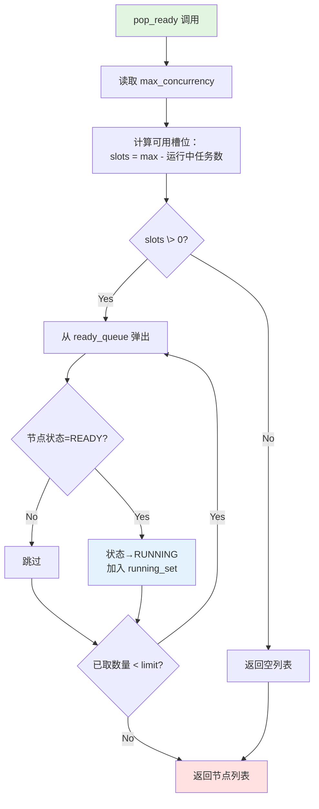

---

## 十、文件结构

```
stages/sql_generation/dag/
├── __init__.py              # 模块入口，导出公共接口
├── models.py                # 数据模型定义
│   ├── NodeStatus           # 节点状态枚举
│   ├── SchedulerEventType   # 事件类型枚举
│   ├── SchedulerEvent       # 事件数据类
│   ├── IntentNode           # 意图节点
│   ├── GlobalState          # 全局状态
│   ├── DialogState          # 对话状态
│   └── DialogTicketRecord   # 对话票据
│
├── scheduler.py             # 调度器核心实现
│   ├── DAGScheduler         # 调度器类
│   ├── SchedulerConfig      # 配置类
│   ├── WorkItem             # 工作项
│   ├── build_global_state   # 状态构建函数
│   └── _validate_acyclic    # 环检测函数
│
├── deps.py                  # 依赖管理
│   ├── build_dependency_payload  # 构建依赖 payload
│   └── collect_ancestors    # 收集祖先节点
│
├── serialize.py             # 序列化/反序列化
│   ├── state_to_dict        # 状态序列化
│   ├── state_from_dict      # 状态反序列化
│   ├── intent_node_to_dict  # 节点序列化
│   └── intent_node_from_dict# 节点反序列化
│
└── README.md                # 设计文档
```
