# Intent SQL 生成模块详细设计方案

## 一、系统概述

### 1.1 设计目标

Intent 模块是**基于意图的单节点 SQL 生成系统**，用于将结构化意图描述转换为可执行的 SQL 查询并生成自然语言解释。该模块接收来自 DAG 编排层的 Intent 节点，通过多阶段流水线完成 SQL 生成与执行。

**核心设计原则**：

1. **阶段化流水线**：BUILDING_SCHEMA → PLANNING_RA → RENDERING_SQL → VALIDATING_SQL → EXECUTING_SQL → INTERPRETING_RESULT
2. **多 Agent 协作**：RA Planner、SQL Renderer、SQL Validator、Result Interpreter 各司其职
3. **收敛保护**：通过 Guard 状态机制防止无限循环
4. **用户澄清**：在 schema 不足时通过 Dialog 系统请求用户帮助

### 1.2 系统架构

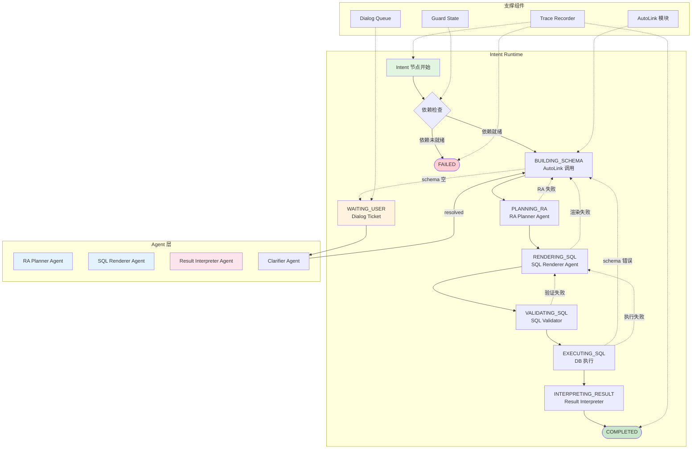
```mermaid
flowchart TB
    subgraph IntentRuntime["Intent Runtime"]
        Start[Intent 节点开始]
        CheckDeps{依赖检查}
        BuildSchema[BUILDING_SCHEMA<br/>AutoLink 调用]
        PlanRA[PLANNING_RA<br/>RA Planner Agent]
        RenderSQL[RENDERING_SQL<br/>SQL Renderer Agent]
        ValidateSQL[VALIDATING_SQL<br/>SQL Validator]
        ExecSQL[EXECUTING_SQL<br/>DB 执行]
        InterpretResult[INTERPRETING_RESULT<br/>Result Interpreter]
        WaitUser[WAITING_USER<br/>Dialog Ticket]
        Complete([COMPLETED])
        Failed([FAILED])
    end

    subgraph Agents["Agent 层"]
        RAPlanner[RA Planner Agent]
        SQLRenderer[SQL Renderer Agent]
        ResultInterpreter[Result Interpreter Agent]
        Clarifier[Clarifier Agent]
    end

    subgraph Support["支撑组件"]
        AutoLink[AutoLink 模块]
        DialogQueue[Dialog Queue]
        TraceRecorder[Trace Recorder]
        GuardState[Guard State]
    end

    Start --> CheckDeps
    CheckDeps -->|依赖就绪 | BuildSchema
    CheckDeps -->|依赖未就绪 | Failed

    BuildSchema --> PlanRA
    PlanRA --> RenderSQL
    RenderSQL --> ValidateSQL
    ValidateSQL --> ExecSQL
    ExecSQL --> InterpretResult
    InterpretResult --> Complete

    BuildSchema -.->|schema 空 | WaitUser
    PlanRA -.->|RA 失败 | BuildSchema
    RenderSQL -.->|渲染失败 | BuildSchema
    ValidateSQL -.->|验证失败 | RenderSQL
    ExecSQL -.->|schema 错误 | BuildSchema
    ExecSQL -.->|执行失败 | RenderSQL

    WaitUser --> Clarifier
    Clarifier -->|resolved | BuildSchema

    AutoLink -.-> BuildSchema
    DialogQueue -.-> WaitUser
    TraceRecorder -.-> Start
    TraceRecorder -.-> Complete
    TraceRecorder -.-> Failed
    GuardState -.-> CheckDeps

    style Start fill:#e1f5e1
    style Complete fill:#c8e6c9
    style Failed fill:#ffcdd2
    style WaitUser fill:#fff3e0
    style RAPlanner fill:#e3f2fd
    style SQLRenderer fill:#e3f2fd
    style ResultInterpreter fill:#fce4ec
```

---

## 二、数据模型设计

### 2.1 核心状态模型

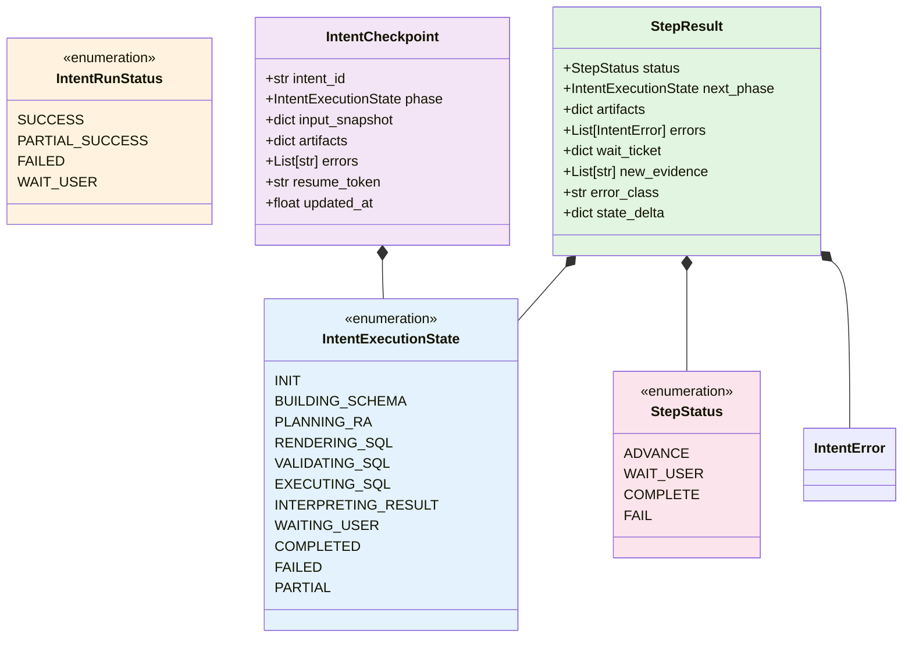
```mermaid
classDiagram
    class IntentExecutionState {
        <<enumeration>>
        INIT
        BUILDING_SCHEMA
        PLANNING_RA
        RENDERING_SQL
        VALIDATING_SQL
        EXECUTING_SQL
        INTERPRETING_RESULT
        WAITING_USER
        COMPLETED
        FAILED
        PARTIAL
    }

    class IntentRunStatus {
        <<enumeration>>
        SUCCESS
        PARTIAL_SUCCESS
        FAILED
        WAIT_USER
    }

    class StepStatus {
        <<enumeration>>
        ADVANCE
        WAIT_USER
        COMPLETE
        FAIL
    }

    class IntentCheckpoint {
        +str intent_id
        +IntentExecutionState phase
        +dict input_snapshot
        +dict artifacts
        +List[str] errors
        +str resume_token
        +float updated_at
    }

    class StepResult {
        +StepStatus status
        +IntentExecutionState next_phase
        +dict artifacts
        +List[IntentError] errors
        +dict wait_ticket
        +List[str] new_evidence
        +str error_class
        +dict state_delta
    }

    IntentCheckpoint *-- IntentExecutionState
    StepResult *-- StepStatus
    StepResult *-- IntentExecutionState
    StepResult *-- IntentError

    style IntentExecutionState fill:#e3f2fd
    style IntentRunStatus fill:#fff3e0
    style StepStatus fill:#fce4ec
    style IntentCheckpoint fill:#f3e5f5
    style StepResult fill:#e1f5e1
```

### 2.2 RA Plan 数据模型

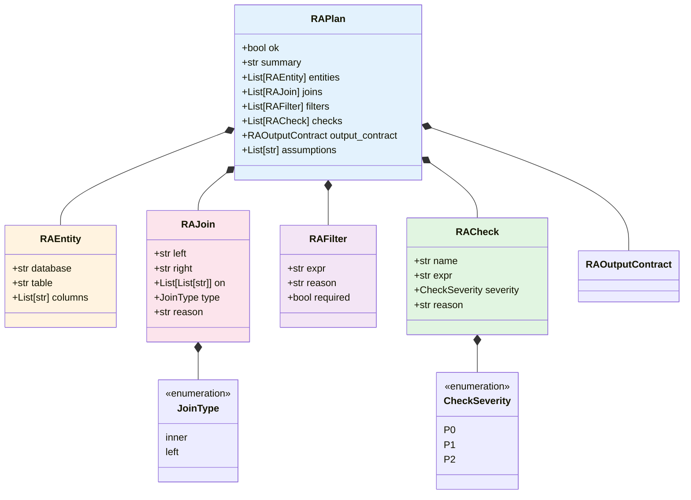
```mermaid
classDiagram
    class RAPlan {
        +bool ok
        +str summary
        +List[RAEntity] entities
        +List[RAJoin] joins
        +List[RAFilter] filters
        +List[RACheck] checks
        +RAOutputContract output_contract
        +List[str] assumptions
    }

    class RAEntity {
        +str database
        +str table
        +List[str] columns
    }

    class RAJoin {
        +str left
        +str right
        +List[List[str]] on
        +JoinType type
        +str reason
    }

    class RAFilter {
        +str expr
        +str reason
        +bool required
    }

    class RACheck {
        +str name
        +str expr
        +CheckSeverity severity
        +str reason
    }

    class JoinType {
        <<enumeration>>
        inner
        left
    }

    class CheckSeverity {
        <<enumeration>>
        P0
        P1
        P2
    }

    RAPlan *-- RAEntity
    RAPlan *-- RAJoin
    RAPlan *-- RAFilter
    RAPlan *-- RACheck
    RAPlan *-- RAOutputContract
    RAJoin *-- JoinType
    RACheck *-- CheckSeverity

    style RAPlan fill:#e3f2fd
    style RAEntity fill:#fff3e0
    style RAJoin fill:#fce4ec
    style RAFilter fill:#f3e5f5
    style RACheck fill:#e1f5e1
```

### 2.3 SQL 候选与验证模型

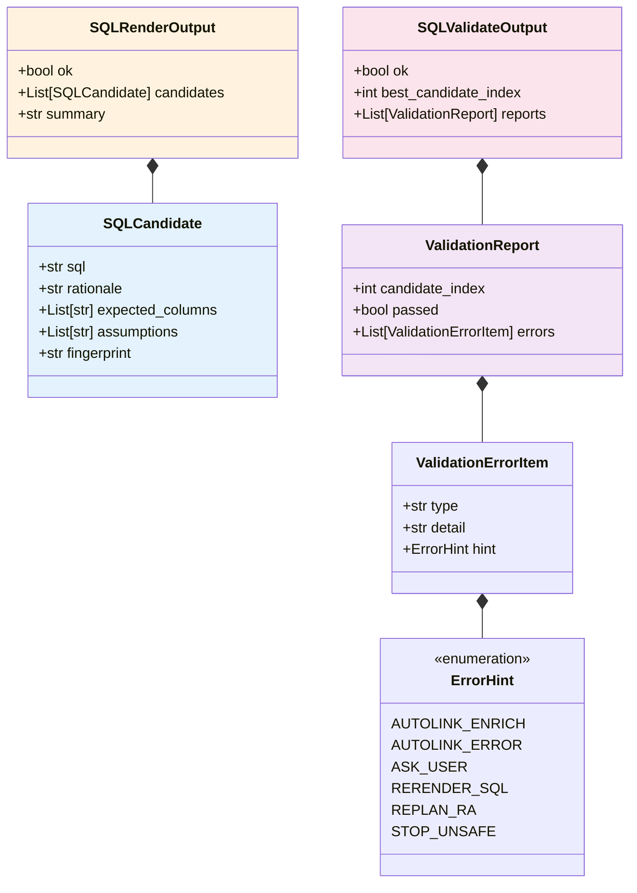
```mermaid
classDiagram
    class SQLCandidate {
        +str sql
        +str rationale
        +List[str] expected_columns
        +List[str] assumptions
        +str fingerprint
    }

    class SQLRenderOutput {
        +bool ok
        +List[SQLCandidate] candidates
        +str summary
    }

    class SQLValidateOutput {
        +bool ok
        +int best_candidate_index
        +List[ValidationReport] reports
    }

    class ValidationReport {
        +int candidate_index
        +bool passed
        +List[ValidationErrorItem] errors
    }

    class ValidationErrorItem {
        +str type
        +str detail
        +ErrorHint hint
    }

    class ErrorHint {
        <<enumeration>>
        AUTOLINK_ENRICH
        AUTOLINK_ERROR
        ASK_USER
        RERENDER_SQL
        REPLAN_RA
        STOP_UNSAFE
    }

    SQLRenderOutput *-- SQLCandidate
    SQLValidateOutput *-- ValidationReport
    ValidationReport *-- ValidationErrorItem
    ValidationErrorItem *-- ErrorHint

    style SQLCandidate fill:#e3f2fd
    style SQLRenderOutput fill:#fff3e0
    style SQLValidateOutput fill:#fce4ec
    style ValidationReport fill:#f3e5f5
```

### 2.4 结果解释与事实包模型

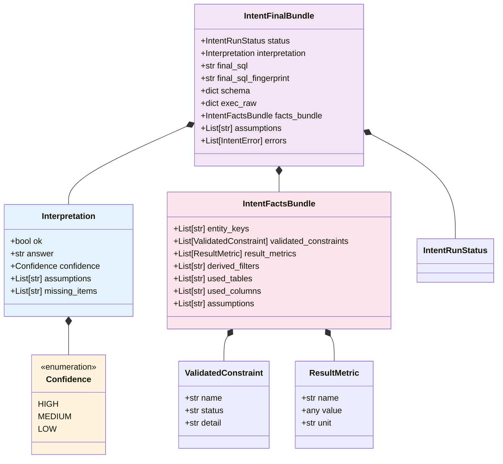
```mermaid
classDiagram
    class Interpretation {
        +bool ok
        +str answer
        +Confidence confidence
        +List[str] assumptions
        +List[str] missing_items
    }

    class Confidence {
        <<enumeration>>
        HIGH
        MEDIUM
        LOW
    }

    class IntentFactsBundle {
        +List[str] entity_keys
        +List[ValidatedConstraint] validated_constraints
        +List[ResultMetric] result_metrics
        +List[str] derived_filters
        +List[str] used_tables
        +List[str] used_columns
        +List[str] assumptions
    }

    class ValidatedConstraint {
        +str name
        +str status
        +str detail
    }

    class ResultMetric {
        +str name
        +any value
        +str unit
    }

    class IntentFinalBundle {
        +IntentRunStatus status
        +Interpretation interpretation
        +str final_sql
        +str final_sql_fingerprint
        +dict schema
        +dict exec_raw
        +IntentFactsBundle facts_bundle
        +List[str] assumptions
        +List[IntentError] errors
    }

    Interpretation *-- Confidence
    IntentFactsBundle *-- ValidatedConstraint
    IntentFactsBundle *-- ResultMetric
    IntentFinalBundle *-- IntentRunStatus
    IntentFinalBundle *-- Interpretation
    IntentFinalBundle *-- IntentFactsBundle

    style Interpretation fill:#e3f2fd
    style Confidence fill:#fff3e0
    style IntentFactsBundle fill:#fce4ec
    style IntentFinalBundle fill:#f3e5f5
```

---

## 三、Agent 角色与协作

### 3.1 Agent 角色定义

| Agent | 职责 | 输入 | 输出 | 触发阶段 |
|-------|------|------|------|----------|
| **RA Planner** | 关系代数计划生成 | intent, schema, dependency_context | RAPlan | PLANNING_RA |
| **SQL Renderer** | SQL 候选生成 | intent, ra_plan, schema, context | SQLRenderOutput | RENDERING_SQL |
| **SQL Validator** | SQL 语法/语义验证 | candidates, database | SQLValidateOutput | VALIDATING_SQL |
| **Result Interpreter** | 执行结果解释 | intent, sql, exec_raw, assumptions | Interpretation | INTERPRETING_RESULT |
| **Clarifier** | 用户澄清对话管理 | intent, ticket, current_hints | ClarificationOutput | WAITING_USER |

### 3.2 Agent 间交换协议


```mermaid
flowchart TD
    subgraph InputProtocol["输入协议"]
        I1["intent: {intent_id, description, meta}"]
        I2["schema: {databases: {db: {tables: {tb: {columns: {col: {type, ...}}}}}}"]
        I3["context: {database_scope, sql_dialect, hints, template_guidance}"]
        I4["dependency_context: {direct_facts, transitive_facts, missing_dependencies}"]
    end

    subgraph RAPlannerOut["RA Planner 输出"]
        R1["ok: bool"]
        R2["summary: str"]
        R3["entities: List[RAEntity]"]
        R4["joins: List[RAJoin]"]
        R5["filters: List[RAFilter]"]
        R6["checks: List[RACheck]"]
        R7["output_contract: RAOutputContract"]
        R8["assumptions: List[str]"]
    end

    subgraph SQLRendererOut["SQL Renderer 输出"]
        S1["ok: bool"]
        S2["candidates: List[SQLCandidate]"]
        S3["summary: str"]
    end

    subgraph InterpreterOut["Result Interpreter 输出"]
        I5["ok: bool"]
        I6["answer: str"]
        I7["confidence: HIGH|MEDIUM|LOW"]
        I8["assumptions: List[str]"]
        I9["missing_items: List[str]"]
    end

    InputProtocol --> RAPlanner[RA Planner Agent]
    RAPlanner --> RAPlannerOut
    RAPlannerOut --> SQLRenderer[SQL Renderer Agent]
    SQLRenderer --> SQLRendererOut
    SQLRendererOut --> Executor[SQL Executor]
    Executor --> Interpreter[Result Interpreter]
    Interpreter --> InterpreterOut

    style InputProtocol fill:#e3f2fd
    style RAPlannerOut fill:#fff3e0
    style SQLRendererOut fill:#fce4ec
    style InterpreterOut fill:#f3e5f5
```

### 3.3 Agent 协作序列图

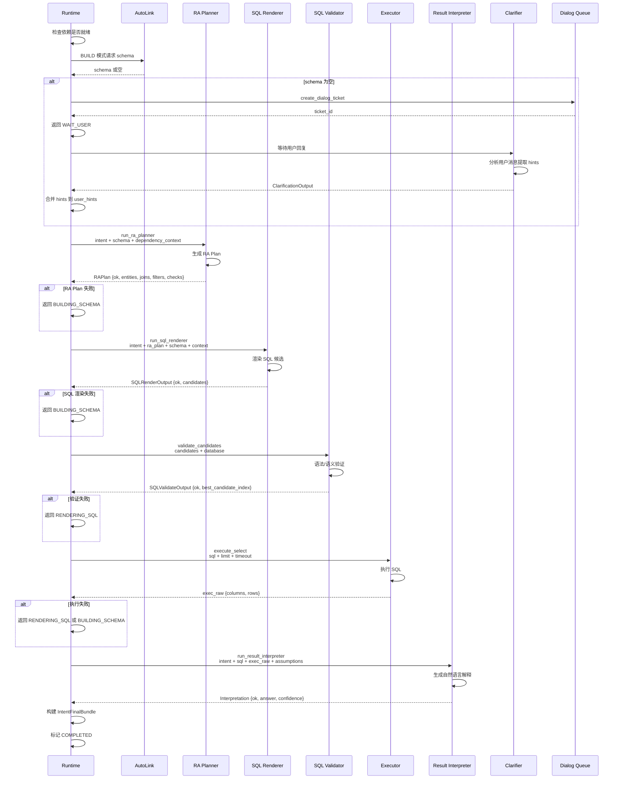
```mermaid
sequenceDiagram
    participant R as Runtime
    participant A as AutoLink
    participant P as RA Planner
    participant S as SQL Renderer
    participant V as SQL Validator
    participant E as Executor
    participant I as Result Interpreter
    participant C as Clarifier
    participant D as Dialog Queue

    R->>R: 检查依赖是否就绪
    R->>A: BUILD 模式请求 schema
    A-->>R: schema 或空

    alt schema 为空
        R->>D: create_dialog_ticket
        D-->>R: ticket_id
        R->>R: 返回 WAIT_USER
        R->>C: 等待用户回复
        C->>C: 分析用户消息提取 hints
        C-->>R: ClarificationOutput
        R->>R: 合并 hints 到 user_hints
    end

    R->>P: run_ra_planner<br/>intent + schema + dependency_context
    P->>P: 生成 RA Plan
    P-->>R: RAPlan {ok, entities, joins, filters, checks}

    alt RA Plan 失败
        R->>R: 返回 BUILDING_SCHEMA
    end

    R->>S: run_sql_renderer<br/>intent + ra_plan + schema + context
    S->>S: 渲染 SQL 候选
    S-->>R: SQLRenderOutput {ok, candidates}

    alt SQL 渲染失败
        R->>R: 返回 BUILDING_SCHEMA
    end

    R->>V: validate_candidates<br/>candidates + database
    V->>V: 语法/语义验证
    V-->>R: SQLValidateOutput {ok, best_candidate_index}

    alt 验证失败
        R->>R: 返回 RENDERING_SQL
    end

    R->>E: execute_select<br/>sql + limit + timeout
    E->>E: 执行 SQL
    E-->>R: exec_raw {columns, rows}

    alt 执行失败
        R->>R: 返回 RENDERING_SQL 或 BUILDING_SCHEMA
    end

    R->>I: run_result_interpreter<br/>intent + sql + exec_raw + assumptions
    I->>I: 生成自然语言解释
    I-->>R: Interpretation {ok, answer, confidence}

    R->>R: 构建 IntentFinalBundle
    R->>R: 标记 COMPLETED
```

---

## 四、运行时状态管理

### 4.1 Checkpoint 状态机

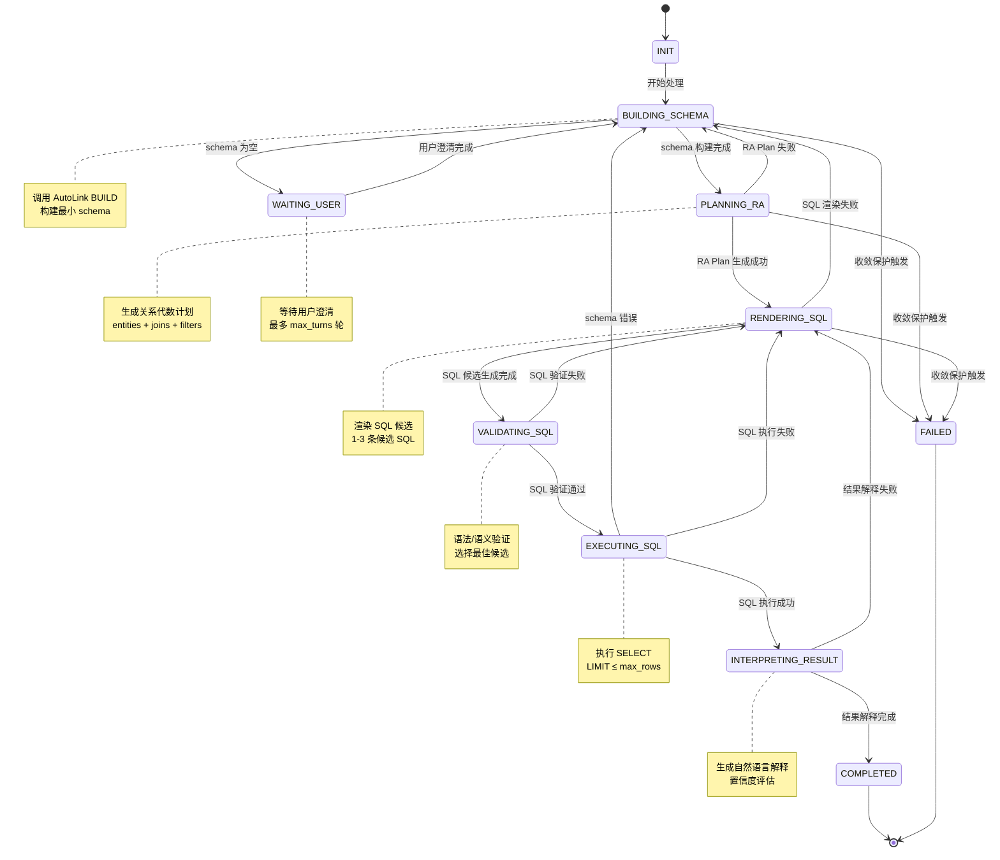
```mermaid
stateDiagram-v2
    [*] --> INIT
    INIT --> BUILDING_SCHEMA: 开始处理
    BUILDING_SCHEMA --> PLANNING_RA: schema 构建完成
    BUILDING_SCHEMA --> WAITING_USER: schema 为空
    PLANNING_RA --> RENDERING_SQL: RA Plan 生成成功
    PLANNING_RA --> BUILDING_SCHEMA: RA Plan 失败
    RENDERING_SQL --> VALIDATING_SQL: SQL 候选生成完成
    RENDERING_SQL --> BUILDING_SCHEMA: SQL 渲染失败
    VALIDATING_SQL --> EXECUTING_SQL: SQL 验证通过
    VALIDATING_SQL --> RENDERING_SQL: SQL 验证失败
    EXECUTING_SQL --> INTERPRETING_RESULT: SQL 执行成功
    EXECUTING_SQL --> BUILDING_SCHEMA: schema 错误
    EXECUTING_SQL --> RENDERING_SQL: SQL 执行失败
    INTERPRETING_RESULT --> COMPLETED: 结果解释完成
    INTERPRETING_RESULT --> RENDERING_SQL: 结果解释失败
    WAITING_USER --> BUILDING_SCHEMA: 用户澄清完成
    COMPLETED --> [*]
    BUILDING_SCHEMA --> FAILED: 收敛保护触发
    PLANNING_RA --> FAILED: 收敛保护触发
    RENDERING_SQL --> FAILED: 收敛保护触发
    FAILED --> [*]

    note right of BUILDING_SCHEMA
        调用 AutoLink BUILD
        构建最小 schema
    end note

    note right of PLANNING_RA
        生成关系代数计划
        entities + joins + filters
    end note

    note right of RENDERING_SQL
        渲染 SQL 候选
        1-3 条候选 SQL
    end note

    note right of VALIDATING_SQL
        语法/语义验证
        选择最佳候选
    end note

    note right of EXECUTING_SQL
        执行 SELECT
        LIMIT ≤ max_rows
    end note

    note right of INTERPRETING_RESULT
        生成自然语言解释
        置信度评估
    end note

    note right of WAITING_USER
        等待用户澄清
        最多 max_turns 轮
    end note
```

### 4.2 Guard 状态保护机制

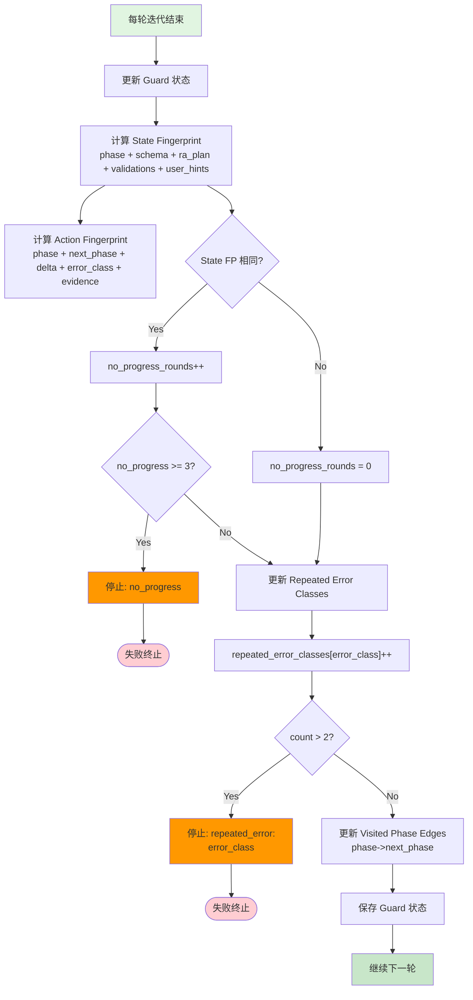
```mermaid
flowchart TD
    Start[每轮迭代结束] --> UpdateGuard[更新 Guard 状态]

    UpdateGuard --> CalcStateFP[计算 State Fingerprint<br/>phase + schema + ra_plan + validations + user_hints]
    CalcStateFP --> CalcActionFP[计算 Action Fingerprint<br/>phase + next_phase + delta + error_class + evidence]

    CalcStateFP --> CompareState{State FP 相同?}
    CompareState -->|Yes| IncNoProgress[no_progress_rounds++]
    CompareState -->|No| ResetNoProgress[no_progress_rounds = 0]

    IncNoProgress --> CheckNoProgress{no_progress >= 3?}
    CheckNoProgress -->|Yes| StopNoProgress[停止: no_progress]
    CheckNoProgress -->|No| UpdateRepeated

    ResetNoProgress --> UpdateRepeated[更新 Repeated Error Classes]

    UpdateRepeated --> IncErrorCount["repeated_error_classes[error_class]++"]
    IncErrorCount --> CheckErrorCount{count > 2?}
    CheckErrorCount -->|Yes| StopRepeated[停止: repeated_error:<br/>error_class]
    CheckErrorCount -->|No| UpdateEdges

    UpdateEdges[更新 Visited Phase Edges<br/>phase->next_phase] --> SaveGuard[保存 Guard 状态]
    SaveGuard --> Continue[继续下一轮]

    StopNoProgress --> Fail1([失败终止])
    StopRepeated --> Fail2([失败终止])

    style Start fill:#e1f5e1
    style Fail1 fill:#ffcdd2
    style Fail2 fill:#ffcdd2
    style StopNoProgress fill:#ff9800
    style StopRepeated fill:#ff9800
    style Continue fill:#c8e6c9
```

### 4.3 Guard 状态数据结构

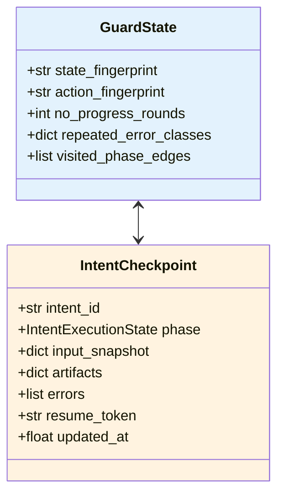
```mermaid
classDiagram
    class GuardState {
        +str state_fingerprint
        +str action_fingerprint
        +int no_progress_rounds
        +dict repeated_error_classes
        +list visited_phase_edges
    }

    class IntentCheckpoint {
        +str intent_id
        +IntentExecutionState phase
        +dict input_snapshot
        +dict artifacts
        +list errors
        +str resume_token
        +float updated_at
    }

    GuardState <--> IntentCheckpoint

    style GuardState fill:#e3f2fd
    style IntentCheckpoint fill:#fff3e0
```

---

## 五、数据处理流程

### 5.1 整体运行流程

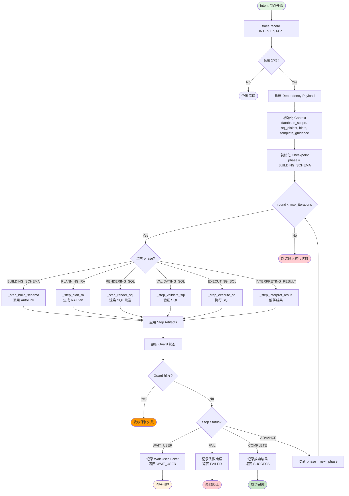
```mermaid
flowchart TD
    Start([Intent 节点开始]) --> Trace1[trace.record INTENT_START]
    Trace1 --> CheckDeps{依赖就绪?}
    CheckDeps -->|No| DepError([依赖错误])
    CheckDeps -->|Yes| BuildDepPayload[构建 Dependency Payload]

    BuildDepPayload --> InitContext[初始化 Context<br/>database_scope, sql_dialect, hints, template_guidance]
    InitContext --> InitCheckpoint[初始化 Checkpoint<br/>phase = BUILDING_SCHEMA]

    InitCheckpoint --> LoopStart{round < max_iterations}

    LoopStart -->|Yes| PhaseCheck{当前 phase?}

    PhaseCheck -->|BUILDING_SCHEMA| StepBuild[_step_build_schema<br/>调用 AutoLink]
    PhaseCheck -->|PLANNING_RA| StepPlan[_step_plan_ra<br/>生成 RA Plan]
    PhaseCheck -->|RENDERING_SQL| StepRender[_step_render_sql<br/>渲染 SQL 候选]
    PhaseCheck -->|VALIDATING_SQL| StepValidate[_step_validate_sql<br/>验证 SQL]
    PhaseCheck -->|EXECUTING_SQL| StepExec[_step_execute_sql<br/>执行 SQL]
    PhaseCheck -->|INTERPRETING_RESULT| StepInterp[_step_interpret_result<br/>解释结果]

    StepBuild --> ApplyArtifacts[应用 Step Artifacts]
    StepPlan --> ApplyArtifacts
    StepRender --> ApplyArtifacts
    StepValidate --> ApplyArtifacts
    StepExec --> ApplyArtifacts
    StepInterp --> ApplyArtifacts

    ApplyArtifacts --> UpdateGuard[更新 Guard 状态]
    UpdateGuard --> GuardCheck{Guard 触发?}
    GuardCheck -->|Yes| GuardFail([收敛保护失败])

    GuardCheck -->|No| StepStatus{Step Status?}

    StepStatus -->|WAIT_USER| RecordWait[记录 Wait User Ticket<br/>返回 WAIT_USER]
    StepStatus -->|FAIL| RecordFail[记录失败错误<br/>返回 FAILED]
    StepStatus -->|COMPLETE| RecordSuccess[记录成功结果<br/>返回 SUCCESS]
    StepStatus -->|ADVANCE| UpdatePhase[更新 phase = next_phase]

    RecordWait --> EndWait([等待用户])
    RecordFail --> EndFail([失败终止])
    RecordSuccess --> EndSuccess([成功完成])
    UpdatePhase --> LoopStart

    LoopStart -->|No| MaxIterFail([超过最大迭代次数])

    style Start fill:#e1f5e1
    style EndSuccess fill:#c8e6c9
    style EndFail fill:#ffcdd2
    style EndWait fill:#fff3e0
    style GuardFail fill:#ff9800
    style MaxIterFail fill:#ffcdd2
```

### 5.2 AutoLink 调用流程

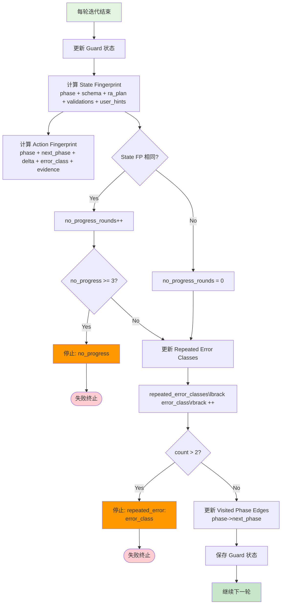
```mermaid
flowchart TD
    Start[每轮迭代结束] --> UpdateGuard[更新 Guard 状态]

    UpdateGuard --> CalcStateFP[计算 State Fingerprint<br/>phase + schema + ra_plan + validations + user_hints]
    CalcStateFP --> CalcActionFP[计算 Action Fingerprint<br/>phase + next_phase + delta + error_class + evidence]

    CalcStateFP --> CompareState{State FP 相同?}
    CompareState -->|Yes| IncNoProgress[no_progress_rounds++]
    CompareState -->|No| ResetNoProgress[no_progress_rounds = 0]

    IncNoProgress --> CheckNoProgress{no_progress >= 3?}
    CheckNoProgress -->|Yes| StopNoProgress[停止: no_progress]
    CheckNoProgress -->|No| UpdateRepeated

    ResetNoProgress --> UpdateRepeated[更新 Repeated Error Classes]

    UpdateRepeated --> IncErrorCount[repeated_error_classes\lbrack error_class\rbrack ++]
    IncErrorCount --> CheckErrorCount{count > 2?}
    CheckErrorCount -->|Yes| StopRepeated[停止: repeated_error:<br/>error_class]
    CheckErrorCount -->|No| UpdateEdges

    UpdateEdges[更新 Visited Phase Edges<br/>phase->next_phase] --> SaveGuard[保存 Guard 状态]
    SaveGuard --> Continue[继续下一轮]

    StopNoProgress --> Fail1([失败终止])
    StopRepeated --> Fail2([失败终止])

    style Start fill:#e1f5e1
    style Fail1 fill:#ffcdd2
    style Fail2 fill:#ffcdd2
    style StopNoProgress fill:#ff9800
    style StopRepeated fill:#ff9800
    style Continue fill:#c8e6c9
```

### 5.3 RA Plan 生成流程

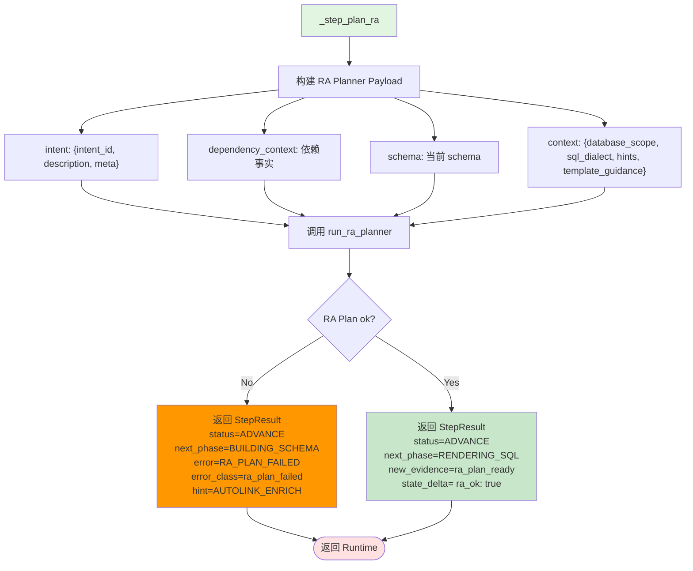
```mermaid
flowchart TD
    Start[_step_plan_ra] --> BuildPayload[构建 RA Planner Payload]

    BuildPayload --> Intent["intent: {intent_id, description, meta}"]
    BuildPayload --> DepCtx[dependency_context: 依赖事实]
    BuildPayload --> Schema[schema: 当前 schema]
    BuildPayload --> Ctx["context: {database_scope, sql_dialect, hints, template_guidance}"]

    Intent --> Invoke[调用 run_ra_planner]
    DepCtx --> Invoke
    Schema --> Invoke
    Ctx --> Invoke

    Invoke --> CheckRA{RA Plan ok?}
    CheckRA -->|No| BackToSchema[返回 StepResult<br/>status=ADVANCE<br/>next_phase=BUILDING_SCHEMA<br/>error=RA_PLAN_FAILED<br/>error_class=ra_plan_failed<br/>hint=AUTOLINK_ENRICH]
    CheckRA -->|Yes| Success[返回 StepResult<br/>status=ADVANCE<br/>next_phase=RENDERING_SQL<br/>new_evidence=ra_plan_ready<br/>state_delta= ra_ok: true ]

    BackToSchema --> End
    Success --> End([返回 Runtime])

    style Start fill:#e1f5e1
    style End fill:#ffe1e1
    style BackToSchema fill:#ff9800
    style Success fill:#c8e6c9
```

### 5.4 SQL 渲染与验证流程

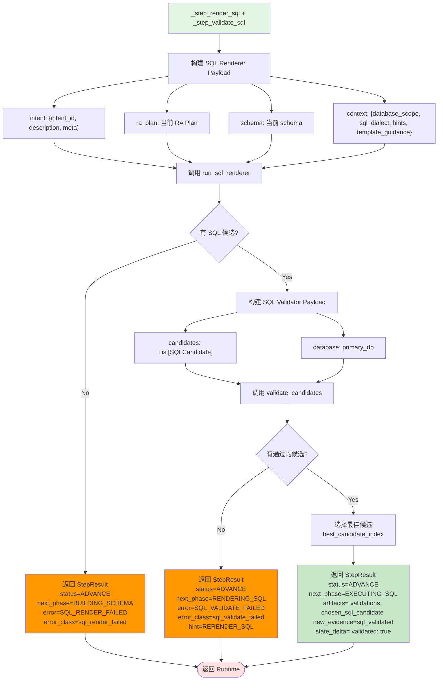
```mermaid
flowchart TD
    Start[_step_render_sql + _step_validate_sql] --> RenderPayload[构建 SQL Renderer Payload]

    RenderPayload --> Intent["intent: {intent_id, description, meta}"]
    RenderPayload --> RAPlan[ra_plan: 当前 RA Plan]
    RenderPayload --> Schema[schema: 当前 schema]
    RenderPayload --> Ctx["context: {database_scope, sql_dialect, hints, template_guidance}"]

    Intent --> RenderInvoke[调用 run_sql_renderer]
    RAPlan --> RenderInvoke
    Schema --> RenderInvoke
    Ctx --> RenderInvoke

    RenderInvoke --> CheckCandidates{有 SQL 候选?}
    CheckCandidates -->|No| BackToSchema[返回 StepResult<br/>status=ADVANCE<br/>next_phase=BUILDING_SCHEMA<br/>error=SQL_RENDER_FAILED<br/>error_class=sql_render_failed]
    CheckCandidates -->|Yes| ValidatePayload[构建 SQL Validator Payload]

    ValidatePayload --> Candidates["candidates: List[SQLCandidate]"]
    ValidatePayload --> Database[database: primary_db]

    Candidates --> ValidateInvoke[调用 validate_candidates]
    Database --> ValidateInvoke

    ValidateInvoke --> CheckValid{有通过的候选?}
    CheckValid -->|No| BackToRender[返回 StepResult<br/>status=ADVANCE<br/>next_phase=RENDERING_SQL<br/>error=SQL_VALIDATE_FAILED<br/>error_class=sql_validate_failed<br/>hint=RERENDER_SQL]
    CheckValid -->|Yes| SelectBest[选择最佳候选<br/>best_candidate_index]

    BackToSchema --> End
    BackToRender --> End
    SelectBest --> Success[返回 StepResult<br/>status=ADVANCE<br/>next_phase=EXECUTING_SQL<br/>artifacts= validations, chosen_sql_candidate <br/>new_evidence=sql_validated<br/>state_delta= validated: true ]

    Success --> End([返回 Runtime])

    style Start fill:#e1f5e1
    style End fill:#ffe1e1
    style BackToSchema fill:#ff9800
    style BackToRender fill:#ff9800
    style Success fill:#c8e6c9
```

### 5.5 SQL 执行与结果解释流程

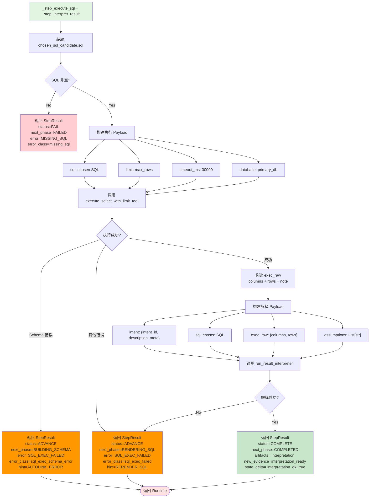
```mermaid
flowchart TD
    Start[_step_execute_sql + _step_interpret_result] --> GetSQL[获取 chosen_sql_candidate.sql]

    GetSQL --> CheckSQL{SQL 非空?}
    CheckSQL -->|No| FailMissing[返回 StepResult<br/>status=FAIL<br/>next_phase=FAILED<br/>error=MISSING_SQL<br/>error_class=missing_sql]

    CheckSQL -->|Yes| ExecPayload[构建执行 Payload]
    ExecPayload --> SQL[sql: chosen SQL]
    ExecPayload --> Limit[limit: max_rows]
    ExecPayload --> Timeout[timeout_ms: 30000]
    ExecPayload --> Database[database: primary_db]

    SQL --> ExecInvoke[调用 execute_select_with_limit_tool]
    Limit --> ExecInvoke
    Timeout --> ExecInvoke
    Database --> ExecInvoke

    ExecInvoke --> CheckExec{执行成功?}
    CheckExec -->|Schema 错误| BackToSchema[返回 StepResult<br/>status=ADVANCE<br/>next_phase=BUILDING_SCHEMA<br/>error=SQL_EXEC_FAILED<br/>error_class=sql_exec_schema_error<br/>hint=AUTOLINK_ERROR]
    CheckExec -->|其他错误| BackToRender[返回 StepResult<br/>status=ADVANCE<br/>next_phase=RENDERING_SQL<br/>error=SQL_EXEC_FAILED<br/>error_class=sql_exec_failed<br/>hint=RERENDER_SQL]
    CheckExec -->|成功| BuildExecRaw[构建 exec_raw<br/>columns + rows + note]

    BackToSchema --> End
    BackToRender --> End

    BuildExecRaw --> InterpPayload[构建解释 Payload]
    InterpPayload --> Intent["intent: {intent_id, description, meta}"]
    InterpPayload --> SQL2[sql: chosen SQL]
    InterpPayload --> ExecRaw["exec_raw: {columns, rows}"]
    InterpPayload --> Assumptions["assumptions: List[str]"]

    Intent --> InterpInvoke[调用 run_result_interpreter]
    SQL2 --> InterpInvoke
    ExecRaw --> InterpInvoke
    Assumptions --> InterpInvoke

    InterpInvoke --> CheckInterp{解释成功?}
    CheckInterp -->|No| BackToRender
    CheckInterp -->|Yes| Success[返回 StepResult<br/>status=COMPLETE<br/>next_phase=COMPLETED<br/>artifacts= interpretation <br/>new_evidence=interpretation_ready<br/>state_delta= interpretation_ok: true ]

    Success --> End([返回 Runtime])

    style Start fill:#e1f5e1
    style End fill:#ffe1e1
    style FailMissing fill:#ffcdd2
    style BackToSchema fill:#ff9800
    style BackToRender fill:#ff9800
    style Success fill:#c8e6c9
```

---

## 六、用户澄清机制

### 6.1 Dialog Ticket 生命周期

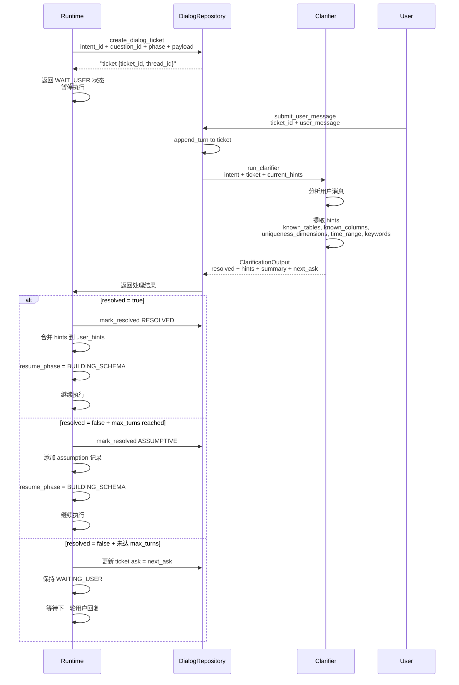
```mermaid
sequenceDiagram
    participant R as Runtime
    participant D as DialogRepository
    participant C as Clarifier
    participant U as User

    R->>D: create_dialog_ticket<br/>intent_id + question_id + phase + payload
    D-->>R: "ticket {ticket_id, thread_id}"

    R->>R: 返回 WAIT_USER 状态<br/>暂停执行

    U->>D: submit_user_message<br/>ticket_id + user_message
    D->>D: append_turn to ticket
    D->>C: run_clarifier<br/>intent + ticket + current_hints

    C->>C: 分析用户消息
    C->>C: 提取 hints<br/>known_tables, known_columns,<br/>uniqueness_dimensions, time_range, keywords

    C-->>D: ClarificationOutput<br/>resolved + hints + summary + next_ask

    D->>R: 返回处理结果

    alt resolved = true
        R->>D: mark_resolved RESOLVED
        R->>R: 合并 hints 到 user_hints
        R->>R: resume_phase = BUILDING_SCHEMA
        R->>R: 继续执行
    else resolved = false + max_turns reached
        R->>D: mark_resolved ASSUMPTIVE
        R->>R: 添加 assumption 记录
        R->>R: resume_phase = BUILDING_SCHEMA
        R->>R: 继续执行
    else resolved = false + 未达 max_turns
        R->>D: 更新 ticket ask = next_ask
        R->>R: 保持 WAITING_USER
        R->>R: 等待下一轮用户回复
    end
```

### 6.2 Clarifier Agent 处理流程

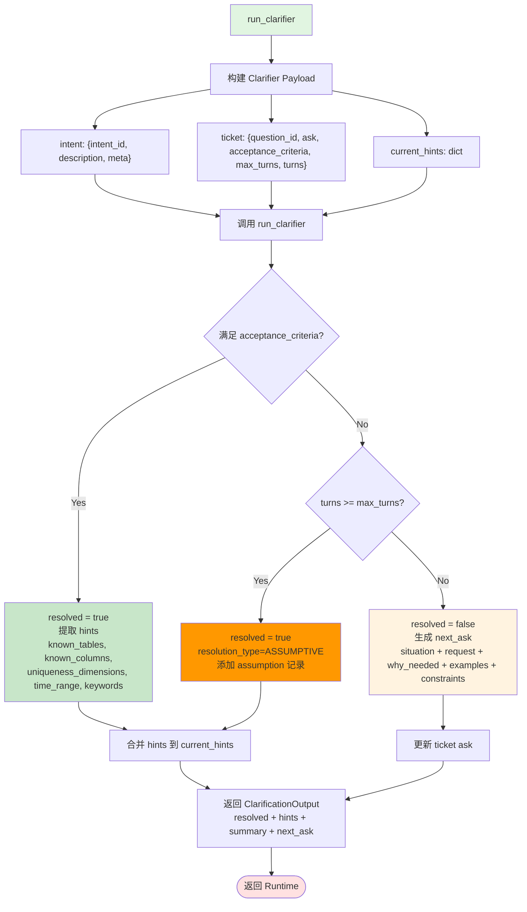
```mermaid
flowchart TD
    Start[run_clarifier] --> BuildPayload[构建 Clarifier Payload]

    BuildPayload --> Intent["intent: {intent_id, description, meta}"]
    BuildPayload --> Ticket["ticket: {question_id, ask, acceptance_criteria, max_turns, turns}"]
    BuildPayload --> CurrentHints[current_hints: dict]

    Intent --> Invoke[调用 run_clarifier]
    Ticket --> Invoke
    CurrentHints --> Invoke

    Invoke --> CheckCriteria{满足 acceptance_criteria?}
    CheckCriteria -->|Yes| Resolved[resolved = true<br/>提取 hints<br/>known_tables, known_columns,<br/>uniqueness_dimensions, time_range, keywords]
    CheckCriteria -->|No| CheckTurns{turns >= max_turns?}

    CheckTurns -->|Yes| Assumptive[resolved = true<br/>resolution_type=ASSUMPTIVE<br/>添加 assumption 记录]
    CheckTurns -->|No| NextAsk[resolved = false<br/>生成 next_ask<br/>situation + request + why_needed + examples + constraints]

    Resolved --> MergeHints[合并 hints 到 current_hints]
    Assumptive --> MergeHints
    NextAsk --> UpdateAsk[更新 ticket ask]

    MergeHints --> Return[返回 ClarificationOutput<br/>resolved + hints + summary + next_ask]
    UpdateAsk --> Return

    Return --> End([返回 Runtime])

    style Start fill:#e1f5e1
    style End fill:#ffe1e1
    style Resolved fill:#c8e6c9
    style Assumptive fill:#ff9800
    style NextAsk fill:#fff3e0
```

### 6.3 Hints 提取与合并

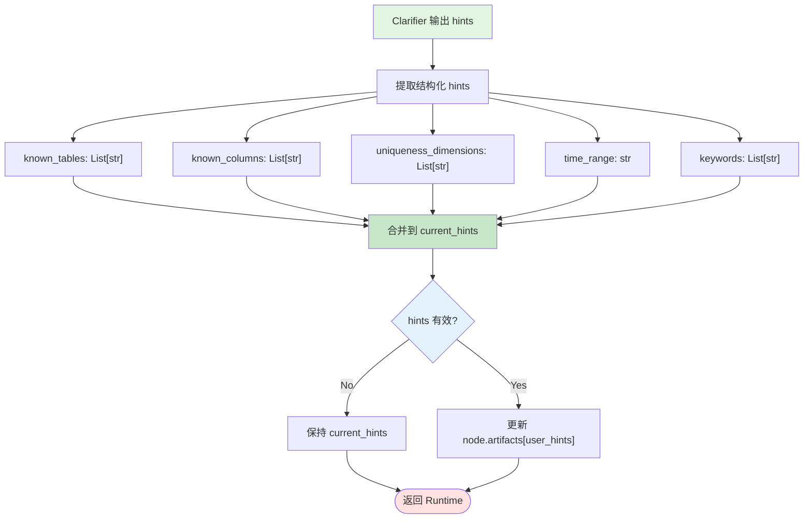
```mermaid
flowchart TD
    Start[Clarifier 输出 hints] --> Extract[提取结构化 hints]

    Extract --> KnownTables["known_tables: List[str]"]
    Extract --> KnownColumns["known_columns: List[str]"]
    Extract --> Uniqueness["uniqueness_dimensions: List[str]"]
    Extract --> TimeRange[time_range: str]
    Extract --> Keywords["keywords: List[str]"]

    KnownTables --> Merge[合并到 current_hints]
    KnownColumns --> Merge
    Uniqueness --> Merge
    TimeRange --> Merge
    Keywords --> Merge

    Merge --> Validate{hints 有效?}
    Validate -->|No| KeepCurrent[保持 current_hints]
    Validate -->|Yes| Update["更新 node.artifacts[user_hints]"]

    KeepCurrent --> End
    Update --> End([返回 Runtime])

    style Start fill:#e1f5e1
    style End fill:#ffe1e1
    style Merge fill:#c8e6c9
    style Validate fill:#e3f2fd
```

---

## 七、Agent 详细实现

### 7.1 RA Planner Agent

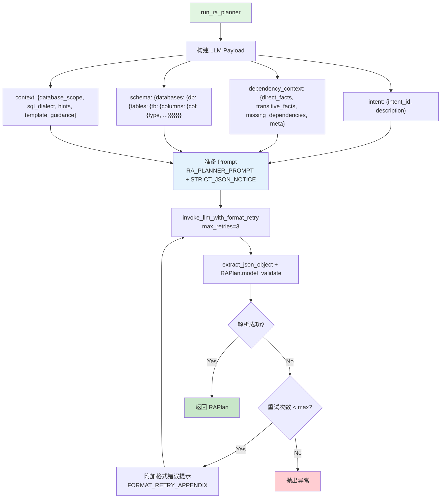
```mermaid
flowchart TD
    Start[run_ra_planner] --> BuildPayload[构建 LLM Payload]

    BuildPayload --> Intent["intent: {intent_id, description}"]
    BuildPayload --> DepCtx["dependency_context: {direct_facts, transitive_facts, missing_dependencies, meta}"]
    BuildPayload --> Schema["schema: {databases: {db: {tables: {tb: {columns: {col: {type, ...}}}}}}}"]
    BuildPayload --> Ctx["context: {database_scope, sql_dialect, hints, template_guidance}"]

    Intent --> PreparePrompt[准备 Prompt<br/>RA_PLANNER_PROMPT + STRICT_JSON_NOTICE]
    DepCtx --> PreparePrompt
    Schema --> PreparePrompt
    Ctx --> PreparePrompt

    PreparePrompt --> InvokeLLM[invoke_llm_with_format_retry<br/>max_retries=3]
    InvokeLLM --> ParseOutput[extract_json_object + RAPlan.model_validate]

    ParseOutput --> Valid{解析成功?}
    Valid -->|No| Retry{重试次数 < max?}
    Valid -->|Yes| Return[返回 RAPlan]

    Retry -->|Yes| AppendError[附加格式错误提示<br/>FORMAT_RETRY_APPENDIX]
    AppendError --> InvokeLLM
    Retry -->|No| Raise[抛出异常]

    style Start fill:#e1f5e1
    style Return fill:#c8e6c9
    style Raise fill:#ffcdd2
    style PreparePrompt fill:#e3f2fd
```

### 7.2 SQL Renderer Agent

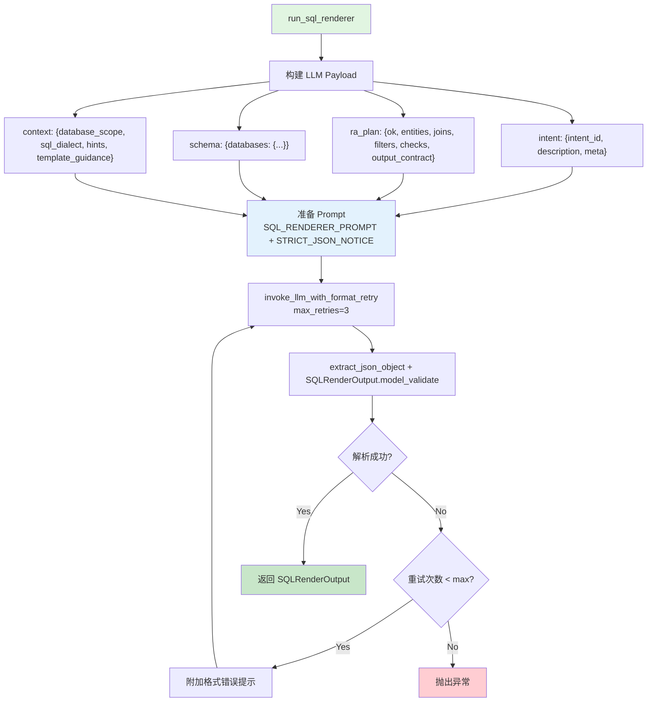
```mermaid
flowchart TD
    Start[run_sql_renderer] --> BuildPayload[构建 LLM Payload]

    BuildPayload --> Intent["intent: {intent_id, description, meta}"]
    BuildPayload --> RAPlan["ra_plan: {ok, entities, joins, filters, checks, output_contract}"]
    BuildPayload --> Schema["schema: {databases: {...}}"]
    BuildPayload --> Ctx["context: {database_scope, sql_dialect, hints, template_guidance}"]

    Intent --> PreparePrompt[准备 Prompt<br/>SQL_RENDERER_PROMPT + STRICT_JSON_NOTICE]
    RAPlan --> PreparePrompt
    Schema --> PreparePrompt
    Ctx --> PreparePrompt

    PreparePrompt --> InvokeLLM[invoke_llm_with_format_retry<br/>max_retries=3]
    InvokeLLM --> ParseOutput[extract_json_object + SQLRenderOutput.model_validate]

    ParseOutput --> Valid{解析成功?}
    Valid -->|No| Retry{重试次数 < max?}
    Valid -->|Yes| Return[返回 SQLRenderOutput]

    Retry -->|Yes| AppendError[附加格式错误提示]
    AppendError --> InvokeLLM
    Retry -->|No| Raise[抛出异常]

    style Start fill:#e1f5e1
    style Return fill:#c8e6c9
    style Raise fill:#ffcdd2
    style PreparePrompt fill:#e3f2fd
```

### 7.3 Result Interpreter Agent

```mermaid
flowchart TD
    Start[run_result_interpreter] --> BuildPayload[构建 LLM Payload]

    BuildPayload --> Intent["intent: {intent_id, description, meta}"]
    BuildPayload --> SQL[sql: chosen SQL]
    BuildPayload --> ExecRaw["exec_raw: {columns, rows, note}"]
    BuildPayload --> Assumptions["assumptions: List[str]"]

    Intent --> PreparePrompt[准备 Prompt<br/>RESULT_INTERPRETER_PROMPT + STRICT_JSON_NOTICE]
    SQL --> PreparePrompt
    ExecRaw --> PreparePrompt
    Assumptions --> PreparePrompt

    PreparePrompt --> InvokeLLM[invoke_llm_with_format_retry<br/>max_retries=3]
    InvokeLLM --> ParseOutput[extract_json_object + Interpretation.model_validate]

    ParseOutput --> Valid{解析成功?}
    Valid -->|No| Retry{重试次数 < max?}
    Valid -->|Yes| Return[返回 Interpretation]

    Retry -->|Yes| AppendError[附加格式错误提示]
    AppendError --> InvokeLLM
    Retry -->|No| Raise[抛出异常]

    style Start fill:#e1f5e1
    style Return fill:#c8e6c9
    style Raise fill:#ffcdd2
    style PreparePrompt fill:#e3f2fd
```

---

## 八、模板约束

### 8.1 通用模板约束

`build_template_guidance()` 返回固定的通用约束字符串，注入到 RA Planner 与 SQL Renderer 的 context 中，包括：

- 必须只读（SELECT/WITH 单语句），并输出可验证的结果集
- 优先返回与任务目标相关的样本行及原因/计数，并带上主键或业务键列
- 若目标字段/键存在多个候选且无法判定，应输出 ok=false 并说明需要用户确认的字段/维度
- 根据任务语义产出最小可执行的 SQL，并给出结果解释

---

## 九、审计与追溯

### 9.1 TraceRecorder 事件流

```mermaid
sequenceDiagram
    participant R as Runtime
    participant T as TraceRecorder

    R->>T: record INTENT_START<br/>{intent_id, description}
    R->>T: record DEPENDENCY_NOT_READY / PHASE_START

    loop 每轮迭代
        R->>T: record PHASE_START<br/>{phase}
        R->>T: record TOOL_CALL_STARTED
        R->>T: record TOOL_CALL_FINISHED
        R->>T: record ROUND_ASSESSMENT
    end

    alt 成功
        R->>T: record INTENT_DONE status=SUCCESS
    else 失败
        R->>T: record CONVERGENCE_STOP / INTENT_DONE status=FAILED
    end

    R->>T: record RUN_COMPLETED
    R->>T: to_dict() 返回完整 trace
```

### 9.2 关键审计事件

| 事件类型 | 触发时机 | Payload 内容 |
|---------|---------|-------------|
| `INTENT_START` | Intent 节点开始处理 | intent_id, description |
| `DEPENDENCY_NOT_READY` | 依赖未就绪 | error |
| `PHASE_START` | 进入新阶段 | phase |
| `ASK_USER_ENQUEUED` | 创建 Dialog Ticket | ticket_id, question_id |
| `CONVERGENCE_STOP` | 收敛保护触发 | reason |
| `INTENT_DONE` | Intent 处理完成 | status, error |

### 9.3 AuditTrace 数据结构

```mermaid
classDiagram
    class AuditEvent {
        +str event_id
        +str timestamp
        +str event_type
        +dict payload
    }

    class AuditTrace {
        +str trace_id
        +List[AuditEvent] events
        +to_dict() dict
    }

    class TraceRecorder {
        +str trace_id
        +record(event_type, payload)
        +to_dict() dict
    }

    AuditTrace "1" *-- "0..*" AuditEvent
    TraceRecorder ..> AuditTrace

    style AuditEvent fill:#e3f2fd
    style AuditTrace fill:#fff3e0
    style TraceRecorder fill:#fce4ec
```

---

## 十、中间件与工具

### 10.1 JSON 解析中间件

```mermaid
flowchart TD
    Start[extract_json_object] --> CheckEmpty{输入非空?}
    CheckEmpty -->|No| Error1[抛出 MiddlewareValidationError<br/>empty llm output]
    CheckEmpty -->|Yes| TryDirect[尝试 json.loads]

    TryDirect --> Valid1{有效 JSON?}
    Valid1 -->|Yes| IsDict1{是 dict?}
    Valid1 -->|No| TryFence

    IsDict1 -->|Yes| Return[返回 dict]
    IsDict1 -->|No| TryFence

    TryFence[尝试匹配 markdown fence] --> MatchFence{匹配成功?}
    MatchFence -->|Yes| TryParseFence[尝试 json.loads fence 内容]
    MatchFence -->|No| TryBrute

    TryParseFence --> Valid2{有效 JSON?}
    Valid2 -->|Yes| IsDict2{是 dict?}
    Valid2 -->|No| TryBrute

    IsDict2 -->|Yes| Return
    IsDict2 -->|No| TryBrute

    TryBrute["暴力提取 { ... }"] --> FindBrace["查找第一个 { 和最后一个 }"]
    FindBrace --> TryParseBrute[尝试 json.loads]
    TryParseBrute --> Valid3{有效 JSON?}
    Valid3 -->|Yes| IsDict3{是 dict?}
    Valid3 -->|No| Error2

    IsDict3 -->|Yes| Return
    IsDict3 -->|No| Error2[抛出 MiddlewareValidationError<br/>cannot parse JSON]

    style Start fill:#e1f5e1
    style Return fill:#c8e6c9
    style Error1 fill:#ffcdd2
    style Error2 fill:#ffcdd2
```

### 10.2 工具封装

```mermaid
flowchart TD
    subgraph Tools[可用工具]
        T1[autolink_tool<br/>调用 AutoLink 模块]
        T2[ask_user_tool<br/>生成澄清请求 payload]
        T3[execute_select_with_limit_tool<br/>执行 SQL 查询]
    end

    subgraph Wrappers[封装层]
        W1[safe_json_dumps<br/>容错 JSON 序列化]
        W2[extract_json_object<br/>严格 JSON 解析]
        W3[invoke_llm_with_format_retry<br/>LLM 调用重试]
    end

    T1 --> W1
    T2 --> W1
    T3 --> W1

    W1 --> W2
    W2 --> W3

    style Tools fill:#e3f2fd
    style Wrappers fill:#fff3e0
```

---

## 十一、错误处理策略

### 11.1 错误处理决策矩阵

```mermaid
flowchart TD
    Start[错误发生] --> ErrorType{错误类型}

    ErrorType -->|AUTOLINK_EMPTY_SCHEMA| Strategy1[请求用户澄清<br/>提供表名/字段名线索]
    ErrorType -->|RA_PLAN_FAILED| Strategy2[返回 BUILDING_SCHEMA<br/>重新构建 schema]
    ErrorType -->|SQL_RENDER_FAILED| Strategy3[返回 BUILDING_SCHEMA<br/>schema 可能不完整]
    ErrorType -->|SQL_VALIDATE_FAILED| Strategy4[返回 RENDERING_SQL<br/>重新渲染 SQL]
    ErrorType -->|SQL_EXEC_SCHEMA_ERROR| Strategy5[返回 BUILDING_SCHEMA<br/>schema 与实际 DB 不符]
    ErrorType -->|SQL_EXEC_FAILED| Strategy6[返回 RENDERING_SQL<br/>SQL 语法/逻辑错误]
    ErrorType -->|ITERATION_LIMIT| Strategy7[标记 FAILED<br/>超过最大迭代次数]
    ErrorType -->|CONVERGENCE_STOP| Strategy8[标记 FAILED<br/>收敛保护触发]

    Strategy1 --> CheckMaxTurns{达到 max_turns?}
    CheckMaxTurns -->|Yes| Assumptive1[假设性恢复]
    CheckMaxTurns -->|No| WaitUser1[等待用户回复]

    Strategy2 --> RetrySchema1[重试 schema 构建]
    Strategy3 --> RetrySchema2[重试 schema 构建]
    Strategy5 --> RetrySchema3[重试 schema 构建]

    Strategy4 --> RetryRender1[重试 SQL 渲染]
    Strategy6 --> RetryRender2[重试 SQL 渲染]

    Strategy7 --> Fail1([失败终止])
    Strategy8 --> Fail2([失败终止])

    Assumptive1 --> RetrySchema1
    WaitUser1 --> UserReply1[用户回复]
    UserReply1 --> Clarify1[Clarifier 处理]
    Clarify1 --> Resolved1{已解决?}
    Resolved1 -->|Yes| RetrySchema1
    Resolved1 -->|No| CheckMaxTurns

    RetrySchema1 --> End
    RetrySchema2 --> End
    RetrySchema3 --> End
    RetryRender1 --> End
    RetryRender2 --> End

    style Start fill:#e1f5e1
    style Fail1 fill:#ffcdd2
    style Fail2 fill:#ffcdd2
    style End fill:#c8e6c9
```

### 11.2 运行时不变式检查

```mermaid
flowchart TD
    Start[每轮迭代结束] --> CheckInvariants[运行时不变式检查]

    CheckInvariants --> CheckMaxIterations{round < max_iterations?}
    CheckMaxIterations -->|No| Fail1([超过最大迭代次数])
    CheckMaxIterations -->|Yes| CheckNoProgress

    CheckNoProgress[检查 no_progress_rounds] --> CheckNoProg{no_progress < 3?}
    CheckNoProg -->|No| Fail2([no_progress 触发])
    CheckNoProg -->|Yes| CheckRepeatedError

    CheckRepeatedError[检查 repeated_error_classes] --> CheckRep{"count[error_class] <= 2"?}
    CheckRep -->|No| Fail3([repeated_error 触发])
    CheckRep -->|Yes| Pass[通过检查]

    Pass --> Continue[继续下一轮]

    style Start fill:#e1f5e1
    style Fail1 fill:#ffcdd2
    style Fail2 fill:#ffcdd2
    style Fail3 fill:#ffcdd2
    style Continue fill:#c8e6c9
```

---

## 十二、文件结构

```
stages/sql_generation/intent/
├── __init__.py              # 模块入口
├── runtime.py               # 主运行循环 run_intent_node
├── models.py                # 数据模型定义（Pydantic）
├── prompts.py               # Agent Prompt 模板
├── middleware.py            # 输入/输出校验、JSON 解析
├── llm_utils.py             # LLM 调用策略与容错（复用 AutoLink）
├── tracing.py               # 审计轨迹记录器
├── dialog.py                # Dialog Ticket 管理
├── dialog_queue.py          # Dialog 队列实现
├── tools.py                 # 工具封装（autolink, ask_user）
├── intent_templates.py      # 意图模板指导
│
├── agents/                  # Agent 实现
│   ├── __init__.py
│   ├── clarifier.py         # Clarifier Agent
│   ├── ra_planner.py        # RA Planner Agent
│   ├── sql_renderer.py      # SQL Renderer Agent
│   ├── sql_validator.py     # SQL Validator Agent
│   └── result_interpreter.py # Result Interpreter Agent
│
└── README.md                # 本设计文档
```

---

## 十三、快速开始

### 13.1 基本用法

```python
from stages.sql_generation.dag.models import IntentNode, GlobalState
from stages.sql_generation.intent.runtime import run_intent_node

# 创建 Intent 节点
node = IntentNode(
    intent_id="intent_001",
    description="查询每个工厂所有设备的最新维护时间",
    deps=[],
)

# 创建全局状态
state = GlobalState(
    config={
        "context": {
            "database_scope": ["industrial_monitoring"],
            "sql_dialect": "MYSQL"
        }
    }
)

# 执行
success, result = run_intent_node(
    node,
    state,
    model_name="qwen3-max",
    max_rows=100,
    max_rounds=4
)

# 结果
if success:
    print(f"SQL: {result['final_sql']}")
    print(f"Answer: {result['interpretation']['answer']}")
    print(f"Confidence: {result['interpretation']['confidence']}")
else:
    print(f"Error: {result}")
```

### 13.2 输出示例

```json
{
    "status": "SUCCESS",
    "interpretation": {
        "ok": true,
        "answer": "共查询到 5 个工厂的 120 台设备，最新维护时间为 2026-03-01",
        "confidence": "HIGH",
        "assumptions": [],
        "missing_items": []
    },
    "final_sql": "SELECT factory_id, MAX(maintenance_time) FROM equipment GROUP BY factory_id",
    "final_sql_fingerprint": "abc123...",
    "schema": {
        "databases": {
            "industrial_monitoring": {
                "tables": {
                    "equipment": {
                        "columns": {
                            "factory_id": {"type": "INT"},
                            "maintenance_time": {"type": "DATETIME"}
                        }
                    }
                }
            }
        }
    },
    "exec_raw": {
        "columns": ["factory_id", "max_maintenance_time"],
        "rows": [
            {"factory_id": 1, "max_maintenance_time": "2026-03-01 10:00:00"},
            {"factory_id": 2, "max_maintenance_time": "2026-03-01 11:30:00"}
        ],
        "note": ""
    },
    "facts_bundle": {
        "entity_keys": ["equipment.factory_id", "equipment.maintenance_time"],
        "used_tables": ["industrial_monitoring.equipment"],
        "used_columns": ["equipment.factory_id", "equipment.maintenance_time"],
        "result_metrics": [{"name": "row_count", "value": 5}],
        "validated_constraints": [],
        "derived_filters": [],
        "assumptions": ["sql_fingerprint:abc123..."]
    },
    "assumptions": [],
    "errors": [],
    "audit": {
        "trace_id": "trace_001",
        "events": [
            {"event_id": "evt_xxx", "timestamp": "2026-03-09T10:00:00Z", "event_type": "INTENT_START", "payload": {"intent_id": "intent_001"}},
            {"event_id": "evt_yyy", "timestamp": "2026-03-09T10:00:01Z", "event_type": "PHASE_START", "payload": {"phase": "BUILDING_SCHEMA"}},
            ...
        ]
    }
}
```

---

## 十四、与 AutoLink 模块的集成

### 14.1 AutoLink 调用协议

```mermaid
flowchart TD
    subgraph IntentModule[Intent 模块]
        I1[_step_build_schema]
        I2[autolink_tool.invoke]
    end

    subgraph AutoLink[AutoLink 模块]
        A1[run_autolink]
        A2[SchemaPlanner]
        A3[Tool Agents]
        A4[RoundJudge]
    end

    subgraph Output[输出]
        O1[schema: Schema]
        O2[audit: AuditTrace]
        O3[status: RunStatus]
        O4["errors: List[str]"]
    end

    I1 --> I2
    I2 --> A1
    A1 --> A2
    A2 --> A3
    A3 --> A4
    A4 --> A2
    A4 --> O1
    A4 --> O2
    A4 --> O3
    A4 --> O4

    style IntentModule fill:#e3f2fd
    style AutoLink fill:#fff3e0
    style Output fill:#fce4ec
```

### 14.2 Request/Response 映射

```mermaid
classDiagram
    class IntentRequest {
        +str request
        +str request_type: BUILD
        +dict schema_data
        +dict context: database_scope, sql_dialect, hints, model_name, max_meta_tables
    }

    class AutolinkRequest {
        +str request
        +RequestType request_type
        +Schema schema
        +AutolinkContext context
    }

    class IntentResponse {
        +dict schema
        +dict audit
        +bool ok
        +List[str] errors
    }

    class AutolinkOutput {
        +Schema schema
        +AuditTrace audit
        +RunStatus status
        +List[str] errors
    }

    IntentRequest ..> AutolinkRequest : 转换为
    AutolinkOutput ..> IntentResponse : 转换为

    style IntentRequest fill:#e3f2fd
    style AutolinkRequest fill:#fff3e0
    style IntentResponse fill:#fce4ec
    style AutolinkOutput fill:#f3e5f5
```

---

## 十五、总结

Intent 模块通过以下机制实现可靠的 SQL 生成：

1. **阶段化流水线**：6 个明确定义的处理阶段，每个阶段有清晰的输入输出
2. **多 Agent 协作**：RA Planner、SQL Renderer、Result Interpreter 各司其职
3. **收敛保护**：通过 Guard 状态（no_progress_rounds、repeated_error_classes）防止无限循环
4. **用户澄清**：通过 Dialog Ticket 系统在 schema 不足时请求用户帮助
5. **完整审计**：TraceRecorder 记录所有决策过程
6. **模板约束**：通用模板指导（只读、可验证结果集、任务语义），减少 LLM 自由度
7. **与 AutoLink 集成**：复用 AutoLink 的 schema 构建能力

整体设计遵循**最小干预**原则，优先自动化执行，仅在必要时请求用户帮助或回退到前一阶段，确保系统既可靠又高效。
